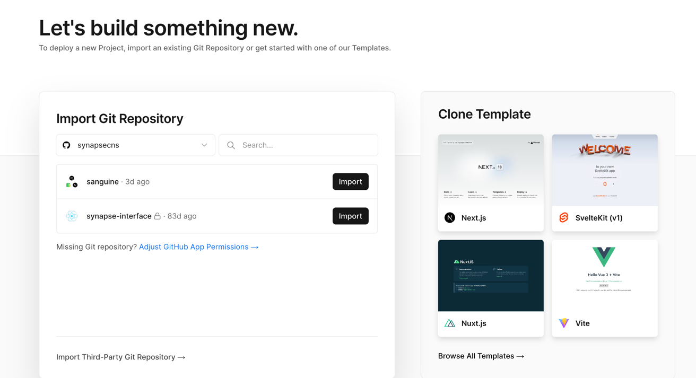
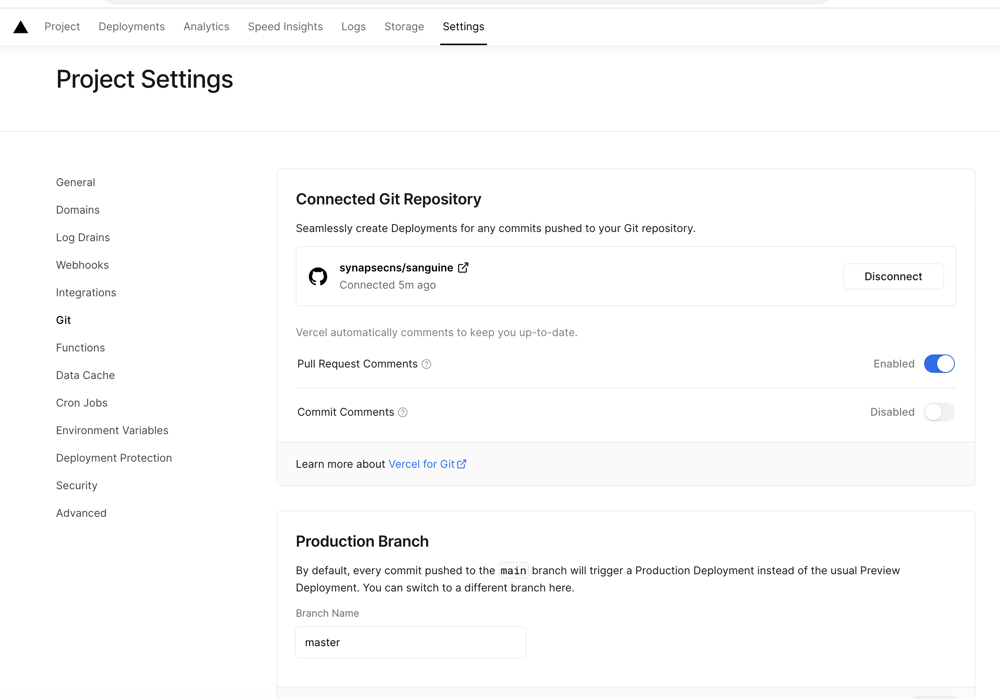
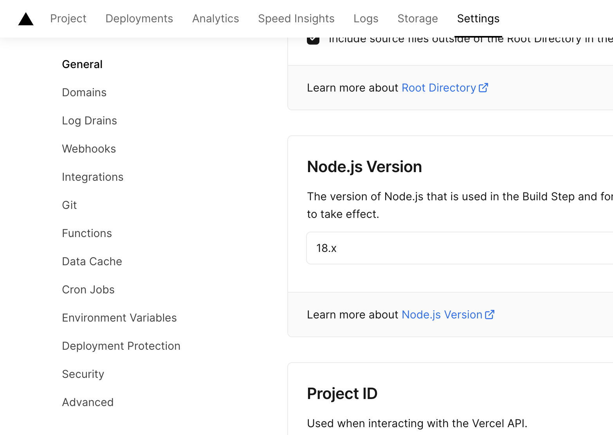
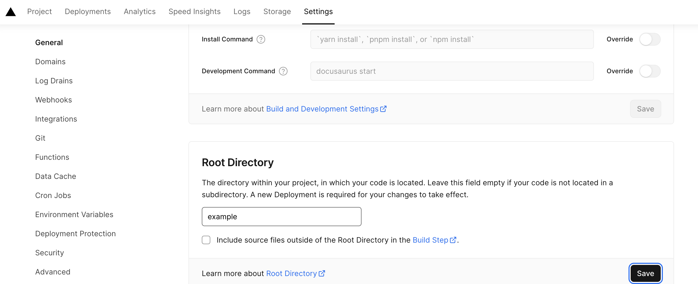

# Configuring a New Vercel Project

Since we're using Vercel via github actions rather than the UI, configuring a new project requires a little extra work.

1. Click "Add New" on the home screen.
2. The project creation page will force you to import a project from github. Select any non-private repo, as this will be disconnected later.

3. Go to the settings->git and disconnect the repo.

4. Get the project id from vercel.

5. Set the root directory to the path in the repo where your package is located.

6. [Add this variable as a secret to github actions](https://docs.github.com/en/actions/security-guides/using-secrets-in-github-actions#creating-secrets-for-a-repository). As a convention this should be called `[PACKAGE_NAME]_VERCEL_PROJECT_ID`.
7. Add the contract id to PROJECT_IDS in [ui-preview.yml](./ui-preview.yaml).

Now you're done. Any time you push to the main branch, the UI will be deployed to vercel.

