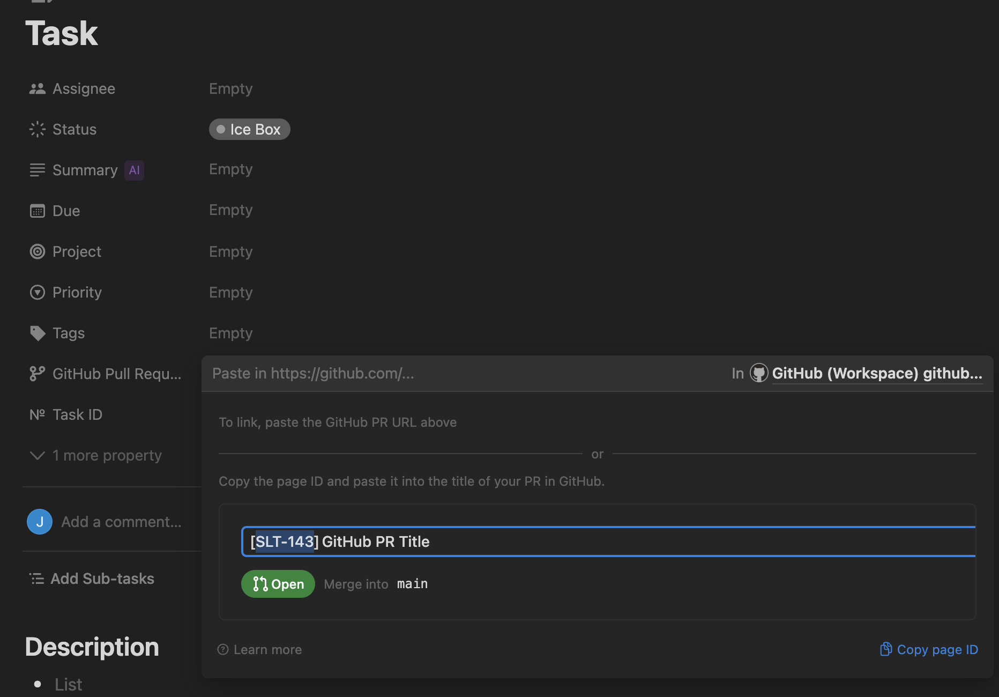
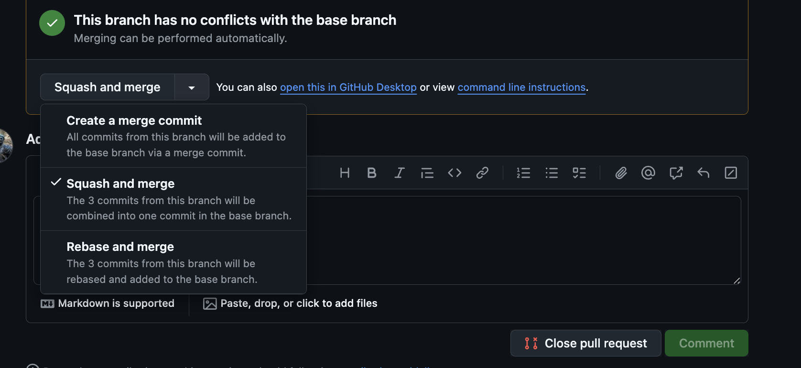

# Contributing

Contributions should roughly follow the [uber style guide](https://github.com/uber-go/guide/blob/master/style.md)

# Submitting a PR

When preparing to submit a pull request, there are a few key points to keep in mind to ensure a smooth review process and maintain the quality of our codebase.

First and foremost, we encourage you to use the default PR template provided in the repository. This template is designed to capture all the necessary information about your changes, making it easier for reviewers to understand the context and purpose of your work.

If your PR is related to a specific task in Notion, it's helpful to include the Notion ID in your PR title or description. For example, you might use a format like [SLT-143] at the end of your PR title. This allows us to easily track the relationship between tasks and code changes. **Note: It's important to include the Notion ID at the end, as if its put at the beginning it will be interpreted as semantic versioning and corrupt the changelog**.



During the review process, you might notice comments about code coverage changes. While we generally aim to maintain or improve code coverage, don't be overly concerned if you see minor fluctuations. If the coverage changes aren't material to the core functionality you're modifying, it's usually fine to proceed.

You'll likely encounter suggestions from CodeRabbit, our automated code review tool. While CodeRabbit can provide valuable insights, remember that it's an AI tool and may not always understand the full context of your changes. Use its suggestions as a starting point for improvement, but don't feel obligated to implement every recommendation it makes. Your judgment as a developer is crucial in determining which suggestions are truly beneficial.

If your PR gets labeled with `needs-go-generate`, don't worry - this is an easy fix. Simply run `go generate ./...` in your terminal, commit the changes, and push. This will update any auto-generated code that might be out of sync.

Similarly, if you see a `needs-yarn-lock` label, it means your changes have affected the project's dependencies. To resolve this, navigate to the root directory of the project and run `yarn`. This will update the yarn.lock file, ensuring that all developers are working with the same dependency versions.

Remember, these guidelines are here to help streamline our development process and maintain consistency across the project. We appreciate your contributions and look forward to reviewing your PRs!


## Carefully Reviewing PRs

Before merging a pull request, it's crucial to carefully review the changes. Here are some key points to consider:

1. Code quality: Ensure the code follows our style guide and best practices.
2. Functionality: Verify that the changes work as intended and don't introduce new bugs.
3. Tests: Check that appropriate tests have been added or updated.
4. Documentation: Confirm that any necessary documentation updates have been made.
5. Performance: Consider the impact on performance, especially for critical paths.

Take your time during the review process. It's better to have a thorough review than to rush and potentially introduce issues.

## Using Squash and Merge

When it's time to merge a PR, we prefer using the "Squash and Merge" option instead of rebasing. This approach combines all commits from the feature branch into a single commit in the main branch, which helps keep our commit history clean and easier to navigate.

Here's how to use the "Squash and Merge" option:

1. Once the PR is approved and ready to merge, click on the "Squash and merge" button in the GitHub interface.
2. Review the commit message. It will be pre-filled with the PR title and description, but you can edit it if needed.
3. Click "Confirm squash and merge".



By using "Squash and Merge", we maintain a linear and clean history in our main branch, making it easier to understand the progression of our project and to revert changes if necessary.


<!-- todo: more-->

## Adding a new JS/TS Package

If you need to make a new JS/TS package, here are the steps to follow:

- If adding under `packages/*`, no need to do anything further.
- Otherwise, make sure you add the package to:
  - `.github/workflows/lerna.yml` under paths. This will make sure that the package is built and tested in CI.
  - `workspaces.packages` in packages.json. This will make sure that the package is built and tested locally.
  - `lerna.json` under `packages` and `version` fields. This will make sure that the package is versioned correctly.
- If the package is a library that you'd like to publish, simply set the `private` field in `package.json` to `false` and the `publishConfig` access to public.
- If the package is a UI, please see [here](./.github/workflows/ui-preview.md) for instructions on configuring vercel. Make sure to update the paths there as well.

# Go

## Linting

Linting for Go code uses [golangci-lint](https://golangci-lint.run/). The version is pinned in `.golangci-version` file and managed automatically through our tooling. Simply run `make lint` from your desired module, and the correct version will be downloaded (if not already cached) and used automatically.

## Adding a new Go Module

If you need to make a new go module, here are the steps to follow:

1. Create a new directory in the right sub-directory. If the file tree already has a `go.mod` or a `go.sum` file, you don't need a new module, you're just creating a package. *Note: the `packages` directory is for javascript and should not be used.
2. Create a `go.mod` file in the new directory. You'll want the module name to match the directory path and the package name to be part of go.mod file. The go version should match the version in the root [go.work](go.work) file unless there's a good reaon for it no to.
    ```go
    module github.com/synapsecns/sanguine/path/to/your/module

    go 1.22.1

    toolchain go1.22.4 // or whatever the version is in go.work
   ```

   Any local dependencies should use replaces like this:
    ```go
    module github.com/synapsecns/sanguine/path/to/your/module

    go 1.22.1

    toolchain go1.22.4 // or whatever the version is in go.work
   require (
        github.com/synapsecns/sanguine/core v0.0.1
   )

   replace (
	      github.com/synapsecns/sanguine/core => ../path/to/core
    )
    ```
   In so far as you have issues running `go mod tidy`, you may need to add additional replace directives. If you can't figure out what these are, please look at other requires of the module you're trying to link to
3. Add the module to the [go.work](go.work) file. The path should be in alphabetical order.
    ```go
    go 1.21
   use (
        ./a_module
        ./another_module
        ./path/to/your/module
   )
    ```
4. Add the module to the [.codecov.yml](.codecov.yml) file under flags in alphabetical order <!--TODO: enforce alphabetical order w/ linter-->. This allows codecov to re-use old coverage information if no changes have been made, which speeds up testing. For an explanation of when changes are ran please see [this post](https://threadreaderapp.com/thread/1693572913662775510.html) <!-- todo: this needs to be moved into ci docs-->, the [go workflow](.github/workflows/go.yml) and the [git-changes-action](contrib/git-changes-action/README.md). For an explanation of the carryforward flag, please see the [codecov docs](https://docs.codecov.com/docs/carryforward-flags):
    ```yaml
      # Lots of other stuff....

      # from the go.work file
      flags:
        # other flags...

        your-module-name: # in the case of github.com/synapsecns/sanguine/path/to/your/module, this would be module
          path: path/to/your/module/
          carryforward: true
    ```
   #### Note: The codecov.yaml used in ci will not be updated until your branch is merged to master. This is expected
5. Create a Makefile.
   If your makefile has no custom commands (it shouldn't if you're just starting), simply create a symlink to the go.Makefile by running `ln -sv ../path/to/repo/root/make/go.Makefile Makefile`.
   Otherwise, create the makefile in `$REPO_ROOT/make/[module_name].Makefile` with the following text:
    ```makefile
    include ../path/to/go.Makefile # this is the path to the go.Makefile from the module directory


    custom command:
      @eval $(echo "do something new!")
    ```
   then symlink it like above.
   Note: please do your best to make `Makefile` commands as portable as possible. For example, this installs tfenv for testing the terraform modules on osx and linux:
    ```makefile
    tfenv-install:
      @#Brew - MacOS
      @if [ "$(shell which tflint)" = "" ] && [ "$(shell which brew)" != "" ]; then brew install rflint; fi;
      # default
      @if [ "$(shell which tflint)" = "" ]; then curl -s https://raw.githubusercontent.com/terraform-linters/tflint/master/install_linux.sh | bash; fi;
    ```
6. Add a `.goreleaser.yml` file. If you're just starting the directory, it's likely you don't have a binary/Dockerfile yet so it can look something like this:
    ```yaml
    project_name: your-module-name

    monorepo:
      tag_prefix: path/from/repo/root/to/module
      dir: path/from/repo/root/to/module

    # for now, this is a library release
    builds:
      - skip: true

    # add a source archive at release time
    source:
      enabled: true

    # Archives
    archives:
      - format: tar.gz
        wrap_in_directory: true
        format_overrides:
          - goos: windows
            format: zip
        name_template: '{{.ProjectName}}-{{.Version}}_{{.Os}}_{{.Arch}}'
        files:
          - README.md

    checksum:
      name_template: checksums.txt

    # Add a changelog
    changelog:
      sort: asc
    ```
   If this is not a library release, please see any other `.goreleaser.yml` file for an example. It is important the production docker files are put in the [`docker/`](docker/) directory and named `[module_name].Dockerfile` so that others can find them.
7. Create a `README.md` file in the directory. This should include a description of the module and a link to the godoc page and go report card <!-- (for vanity) -->. If you're not sure what to put in the readme, look at the other modules for inspiration. If the module is on the more complex side, consider including a directory tree like we have [here](#directory-structure). If the application is runnable, instructions on running should be present.
8. Add the new directory and description to the [Directory Structure](#directory-structure) section of this [README](./README.md) in alphabetical order. <!-- TODO: we should really lint that this is in alphabetical order. Also, markdown files should be linted for broken links. -->


## Best Practices

For the most part, we follow the [uber style guide](https://github.com/uber-go/guide/blob/master/style.md).

### macOS and Docker-based Tools

If you're using a Mac with Apple Silicon (M1/M2/M3), you might encounter issues with Docker-based tools that use AMD64 images. This is particularly relevant for tools like our `abigen` utility. Please see our [abigen README](./tools/abigen/README.md#note-on-macos-and-rosetta) for details on how to resolve Rosetta-related issues and our plans for future improvements.

### Testing

We often use the [testsuite](https://pkg.go.dev/github.com/synapsecns/sanguine/core/testsuite) lib to create a test suite. You don't need this, as it adds a lot of overhead, but if you need a context you should us it. This library contains two  methods:

```go
package imanexample_test

import "github.com/synapsecns/sanguine/core/testsuite"


type MyTestSuite struct {
    *testsuite.TestSuite
	  reusableThing string // can be reused across tests
	  thingCreatedOncePerTest string // can be reused within a test, recreated in between
}

func (s *MyTestSuite) SetupSuite() {
    s.TestSuite.SetupSuite()
	  s.reusableThing = "hello" // if this needed context to get, you'd use s.GetSuiteContext()
}

func (s *MyTestSuite) SetupTest()  {
  s.TestSuite.SetupTest()
  s.thingCreatedOncePerTest = "world"
}

func (s *MyTestSuite) TestSomething()  {
	// if we needed context here, we'd use s.GetTestContext()
  s.Equal("hello", s.reusableThing)
  s.Equal("world", s.thingCreatedOncePerTest)
}

```

### Databases

When using the sqlite driver, it's preferred you use [`filet.TmpDir`](https://pkg.go.dev/github.com/Flaque/filet) for the tempdir. This will ensure the directory is cleaned up after the test is run. If you need to use a different driver, please use the [`testcontainers`](https://pkg.go.dev/github.com/testcontainers/testcontainers-go) library. This will ensure the database is eventually cleaned up after the test is run. More importantly, in the case the test fails, you can use the sqlite3 driver to inspect the database. This is not possible with the testcontainers library. You can also use [`schema.NamingStrategy`](https://pkg.go.dev/gorm.io/gorm/schema#NamingStrategy) for new mysql tables everytime  (in ci, for example)

```go
package imanexample_test

import (
  "database/sql"
  "github.com/Flaque/filet"
  "github.com/synapsecns/sanguine/agents/agents/executor/db"
  "github.com/synapsecns/sanguine/agents/agents/executor/db/sql/sqlite"
  "github.com/synapsecns/sanguine/core/"
  "github.com/synapsecns/sanguine/core/dbcommon"
  "github.com/synapsecns/sanguine/core/metrics"
  "github.com/synapsecns/sanguine/core/metrics/localmetrics"
  "github.com/synapsecns/sanguine/core/testsuite"
  "gorm.io/gorm/schema"
  "sync"
  "testing"
)

// NewEventDBSuite creates a new EventDBSuite.
func NewEventDBSuite(tb testing.TB) *DBSuite {
  tb.Helper()
  return &DBSuite{
    TestSuite: testsuite.NewTestSuite(tb),
    dbs:       []db.ExecutorDB{},
  }
}

type DBSuite struct {
  *testsuite.TestSuite
  dbs      []db.ExecutorDB
  logIndex atomic.Int64
  metrics  metrics.Handler
}

func (d *DBSuite) SetupSuite() {
  d.TestSuite.SetupSuite()

  // don't use metrics on ci for integration tests
  isCI := core.GetEnvBool("CI", false)
  useMetrics := !isCI
  metricsHandler := metrics.Null

  if useMetrics {
    localmetrics.SetupTestJaeger(d.GetSuiteContext(), d.T())
    metricsHandler = metrics.Jaeger
  }

  var err error
  d.metrics, err = metrics.NewByType(d.GetSuiteContext(), metadata.BuildInfo(), metricsHandler)
  Nil(d.T(), err)
}

func (d *DBSuite) SetupTest() {
  d.TestSuite.SetupTest()

  sqliteStore, err := sqlite.NewSqliteStore(d.GetTestContext(), filet.TmpDir(d.T(), ""), d.metrics, false)
  Nil(d.T(), err)

  d.dbs = []reldb.Service{sqliteStore}
  d.setupMysqlDB()
}

func (d *DBSuite) setupMysqlDB() {
  // skip if mysql test disabled, this really only needs to be run in ci

  // skip if mysql test disabled
  if os.Getenv(dbcommon.EnableMysqlTestVar) == "" {
    return
  }
  // sets up the conn string to the default database
  connString := dbcommon.GetTestConnString()
  // sets up the mysql db
  testDB, err := sql.Open("mysql", connString)
  Nil(t.T(), err)
  // close the db once the connection is done
  defer func() {
    Nil(t.T(), testDB.Close())
  }()

  // override the naming strategy to prevent tests from messing with each other.
  // todo this should be solved via a proper teardown process or transactions.
  mysql.NamingStrategy = schema.NamingStrategy{
    TablePrefix: fmt.Sprintf("test%d_%d_", t.GetTestID(), time.Now().Unix()),
  }

  mysql.MaxIdleConns = 10

  // create the sql store
  mysqlStore, err := mysql.NewMysqlStore(t.GetTestContext(), connString, t.metrics, false)
  Nil(t.T(), err)
  // add the db
  t.dbs = append(t.dbs, mysqlStore)
}

// you can then test against both dbs
func (d *DBSuite) RunOnAllDBs(testFunc func(testDB db.ExecutorDB)) {
  t.T().Helper()

  wg := sync.WaitGroup{}
  for _, testDB := range t.dbs {
    wg.Add(1)
    // capture the value
    go func(testDB db.ExecutorDB) {
      defer wg.Done()
      testFunc(testDB)
    }(testDB)
  }
  wg.Wait()
}

// TestDBSuite tests the db suite.
func TestEventDBSuite(t *testing.T) {
  suite.Run(t, NewEventDBSuite(t))
}

```

# Github Actions

If you want to do a shallow clone, use `fetch-depth: 2` rather than `fetch-depth: 1`. This allows [some actions](https://docs.codecov.com/docs/environment-specific-requirements) (though not all of them) to determine the correct sha.
