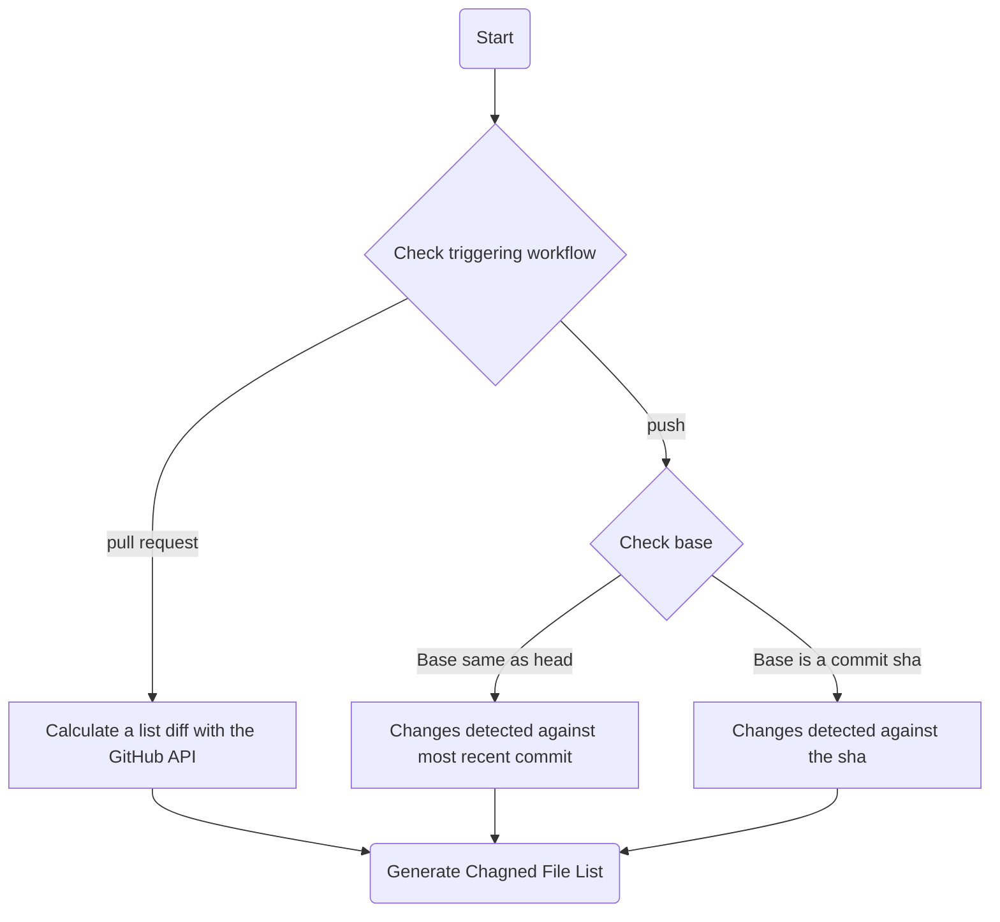
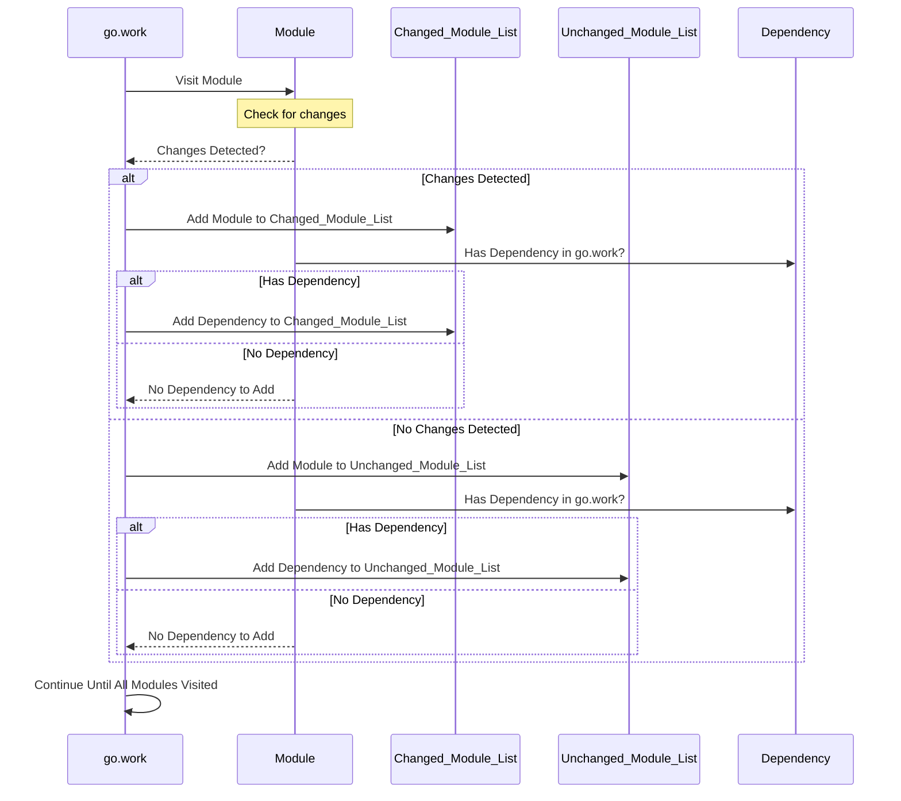

# Git Changes Action

This GitHub Action exports a variable that contains the list of Go modules changed in the current pull request, along with any dependent modules. This can be useful for automating build, test, or deployment workflows that involve Go projects.

[](https://pkg.go.dev/github.com/synapsecns/sanguine/contrib/git-changes-action)
[](https://goreportcard.com/report/github.com/synapsecns/sanguine/contrib/git-changes-action)

## Usage:

1. To use this action, add the following steps to your workflow:

    Check out the current pull request using the actions/checkout action. It's recommended to set fetch-depth to 0 and submodules to recursive to ensure that all necessary dependencies are fetched.


```yaml
    steps:
      - uses: actions/checkout@v4
        with:
          fetch-depth: 0
          submodules: 'recursive'
```

1. Use the synapsecns/sanguine/git-changes-action Docker image to run the git-changes script, which exports a variable that contains the list of changed Go modules.

```yaml
      - uses: docker://ghcr.io/synapsecns/sanguine/git-changes-action:latest
        id: filter_go
        with:
          github_token: ${{ secrets.github_token }}
          timeout: "1m" # optional, defaults to 1m
```

You can customize the behavior of the git-changes script by using the following inputs:

 - `github_token`: The token to use for authentication with the GitHub API. This is required to fetch information about the current pull request.
 - `timeout`: The maximum time to wait for the GitHub API to respond. Defaults to 1 minute.

The output of the git-changes script is a comma-separated list of Go module paths. You can access this list using the `filter_go` output variable, like so:

```yaml
      - run: echo "Changed modules: ${{ steps.filter_go.outputs.changed_modules }}"
      - run: echo "Unchanged modules: ${{ steps.filter_go.outputs.unchanged_modules }}"
      - run: echo "Changed modules (including dependencies): ${{ steps.filter_go.outputs.changed_modules_deps }}"
      - run: echo "Unchanged modules (including dependencies): ${{ steps.filter_go.outputs.unchanged_modules_deps }}"
```

## Example

Here's an example workflow that uses the `git-changes` action to run tests for changed Go modules:


```yaml
name: Test Go Modules

on:
  pull_request:
    types: [opened, synchronize]

jobs:
  test_go_modules:
    runs-on: ubuntu-latest
    steps:
      - uses: actions/checkout@v3
        with:
          fetch-depth: 0
          submodules: 'recursive'

      - uses: docker://ghcr.io/synapsecns/sanguine/git-changes-action:latest
        id: filter_go
        with:
          github_token: ${{ secrets.github_token }}
          timeout: "1m"

      - name: Run tests
        run: go test -v ${{ steps.filter_go.outputs.changed_modules }}
```

This workflow will run tests for all changed Go modules and their dependencies whenever a pull request is opened or synchronized.

## How It Works

First a change tree is calculated between the ref and the base (as passed in by the user or inferred by the event type) based on the flow described below and [here](https://github.com/dorny/paths-filter/blob/4067d885736b84de7c414f582ac45897079b0a78/README.md#supported-workflows). This is a file tree that contains all the files that have changed between two refs.



Each module in the `go.work` is visited. If any changes were detected by the previous step, the module is added to the list of changed modules. If `include_dependencies` is on and the module has a dependency that is also in the `go.work`, the dependency is added to the list of changed modules as well. This process is repeated until all modules in the `go.work` have been visited.


