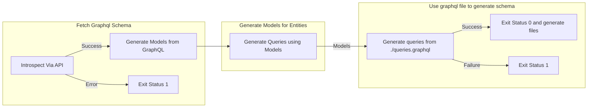

# DFK

This package contains a monitoring interface for the DFK community api as a secondary check to the explorer api in cases of lag. The structure of this folder is as follows:

```
├── <a href="./queries">queries</a>: graphql queries used to query the api
├── <a href="./.gqlgenc.yaml">.gqlgenc.yaml</a>: <a href="https://github.com/Yamashou/gqlgenc"> gqlgenc config </a>
```


The diagram below explains the generation workflow and where errors could occur:


