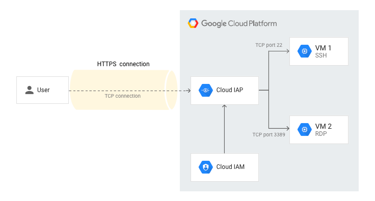

# IAP Tunnel Provider

The goal of the iap provider is to allow the use of an identity-aware proxy to connect to a GCP through a bastion host using terraform. This looks like this:

This provider is written in pure go and is based on the google terraform provider.

## Future Work

 - *SSH Tunnels*: Right now: this works for creating a proxy through an ip tunnel. Eventually, we want to allow the use of an ssh tunnel using os-loging to connect through the bastion host with more robust logging. The challenge here is `gcloud compute beta ssh --tunel-through-iap` (which this provider has been reverse engineered from) uses a stdio proxy, so we need to implement our ssh provider using that mechanism. This will be implemented in a future version
 - *Public Provider*: This is going to require mirroring to another repo to work with [the requirements](https://developer.hashicorp.com/terraform/cloud-docs/registry/publish-providers) around publishing
 - *Better Documentation*: This is a first pass at documentation, but it needs to be improved, including references to examples folder

## Disadvantages:

Terraform resources are limited to the lifecycle of the proxy. This means that if you want to use this to connect to a GCP instance, you need to create a proxy resource, then create a compute instance resource, then create a connection resource. This is because the proxy resource is ephemeral and will be destroyed when the connection resource is destroyed. This is a limitation of the IAP tunneling mechanism, not the provider. The helm provider is exported witha  configurable proxy for this reason

