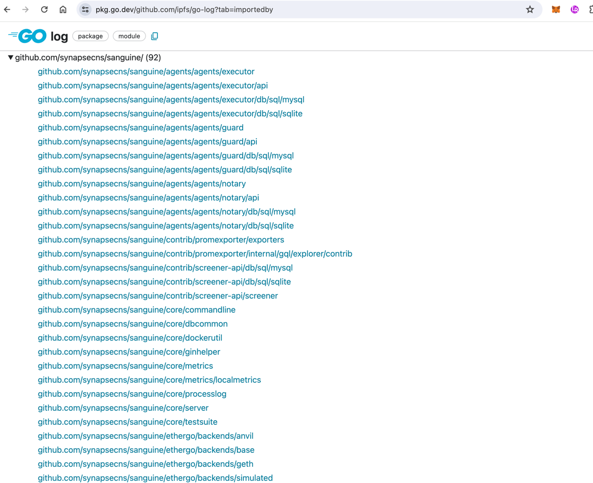

# Metrics Package

The metrics package contains standard drivers for opentracing, profiling and metrics.You can enable this in your appplication by calling `metrics.Setup()`. This will start the metric handler defined in the `METRICS_HANDLER` environment variable. The default is `null` which is a no-op handler.

| `METRICS_HANDLER` env | Description                                                                                                                                                                                                                                                                                                                                                                                                                          | Supports Traces | Supports Span Events | Supports Profiling                                                                            |
|-----------------------|--------------------------------------------------------------------------------------------------------------------------------------------------------------------------------------------------------------------------------------------------------------------------------------------------------------------------------------------------------------------------------------------------------------------------------------|-----------------|----------------------|-----------------------------------------------------------------------------------------------|
| OTLP                  | [OTLP Exporter](https://opentelemetry.io/docs/specs/otel/protocol/exporter/) protocol. Supported by various external providers including [New Relic](https://docs.newrelic.com/docs/more-integrations/open-source-telemetry-integrations/opentelemetry/opentelemetry-introduction/), [Signoz](https://signoz.io/blog/opentelemetry-collector-complete-guide/), [Grafana](https://grafana.com/docs/opentelemetry/collector/), [Middleware](https://docs.middleware.io/open-telemetry/otel-collector) and more | ✅               | ✅                    | ❌ (but it can through pyroscope, by specifying the `PYROSCOPE_ENDPOINT` environment variable) |
| Jaeger                | [Jaeger](https://www.jaegertracing.io/docs/1.46/) Client Clibrary, will soon be deprecated in favor of OTLP exports to jaeger as per [this deprecation notice](https://www.jaegertracing.io/docs/1.46/client-libraries/)                                                                                                                                                                                                             | ✅               | ✅                    | ❌ (but it can through pyroscope, by specifying the `PYROSCOPE_ENDPOINT` enviornment variable) |


There's also a `NAME_PREFIX` environment variable that will prefix all the metrics with the value of `NAME_PREFIX`. This is useful for differentiating between different instances of the same service.

## OTLP

We do our best to support enviornment variables specified in the [Otel Spec](https://opentelemetry.io/docs/specs/otel/configuration/sdk-environment-variables/) and the [OTLP Spec](https://opentelemetry.io/docs/languages/sdk-configuration/otlp-exporter/) and have added a few of our own. This was to allow for multiple exporter backends for traces, as otel clients only allow for one URL. The relevant multi exporter code is in `multiexporter.go`, and simply wraps multiple otel clients.

The additional environment variables to note are:
| Enviornment Variable                     | Description                               | Default |
|------------------------------------------|-------------------------------------------|---------|
| `OTEL_EXPORTER_OTLP_ENDPOINT`            | The endpoint for the primary OTLP exporter | None    |
| `OTEL_EXPORTER_OTLP_ENDPOINT_1`          | The endpoint for the first additional OTLP exporter | None    |
| `OTEL_EXPORTER_OTLP_ENDPOINT_2`          | The endpoint for the second additional OTLP exporter | None    |
| `OTEL_EXPORTER_OTLP_ENDPOINT_3`          | The endpoint for the third additional OTLP exporter | None    |
| ...                                      | Additional endpoints can be added by incrementing the number | None    |
| `OTEL_EXPORTER_OTLP_TRANSPORT`           | The transport protocol for the primary OTLP exporter | `http` |
| `OTEL_EXPORTER_OTLP_TRANSPORT_1`         | The transport protocol for the first additional OTLP exporter | `http` |
| `OTEL_EXPORTER_OTLP_TRANSPORT_2`         | The transport protocol for the second additional OTLP exporter | `http` |
| `OTEL_EXPORTER_OTLP_TRANSPORT_3`         | The transport protocol for the third additional OTLP exporter | `http` |
| ...                                      | Additional transports can be specified by incrementing the number | `http` |

You can do the same thing for `OTEL_EXPORTER_OTLP_SECURE_MODE` and `OTEL_EXPORTER_OTLP_HEADERS`

<!-- TODO: fully document these optins-->

Note: The OTLP exporter endpoints and transports can be specified for multiple exporters by using incrementing numbers (1, 2, 3, etc.) in the environment variable names. This allows for configuration of multiple OTLP exporters. The primary exporter uses the base names without numbers.


## Jaeger

Pass in the `JAEGER_ENDPOINT` enviornment variable

## Pyroscope

Pass in the `PYROSCOPE_ENDPOINT` environment variable

## Metrics Endpoint

The metrics endpoint is exposed on `/metrics` on port `8080` by default and is compatible with prometheus. The following options control the metrics endpoint:

| Enviornment Variable   | Description                                                                 | Default    |
|------------------------|-----------------------------------------------------------------------------|------------|
| `METRICS_PORT_ENABLED` | Wether or not to enable the metrics endpoint.                               | `true`     |
| `METRICS_PORT`         | Port to serve metrics on.                                                   | `8080`     |
| `METRICS_PATH`         | Path to serve metrics on                                                    | `/metrics` |
| `METRICS_ALWAYS_SYNC`  | Wether or not to wait until metrics have been exported before ending a span | `false`    |

**Note: this server failing to bind to `METRICS_PORT` will not cause the application to fail to start. The error will be logged.**

Most metrics come with a `# HELP` explanation that explains them, for example:

```promql
# HELP process_uptime_seconds The uptime of the process in seconds
# TYPE process_uptime_seconds gauge
process_uptime_seconds{otel_scope_name="standard_metrics",otel_scope_version=""} 24.241680459
```

## Logger

Currently, the entire sanguine codebase uses [ipfs go-log]("https://github.com/ipfs/go-log"). As pointed out in [#1521](https://github.com/synapsecns/sanguine/issues/1521), this is not a good long term solution since the logs are not currently appended to opentelemetry, and so new traces require telemtry.

In an attempt to fix this, we introduced the new context aware [otelzap logger](https://pkg.go.dev/github.com/uptrace/opentelemetry-go-extra/otelzap). Since this is in beta, you ned to call `handler.ExperimentalLogger`. In a future version, we will remove the `handler.ExperimentalLogger` and replace it with `handler.Logger` and deprecate [`ipfs/go-log`](https://github.com/ipfs/go-log).

The current logger is currently depended on by a large amount of modules:

 so it'd be wise to keep this module out of new code until ready to do an entire go.module, and possibly it's dependencies. This should be tracked in  [#1521](https://github.com/synapsecns/sanguine/issues/1521)

### Limitations

Currently, no environment variables are supported for the logger. This is a known limitation and will be fixed in a future release. Things like controlling the log level, sugaring, format, etc are [not currently supported](https://pkg.go.dev/go.uber.org/zap#NewProductionConfig). These will be added as the module beocmes more stable.

Note: because both  [ipfs go-log]("https://github.com/ipfs/go-log") and [otelzap logger](https://pkg.go.dev/github.com/uptrace/opentelemetry-go-extra/otelzap) depend on zap globals, in order to enable globals you can set `ENABLE_EXPERIMENTAL_ZAP_GLOBALS` to `true` in your environment. This will enable the zap globals, and you can use the `handler.Logger` to log to the global logger. This is not recommended, and will be removed in a future release.

### Using the logger

Since the logger is dependent on the `context` to derive the current span, you need to always use `logger.Ctx(ctx)` or `logger.InfoCtx`. One thing under consideration is removing the non-ctx methods

