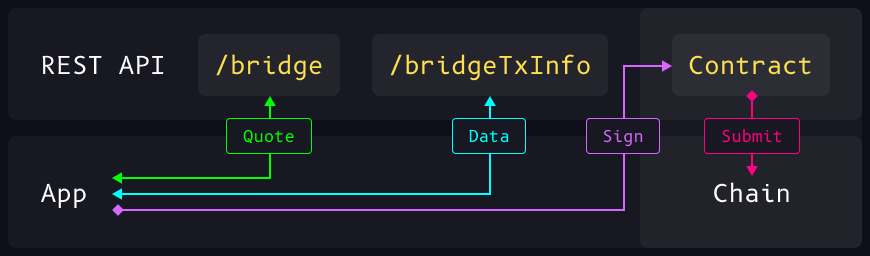

We are excited to announce the launch of the **Synapse REST API**.

Last week, we launched the Synapse REST API: [api.synapseprotocol.com](https://api.synapseprotocol.com). The new update is key in making Synapse easier to integrate for applications.

<!--truncate-->

## Summary

The REST API is a restful interface for applications to query, construct, and initiate cross-chain transactions. The service comes with supporting modules for querying liquidity, transaction status, and more. The aim of the API is to enable applications to integrate cross-chain functionality through an API call.

## Why it Matters

The REST API makes it significantly easier for aggregators to integrate with the Synapse Bridge, complete with supplementary modules for returning key information like transaction status to users , as well as standardizing and sanitizing inputs and outputs. Rather than interact with complex contracts, aggregators can interact with a simple /bridge endpoint.

The REST API is also built with third-party developers in mind. Many people run external services around the Synapse Bridge: from arbitrage bots, to on-chain AI agents. The REST API makes it much simpler to interact with the Synapse Bridge from any environment, with just an http request. Third party developers also don't have to sacrifice complexity.

## Challenges

When building the REST API we ran into a couple challenges that have created a more robust developer experience.

*Standardizing Constants:* We needed a set of constants to verify all inputs against, so that users did not attempt to bridge or swap with unsupported assets/chains. This launch gave us the chance to standardize the Synapse Constants library, and extend this library throughout other services.

*Liquidity Warnings:* When bridging programmatically, it's harder to identify abnormalities, thus we added different endpoints to help applications retrieve liquidity parameters before bridging. Responses also include detailed information about what the expected amount will be.

## Launch Details

Structurally, the REST API is a wrapper around the Synapse SDK – the primary abstraction of the Synapse Contracts. The modules allow users to swap, bridge, and a host of other supporting functions. This level of abstraction is key for applications that want to interact with the Synapse Contracts from any framework, in a standardized manner.

This update incorporated the addition of new methods to support aggregator integrations such as:

`/bridgeTxStatus`
	Enables developers to retrieve the status of any bridge transaction. Helpful for debugging as well as providing transaction level information to the user.

`/destinationTokens`
	Returns a list of tokens that can be bridged to (given an input token), giving developers clarity on where they can bridge to.

`/bridgeLimits`
	Returns a max/min amount of tokens to be bridged, giving an accurate representation of liquidity for any possible bridge route.

Other main changes include:
- Standardized RESTful responses, eliminated mixed response types (Markup and JSON) to now consistently return JSON for all endpoints.
- Enhanced error handling using input validations with express-validator, middleware for error handling. Includes checks for unsupported chains, bridge modules, tokens and a friendly error message indicating specific error messages.
- Architectural improvements including a traditional MVC approach, separating routes and controllers, improved code readability and organization, so we can easily compose new routes
- Development workflow updates, like yarn dev which has hot reloading so we don't need to manually stop and restart the server during development

Swagger documentation was also included in the latest release to assist developer onboarding.
