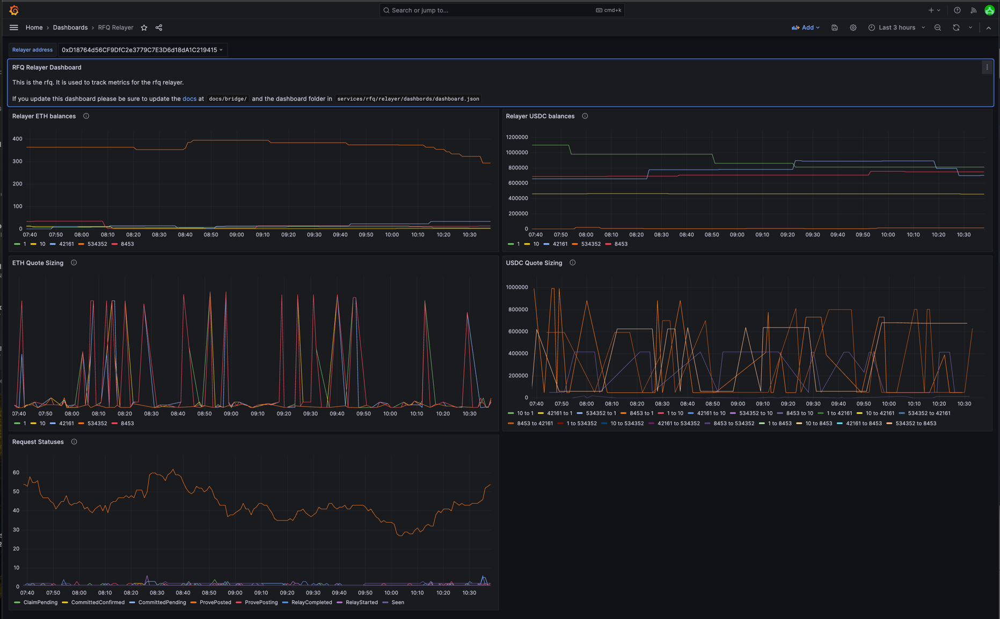

# RFQ Relayer

:::note

Relayers must be whitelisted in order to fulfill bridge requests.

:::

A Go application which coordinates on-chain events and stored message states to relay user funds. Relayers are easily observable.

The canonical RFQ Relayer handles **three event loops**: quoting routes, approving relays, and rebalancing funds.

## Quote

Continuously track and update route quotes based on changes to available and in-flight balances via [API](API). The quote should update each time the available balance or other parameters change.

| Param   | Description
|---------|-
| Balance | Maximum amount the relayer can fill
| Offset  | Token price percentage, used to ensure the relayer is profitable.
| Fee     | `fixed_fee_multiplier` (from [config](#configure)) multiplied by `origin_gas_estimate + destination_gas_estimate`

 <!-- TODO: Allow `time` as a quote parameter to put funds that are not _yet_ available to be put into play.  -->

## Relay

Listen to on-chain events and database updates to move [`BridgeRequest`](https://vercel-rfq-docs.vercel.app/contracts/interfaces/IFastBridge.sol/interface.IFastBridge.html#bridgeparams) objects through the following states:

| State                | Description
|----------------------|-
| `Seen`               | [`BridgeRequested`](https://vercel-rfq-docs.vercel.app/contracts/interfaces/IFastBridge.sol/interface.IFastBridge.html#bridgerequested) event stored in the db.
| `WillNotProcess`     | [`BridgeRequested`](https://vercel-rfq-docs.vercel.app/contracts/interfaces/IFastBridge.sol/interface.IFastBridge.html#bridgerequested) event is invalid
| `NotEnoughInventory` | Retry later
| `CommittedPending`   | All checks pass, waiting for transaction to finalize
| `CommittedConfirmed` | Transaction is finalized on-chain
| `RelayPending`       | Called [`relay`](https://vercel-rfq-docs.vercel.app/contracts/FastBridge.sol/contract.FastBridge.html#relay)
| `RelayComplete`      | Relay completed on-chain
| `ProvePosting`       | Called [`prove`](https://vercel-rfq-docs.vercel.app/contracts/FastBridge.sol/contract.FastBridge.html#prove)
| `ClaimPending`       | Called [`claim`](https://vercel-rfq-docs.vercel.app/contracts/FastBridge.sol/contract.FastBridge.html#claim)
| `ClaimComplete`      | Dispute period expired, funds received.

## Rebalance

For cases where flows are mono-directional, the Relayer provides an interface for rebalancing funds.

Automated rebalancing is configurable by token and currently supports CCTP routes as well as native bridging on Scroll. Rebalancing evaluation follows this logic every `rebalance_interval`:

For each supported rebalance method, calculate the `total_balance` of each token across the chains that support that rebalance method, and which tokens have a balance below `total_balance * maintenance_balance_pct`.

:::note

To limit in-flight inventory, only one rebalance can be pending at a time for each token. We select the 'best' rebalance candidate as the rebalance with the largest delta between origin and destination balance.

:::

The rebalance amount is the smaller of the maximum rebalance amount on origin, and minimum rebalance amount on destination, clamped to the `min` and `max` values in the configuration file.

#### Example

| # | CCTP | USDC | `maintenance_pct` | `initial_pct`
|---|------|------|-------------------|-
| 1 | Yes  | 20%  | 40%               | 100 USDC
| 2 | Yes  | 20%  | 40%               | 900 USDC
| 3 | No   | 20%  | 40%               | 2000 USDC

The total balance of CCTP-supported chains is `1000 USDC`. Since chain 1, with 10% of the total inventory, is below the 20% maintenance threshold, the system triggers a rebalance from Chain 2 to Chain 1.

Chain 3 does not support CCTP, and is not considered for rebalance.

The maximum rebalance amount is `600 USDC` which takes chain 2 to its 40% initial threshold

`300 USDC` is sent from chain 2 to chain 1 is, which is the minimum required to reach chain 1's initial 40% threshold.

:::note Scroll

Rebalancing for certain native bridges (e.g Scroll) is supported. It works slightly differently as flows are only supported between Scroll and Mainnet.

At a high level, the rebalancer checks inventory on Scroll versus other chains, and if imbalanced, initiates a bridge to mainnet, allowing the CCTP relayer to rebalance funds where needed.

:::

## Configure

RFQ Relayer requires a YAML configuration file path to be provided at run time.

<!-- TODO: this should work the same way as the openapi doc gen where its autogenerated from code and a mix-in  -->

:::note rebalance_method

`synapse` collects a fee, but does not spend user gas. Use `synapse_cctp_address` when configuring `chains`.

`cctp` has no fees, but spends user gas. Use `token_messenger_address` when configuring `chains`.

:::

* `submitter_config`: Covered [here](/docs/Services/Submitter#observability). Controls gas parameters for on-chain transactions.
* `database`: Database settings for API backend. Required to store quotes and other information. SQLite with `DSN` set to a `/tmp/` directory is recommended for development.
  *  `type`: Database driver to use, can be `mysql` or `sqlite`.
  *  `dsn`: 'Data Source Name'. If using SQLite, this can be a path. For MySQL see [here](https://dev.mysql.com/doc/connector-odbc/en/connector-odbc-configuration.html) for more information.
* `screener_api_url` (optional): [Screener API](https://github.com/synapsecns/sanguine/tree/master/contrib/screener-api#screening-api)
* `rfq_url`: [Mainnet & Testnet addresses](API/#api-urls)
* `omnirpc_url`: [Running an OmniRPC instance](/docs/Services/Omnirpc)
* `rebalance_interval`: How often to rebalance. Can use `s` (seconds), `m` (minutes), or `h` (hours)
* `relayer_api_port`: Controls the relayer. Should be private or secured. <!--TODO: more info here-->
* `base_chain_config`: Default chain configuration. Overridden by individual chain configurations. See `chains` for details.
* `enable_guard`: Run a guard in the same instance.
* `submit_single_quotes`: Whether to use the batch endpoint to post quotes to the API. Useful for debugging.
* `chains`: Individual configurations to override `base_chain_config`.
  * `rfq_address`: [RFQ contract address](/docs/Contracts/RFQ) for this chain.
  * `confirmations`: how many confirmations to wait before acting on an event. This will vary per-chain.
  * `tokens`: this is a map of token symbol→token info for this chain. For example, token may be USDC, ETH, etc
    * `address`: address of the token on this chain id
    * `decimals`: number of decimals this token uses. Please verify this against the token contract itself.
    * `min_quote_amount`: smallest amount to quote for a given chain. This should be balanced against expected gas spend for a relayer to be profitable. `min_quote_amount` is to be given in decimal units (so 1000.00 is 1000)
    * `rebalance_method`: Some tokens may not have a rebalance method. Uses `synapse` or `cctp`.
    * `maintenance_balance_pct`: Portion of liquidity to maintain for this token on this chain. A balance under this amount triggers a rebalance.
    * `initial_balance_pct`: Portion of liquidity to maintain after a rebalance. Should total 100% across all chains.
    * `min_rebalance_amount`: Minimum amount of this token to try to rebalance.
    * `max_rebalance_amount`: Maximum amount of this token to rebalance at one time.
  <!-- * `quotable_tokens`: -->
  * `synapse_cctp_address` (optional): Used with `rebalance_method: synapse`. Uses a [Synapse CCTP address](/docs/Contracts/CCTP).
  * `token_messenger_address` (optional): Used with `rebalance_method: cctp`. Tells the relayer to use the token messenger instead of Synapse.
* `quotable_tokens`: list of `[chain-id]-[token_address]: [chain-id]-[token_address]`. For example 1-0x00… could be paired with 10-0x01
    ```yaml
    "1-0x00":
      - "1-0x01"
    ```
* `cctp_relayer_config`: See [CCTP](/docs/Routers/CCTP).

### Example

<details>
  <summary>`config.yml`</summary>
  ```yaml
submitter_config: # please see the more detailed submitter documentation
  chains:
    1:
      supports_eip_1559: true
      gas_estimate: 1000000
database:
  type: sqlite # can be other mysql or sqlite
  dsn: /tmp/db # should be the dsn of your database. If using sqlite, this can be a path

signer: # please see more detailed signer config  #can be text, gcp, or aws
  type: GCP
  file: /config/signer.txt

screener_api_url: 'http://screener-url' # can be left blank
rfq_url: 'http://rfq-api' # url of the rfq api backend.
omnirpc_url: 'http://omnirpc' # url of the omnirpc instance, please reference the Omnirpc section under Services for proper configuration
rebalance_interval: 2m # how often to rebalance
relayer_api_port: '8081' # api port for the relayer api
volume_limit: 10000 # USD price cap for a bridge under block confirmation minimum (configurable under `chains`)

base_chain_config: # this is hte base chain config, other chains override it
  confirmations: 0
  # Claim (72.5k) + Prove (57.5k) gas limits, rounded up
  origin_gas_estimate: 130_000
  # Relay gas limit, rounded up
  dest_gas_estimate: 110_000
  quote_offset_bps: 2
  native_token: ETH
  quote_pct: 90
  min_gas_token: 1000000000000000000
  fixed_fee_multiplier: 1.25

chains:
  1:
    rfq_address: "0x5523D3c98809DdDB82C686E152F5C58B1B0fB59E" # rfq contract address on eth
    synapse_cctp_address: "0x12715a66773BD9C54534a01aBF01d05F6B4Bd35E" # cctp contract address on eth
    token_messenger_address: "0xbd3fa81b58ba92a82136038b25adec7066af3155" # token messenger address on eth, note: only one of token_messenger_address or synapse_cctp_address actually needs to be present
    cctp_start_block: 19341000
    confirmations: 2
    tokens:
      USDC:
        address: "0xa0b86991c6218b36c1d19d4a2e9eb0ce3606eb48"
        decimals: 6
        price_usd: 1.0
        min_quote_amount: 10000
        rebalance_method: "circlecctp"
        maintenance_balance_pct: 20
        initial_balance_pct: 50
        max_rebalance_amount: 500000
      ETH:
        address: "0xEeeeeEeeeEeEeeEeEeEeeEEEeeeeEeeeeeeeEEeE"
        decimals: 18
        price_usd: 2600
  10:
    rfq_address: "0x5523D3c98809DdDB82C686E152F5C58B1B0fB59E"
    synapse_cctp_address: "0x12715a66773BD9C54534a01aBF01d05F6B4Bd35E"
    token_messenger_address: "0x2B4069517957735bE00ceE0fadAE88a26365528f"
    cctp_start_block: 116855000
    l1_fee_chain_id: 1
    # Prove + Claim L1 gas estimate
    l1_fee_origin_gas_estimate: 20
    # Relay L1 gas estimate
    l1_fee_dest_gas_estimate: 10
    tokens:
      USDC:
        address: "0x0b2c639c533813f4aa9d7837caf62653d097ff85"
        decimals: 6
        price_usd: 1.0
        min_quote_amount: 10000
        rebalance_method: "circlecctp"
        maintenance_balance_pct: 20
        initial_balance_pct: 50
        max_rebalance_amount: 500000
      ETH:
        address: "0xEeeeeEeeeEeEeeEeEeEeeEEEeeeeEeeeeeeeEEeE"
        decimals: 18
        price_usd: 2600

quotable_tokens:
  10-0x0b2c639c533813f4aa9d7837caf62653d097ff85:
    - "1-0xa0b86991c6218b36c1d19d4a2e9eb0ce3606eb48"
  1-0xa0b86991c6218b36c1d19d4a2e9eb0ce3606eb48:
    - "10-0x0b2c639c533813f4aa9d7837caf62653d097ff85"
  1-0xEeeeeEeeeEeEeeEeEeEeeEEEeeeeEeeeeeeeEEeE:
    - "10-0xEeeeeEeeeEeEeeEeEeEeeEEEeeeeEeeeeeeeEEeE"
  10-0xEeeeeEeeeEeEeeEeEeEeeEEEeeeeEeeeeeeeEEeE:
    - "1-0xEeeeeEeeeEeEeeEeEeEeeEEEeeeeEeeeeeeeEEeE"

fee_pricer:
  gas_price_cache_ttl: 60
  token_price_cache_ttl: 60

cctp_relayer_config:
  cctp_type: "circle"
  circle_api_url: "https://iris-api.circle.com/v1/attestations"
  chains:
    - chain_id: 1
      synapse_cctp_address: "0x12715a66773BD9C54534a01aBF01d05F6B4Bd35E"
      token_messenger_address: "0xbd3fa81b58ba92a82136038b25adec7066af3155"
    - chain_id: 10
      synapse_cctp_address: "0x12715a66773BD9C54534a01aBF01d05F6B4Bd35E"
      token_messenger_address: "0x2B4069517957735bE00ceE0fadAE88a26365528f"
  base_omnirpc_url: "http://omnirpc" # Make sure this is configured properly
  unbonded_signer:
    type: GCP
    file: /config/signer.txt
  http_backoff_initial_interval_ms: 1000
  http_backoff_max_elapsed_time_ms: 300000
    ```
</details>

## Run

### From Docker

Run the Docker [image](https://github.com/synapsecns/sanguine/pkgs/container/sanguine%2Frfq-relayer) along with the path to your [YAML configuration file](#configure).

1. `docker run ghcr.io/synapsecns/sanguine/rfq-relayer:latest --config /path/to/config`

### From Source

:::note Requires Go 1.21 or higher

Not generally recommended for end-users.

:::

Clone the Sanguine repository, then run the main.go file along with the path to your [YAML configuration file](#configure).

1. `git clone https://github.com/synapsecns/sanguine --recursive`
2. `cd sanguine/services/rfq/relayer`
3. `go run main.go --config /path/to/config.yaml`

## sendChainGas

Boolean flag available to Bridge users. When `sendChainGas` is `true`, the amount to send is specified as `chainGasAmount` in the FastBridge contract on the destination chain.

:::note

`chainGasAmount` is currently set to `0` on all contracts. You can ignore `sendChainGas` by only providing quotes where `sendChainGas` is not set, or `chainGasAmount` is `0`.

:::

## Withdrawals

The `POST /withdraw` endpoint is exposed to allow withdrawals from the relayer wallet without needing to deal with the private key directly. This can be used for manual rebalancing. To use this feature, set the following config values:

```yaml
enable_api_withdrawals: true
withdrawal_whitelist:
  - <your_address_here>
```

The relayer CLI (at `services/rfq/relayer/main.go`) exposes a withdrawal command for convenience:

```bash
go run main.go withdraw --relayer-url https://localhost:8081 --chain-id 1 --amount 1000000000000000000 --token-address 0xEeeeeEeeeEeEeeEeEeEeeEEEeeeeEeeeeeeeEEeE --to 0x0000000000000000000000000000000000000000
```

Be sure to sub in your respective `to` address!

## Observability

The RFQ relayer implements open telemetry for both tracing and metrics. Please see the [Observability](/docs/Services/Observability) page for more info. There is also a custom [grafana dashboard](https://github.com/synapsecns/sanguine/tree/master/services/rfq/relayer/dashboards/dashboard.json) available for the relayer. We'd also highly recommend setting up the [submitter dashboard](/docs/Services/Submitter) as well.



The metrics exposed by the relayer are:

- `inventory_balance`: The balance of the inventory on the chain for a given `token_name` and `relayer`.
- `quote_amount`: The amount quoted for a given `token_name` and `relayer`.
- `status_count`: The distribution of non-terminal `QuoteRequestStatus` values over time.
