# Signer

## Setup with AWS KMS

In order to setup the signer with AWS KMS, you will need to create a KMS key and give the appropriate permissions to a user that will be using the signer. While we do not have IAC (Infrastructure as Code) for this, you can follow the steps below to setup the KMS key and the user.

**Note**: If you already have an IAM user you can skip to the [Create a KMS Key](#create-a-kms-key) section. If you have a custom IAM setup/role skip this and assign the permissions to the user or role you want to use.

### Create an IAM User

1. Sign in to the AWS Management Console and open the IAM console at https://console.aws.amazon.com/iam.
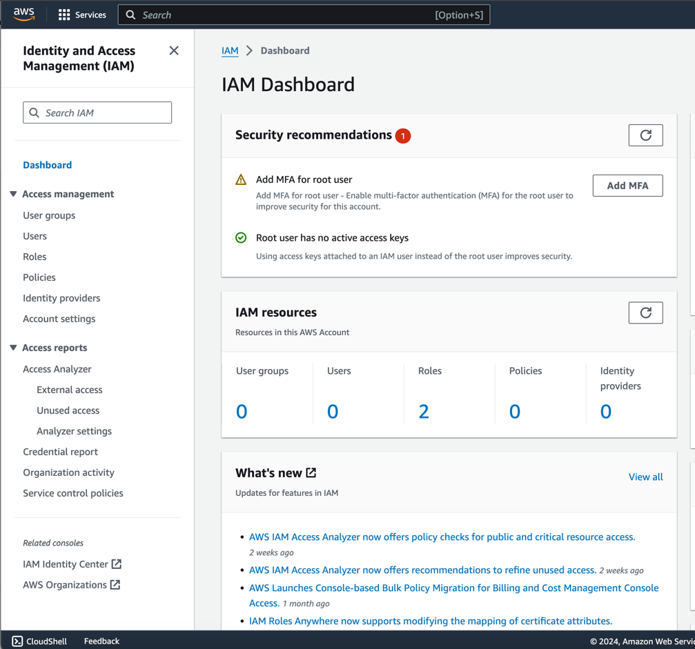

2. Click on `Users` in the left-hand menu and then click on `Add user`.

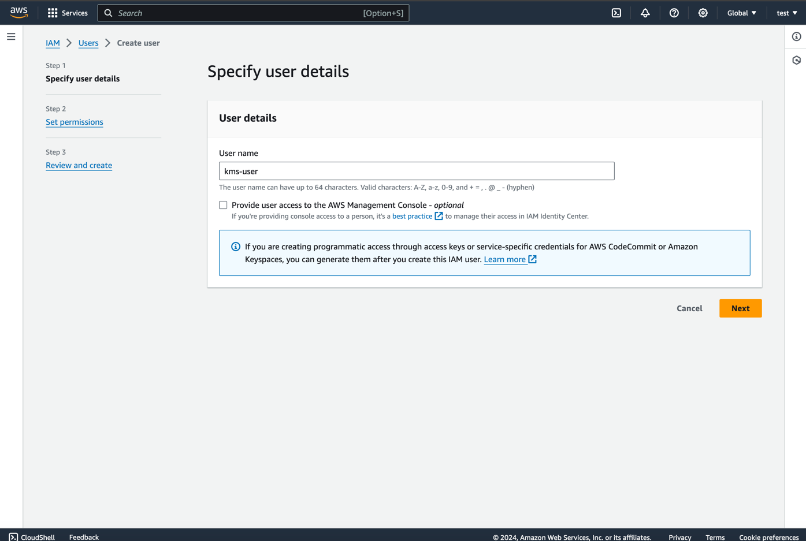

3. Leave Permissions empty and click `Next`

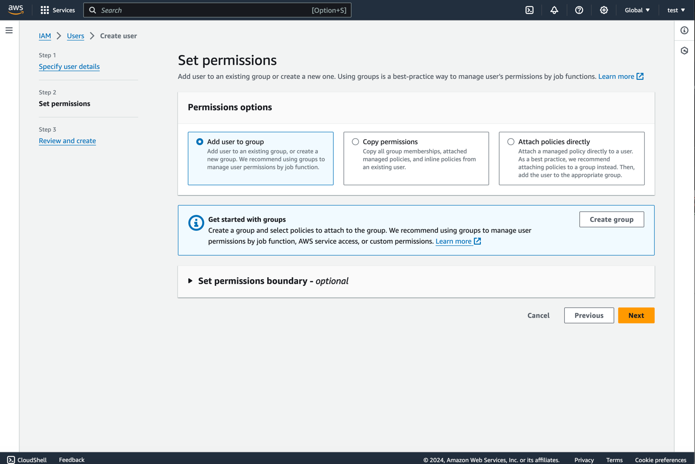

4. Add tags if you want and click `Create User`

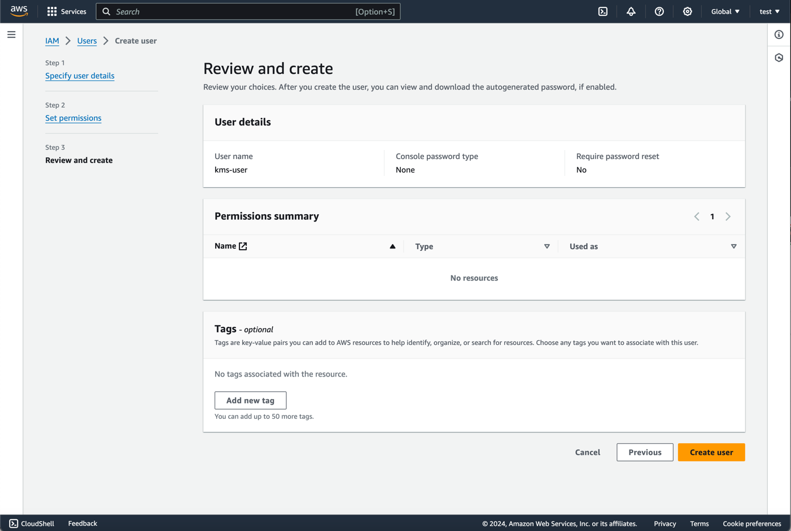

5. The user will be create and appear in the list of users. Click on the user to view the user details.

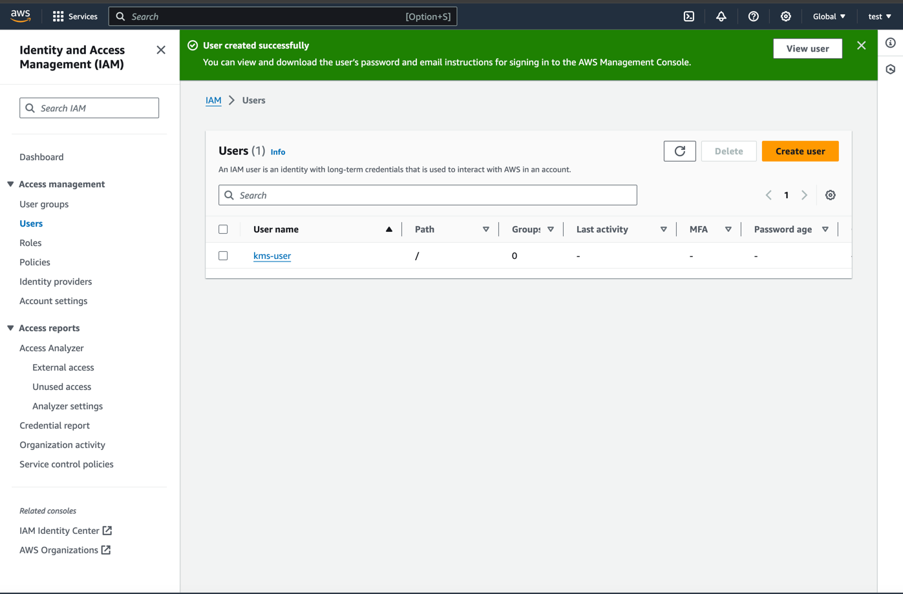

6. Click on 'Create access key'.

<details>
  <summary>Important Note</summary>
<p>
In the example above, we use access keys & secrets to authenticate the user. This is not recommended for production use. There are a lot of ways to authenticate users in AWS and the "Best Practices & alternatives" page below will tell you the best way to authenticate. Since we're only covering access key & secret, we'll ignore these other methods. The AWS documentation is very good and you can find more information on the best practices & alternatives [here](https://docs.aws.amazon.com/IAM/latest/UserGuide/best-practices.html).
</p>
</details>


7. Skip the description page

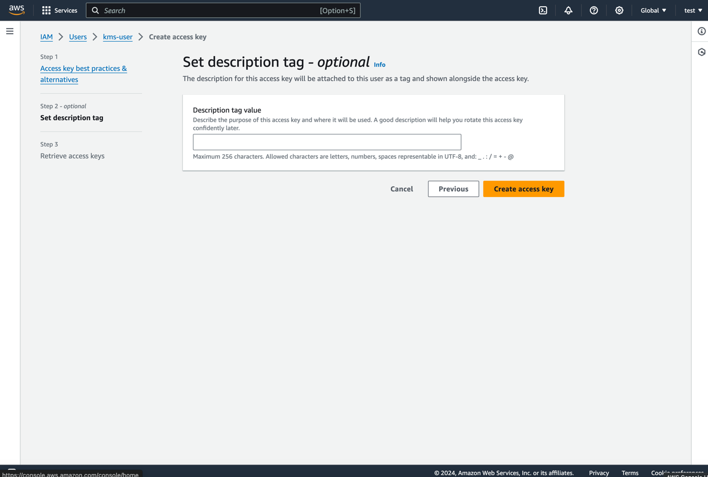

8. Click on `Create access key`

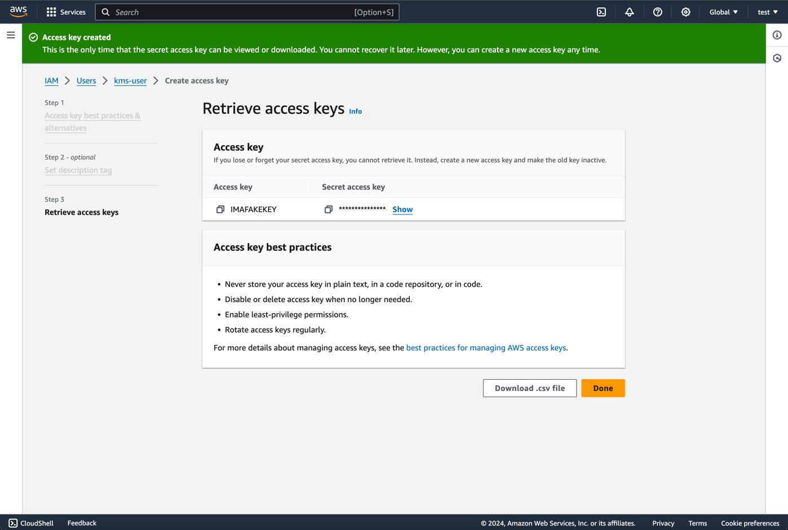

Note down the `Access key ID` and `Secret access key` as you will need these to configure the signer.

### Create a KMS Key
1. Sign in to the AWS Management Console and open the KMS console at https://console.aws.amazon.com/kms.

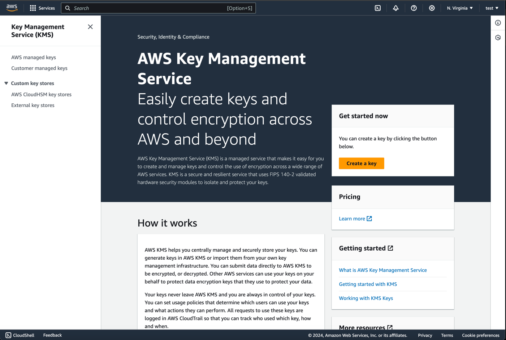

2. Choose `Create key` and fill in the following options:

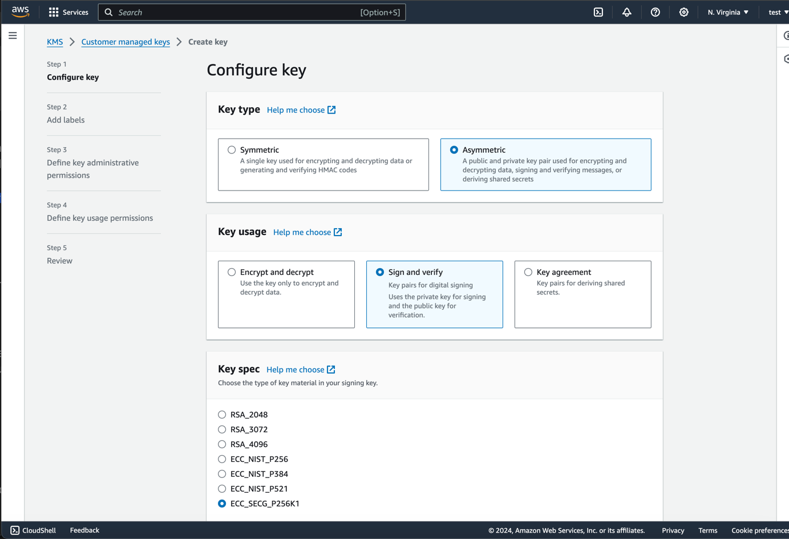

- Key Type: `Asymmetric`: Since ethereum uses [ECDSA](https://en.wikipedia.org/wiki/Elliptic_Curve_Digital_Signature_Algorithm) keys, we need to use an asymmetric key.
- Key Usage: `Sign and verify`: We will be using the key to sign transactions so we select this option.
- Key Spec: `ECC_SECG_P256K1`: Ethereum uses the [`secp256k1`](https://en.bitcoin.it/wiki/Secp256k1) curve for transacting keys.

Note: The advanced options are not required for this setup. You can leave them as default:

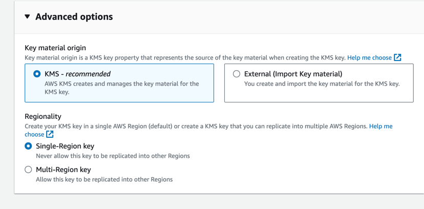

3. Choose `Next` and fill in the following options:

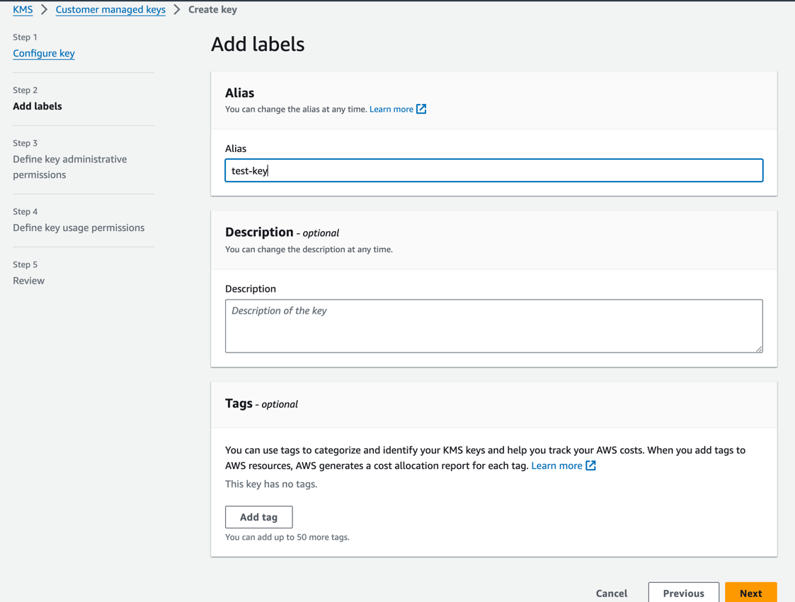

- Alias: This is an alias that will be used to reference the key in the signer. The field is required but the value doesn't matter.
- Description: This is a description that will be used to describe the key in the signer. This is only optional and only for your reference.
- Tags: These are tags that will be used to describe the key in the signer. These are optional and only for your reference.

4. Choose `Next` and define your key admin permissions. These are *not* required by the signer itself but are required to manage the key. You can use whatever you like here.

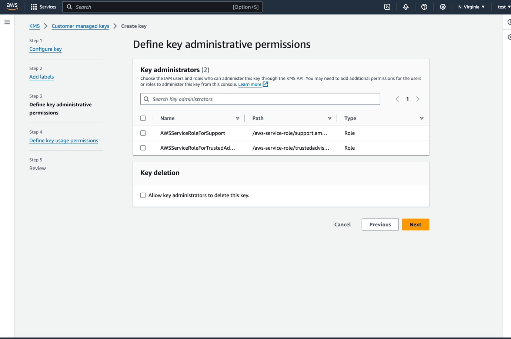

5. Choose `Next` and define your user permissions. Here you should set your user as a user.

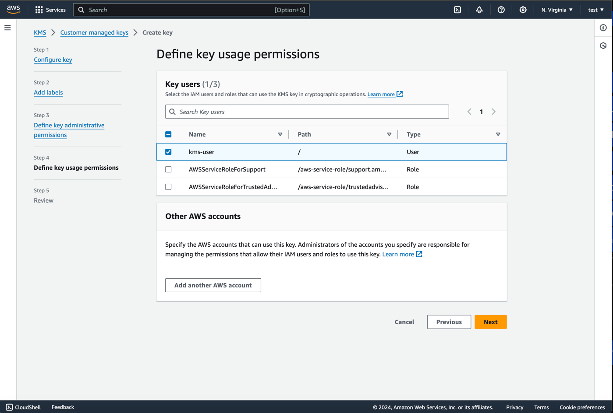

6. Choose `Next` and review your key settings. If everything looks good, choose `Finish`.

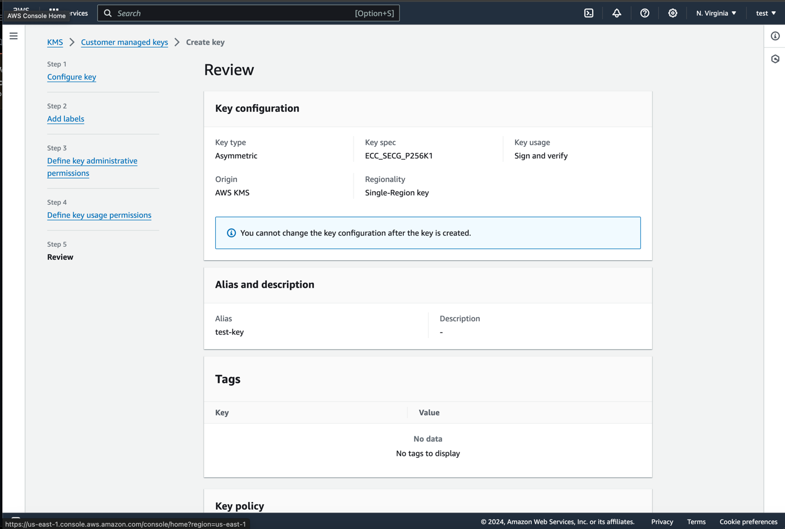

7. Your key will be created and you will be redirected to the key details page. Note down the `Key ID` as you will need this to configure the signer.

8. You will be redirected to the key details page. Click on the key alias to view the key details.

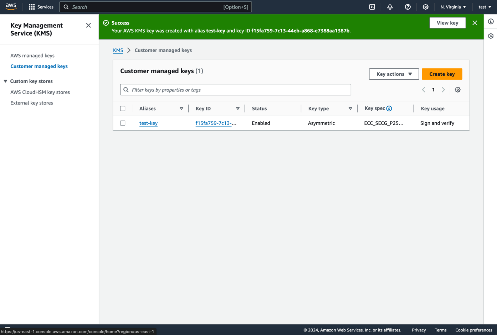

9. Using Your Key (AWS)

Now that you have your key and user setup, you can use the key to sign transactions. Since the `signerconfig` is used across multiple services, I'll be doing a generic example that just prints out the key.

Note: this is a very basic example and you should not use this in production. You should store your key in a secure location and use it securely.


`signer.yml`:
```yaml
signer_config:
  type: "aws"
  file: "/path/to/aws.yaml"
```

`aws.yaml`:
```yaml
region: "us-east-1" # should match the region of your key!
access_key: "YOUR_ACCESS_KEY"
access_secret: "YOUR_ACCESS_SECRET"
key_id: "f15fa759-7c13-44eb-a868-e7388aa1387b" # this will be the id from above.
```

This is obviously used in multiple services, so we've put together an example service that will print out the address of your key.

You can run this locally by running:

```bash
brew install go # if on mac
git clone https://github.com/synapsecns/sanguine --recurse-submodules
cd sanguine/ethergo/examples/signer
go run main.go --config=/path/to/signer.yml
```

We also have this available as a docker container for your convenience here:

`ghcr.io/synapsecns/sanguine/signer-example:latest`

## Setup with GCP CloudKMS

This section is still in progress, please see [here](https://pkg.go.dev/github.com/synapsecns/sanguine/ethergo@v0.9.0/signer/signer#section-readme) for details.

## Setup with a Local Signer

This section is still in progress, please see [here](https://pkg.go.dev/github.com/synapsecns/sanguine/ethergo@v0.9.0/signer/signer#section-readme) for details.
