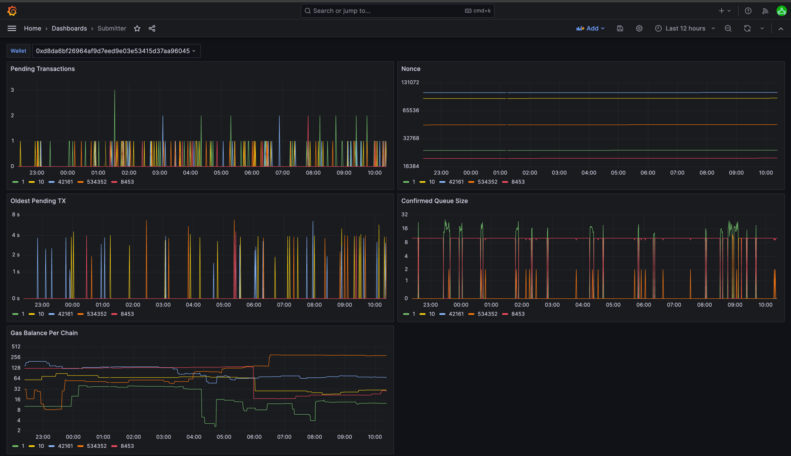

:::note In-progress

Please see the [Go Submitter documentation page](https://pkg.go.dev/github.com/synapsecns/sanguine/ethergo/submitter#section-readme) for more details.

:::

# Ethergo Submitter

## Overview

The Ethergo Submitter module is designed to submit transactions to an EVM-based blockchain. It handles gas bumping and confirmation checking to ensure that transactions are eventually confirmed. This module is essential because the EVM does not specify transaction submission or consensus, and rate limits can affect transaction submission.

## Key Features

The module is the `SubmitTransaction` method, which returns a nonce and ensures that the transaction will eventually be confirmed. The nonce may then be used in the `GetSubmissionStatus` method to check the status: `Pending`, `Stored`, `Submitted`, `FailedSubmit`, `ReplacedOrConfirmed`, `Replaced`, `Confirmed`. [More about the `Status` enum](#status-enum)

- **Gas Bumping**: Automatically adjusts the gas price to ensure timely transaction confirmation.
- **Confirmation Checking**: Continuously checks the status of submitted transactions to confirm their inclusion in the blockchain.
- **Reaper Functionality**: Flushes old entries in the database that have reached a terminal state.

### Reaper

The Submitter also has "reaper" functionality, which flushes old entries in the database that have reached a terminal state (`Replaced`, `ReplacedOrConfirmed`, `Confirmed`). By default, entries are flushed after a week, but this functionality is configurable by the `MaxRecordAge` config value.

### Submitter Config

Config contains configuration for the Submitter. It can be loaded from a YAML file.
Chain-specific configuration items can be provided via the `Chains` map, which overrides the global config
for each chain. If a chain-specific item is not provided, the global config is used.

#### Example config

```yaml
submitter_config:
  chains:
    1:
      # MaxBatchSize is the maximum number of transactions to send in a batch.
      # If this is zero, the default will be used.
      # This field is ignored if batching is disabled.
      max_batch_size: 50
      # Batch is whether or not to batch transactions at the rpc level.
      skip_batching: false
      # MaxGasPrice is the maximum gas price to use for transactions.
      max_gas_price: 200000000000 # 200 Gwei
      # MinGasPrice is the gas price that will be used if 0 is returned
      # from the gas price oracle.
      min_gas_price: 1000000000 # 1 Gwei
      # BumpIntervalSeconds is the number of seconds to
      # wait before bumping a transaction.
      bump_interval_seconds: 120
      # GasBumpPercentages is the percentage to bump the gas price by.
      # This is applied to the greater of the chainprice or the last price.
      gas_bump_percentage: 10
      # GasEstimate is the gas estimate to use for transactions if
      # dynamic gas estimation is enabled.
      # This is only used as a default if the estimate fails.
      gas_estimate: 1000000
      # DynamicGasEstimate is whether or not to use dynamic gas estimation.
      dynamic_gas_estimate: true
      # SupportsEIP1559 is whether or not this chain supports EIP1559.
      supports_eip_1559: true
    43114:
      max_gas_price: 100000000000 # 100 Gwei
    10:
      max_gas_price: 90000000000 # 90 Gwei
      min_gas_price: 100000000 # 0.1 Gwei
  # ReaperInterval is the interval at which scan for transactions to flush
  reaper_interval: 604800000000000 # int64(7 * 24 * time.Hour)
  # MaxRecordAge is the maximum age of a record before it is flushed
  max_record_age: 86400000000000 # int64(1 * 24 * time.Hour)
```

Please see [here](https://pkg.go.dev/github.com/synapsecns/sanguine/ethergo@v0.9.0/submitter/config) for details on the configuration.

## Overview

`SubmitTransaction` abstracts many of the complexities of on-chain transaction submission such as nonce management and gas bumping. In addition, sent transactions are stored in the database for easy indexing of older transactions.

## How to Use a Service with Submitter

Suppose you want to run our interchain Executor, which, from a high-level, listens for an event on a certain chain and calls a function on a smart contract deployed on another remote chain, namely the `Execute()` function. This is an event-driven architecture, which Submitter thrives in.

The Executor naturally uses the Submitter because we want to asynchronously listen for events, process them, and fire off the respective transaction since many of the triggering events can happen simultaneously.

You will need a couple things in order to use the Transaction submitter that signs with your own private key, config values, and more.

Firstly, you will create a signer. For this example, our signer will just be a text file `signer.txt` with a private key. You may also use GCP or the other supported signer types (link here).

```yaml
# signer.txt
55a4bb8f1bdaec6a8b7a9aa45824f91a96200dc316297eb82ad19e3d035ee5af
```

Secondly, you want to create a `config.yml` that matches the config of the respective service you want. If the service uses a submitter, it will for sure have the `submitter_config` below.

```yaml
# config.yml
submitter_config:
  chains:
    1:
      supports_eip_1559: true
      gas_estimate: 1000000
    10:
      gas_estimate: 5000000
      max_gas_price: 200000000000
      supports_eip_1559: true
```

For chain ID 1 (mainnet) and chain ID 10 (Optimism), the transactions will use these configs.

Finally, run the service and pass in `config.yml` like so: `<service_name> --config=config.yml`

You will then have successfully created the service that uses the submitter and able to send multi/interchain transactions!

## Nonce Management, Database, Internals

### Nonce Management and Multichain

Submitter was designed with multiple chains in mind by keeping track of a thread-safe `map[chainid]nonce`. When we build the transaction opts, we lock on the chainid until we finish firing off the transaction.
We also keep a `map[txHash]txStatus` with the same thread-safe mechanism.
This allows us to concurrently fire off transactions on different chains while ensuring our nonces are correct.
The [Queue](https://github.com/synapsecns/sanguine/blob/ethergo/v0.9.0/ethergo/submitter/chain_queue.go) has a selector loop running at all times which calls the `processQueue` method, concurrently processing and storing confirmed txs, or using the [chain queue](https://github.com/synapsecns/sanguine/blob/ethergo/v0.9.0/ethergo/submitter/chain_queue.go) to fire off and store pending txs on chain.

### DB Configurability

#### Customizing DB Behavior

The Chain Queue db interface, [Service](https://github.com/synapsecns/sanguine/blob/ethergo/v0.9.0/ethergo/submitter/db/service.go), allows a user to customize their Transaction DB behavior. The concrete implementation is in [store.go](https://github.com/synapsecns/sanguine/blob/ethergo/v0.9.0/ethergo/submitter/db/txdb/store.go).

#### Transaction DB Schema

The schema for a transaction to be stored in the Transaction DB is:

```go title="submitter/db/txdb/model.go"
// ETHTX contains a raw evm transaction that is unsigned.
type ETHTX struct {
  ID uint64 `gorm:"column:id;primaryKey;autoIncrement:true"`
  // UUID is a unique ID for this transaction that will persist across retries.
  UUID string `gorm:"column:uuid;index"`
  // CreatedAt is the time the transaction was created
  CreatedAt time.Time
  // TXHash is the hash of the transaction
  TXHash string `gorm:"column:tx_hash;uniqueIndex;size:256"`
  // From is the sender of the transaction
  From string `gorm:"column:from;index"`
  // ChainID is the chain id the transaction hash will be sent on
  ChainID uint64 `gorm:"column:chain_id;index"`
  // Nonce is the nonce of the raw evm tx
  Nonce uint64 `gorm:"column:nonce;index"`
  // RawTx is the raw serialized transaction
  RawTx []byte `gorm:"column:raw_tx"`
  // Status is the status of the transaction
  Status db.Status `gorm:"column:status;index"`
}
```

Using [GORM.db](https://pkg.go.dev/gorm.io/gorm), you can use whatever database you'd like, MySQL, Sqlite, etc.

#### MySQL Example

```go
gdb, err := gorm.Open(mysql.Open(dbURL), &gorm.Config{
    Logger:               common_base.GetGormLogger(logger),
    FullSaveAssociations: true,
    NamingStrategy:       NamingStrategy,
    NowFunc:              time.Now,
})
```

### Status Enum

In the DB, `Status`, is an enum, represented as a uint8. It is important to know what number indicates which status.

```go title="submitter/db/service.go"
type Status uint8

// Important: do not modify the order of these constants.
// if one needs to be removed, replace it with a no-op status.
// additionally, due to the GetMaxNoncestatus function, statuses are currently assumed to be in order.
// if you need to modify this functionality, please update that function. to reflect that the highest status
// is no longer the expected end status.
const (
	// Pending is the status of a tx that has not been processed yet.
	Pending Status = iota + 1 // Pending
	// Stored is the status of a tx that has been stored.
	Stored // Stored
	// Submitted is the status of a tx that has been submitted.
	Submitted // Submitted
	// FailedSubmit is the status of a tx that has failed to submit.
	FailedSubmit // Failed
	// ReplacedOrConfirmed is the status of a tx that has been replaced by a new tx or confirmed. The actual status will be set later.
	ReplacedOrConfirmed // ReplacedOrConfirmed
	// Replaced is the status of a tx that has been replaced by a new tx.
	Replaced // Replaced
	// Confirmed is the status of a tx that has been confirmed.
	Confirmed // Confirmed
)
```

## Observability

Submitter exposes metrics for Prometheus. The metrics are:

- `num_pending_txs`: The number of pending transactions.
- `current_nonce`: The current nonce.
- `oldest_pending_tx`: The age of the oldest pending transaction.
- `confirmed_queue`: The number of confirmed transactions.
- `gas_balance`: The current gas balance.

The metrics can be used in a dashboard [here](https://raw.githubusercontent.com/synapsecns/sanguine/master/ethergo/dashboard.json). It looks like this:


