# Submitter

This section is still in progress, please see [here](https://pkg.go.dev/github.com/synapsecns/sanguine/ethergo/submitter#section-readme) for details.

# Ethergo Submitter

## Overview

The Ethergo Submitter module is designed to submit transactions to an EVM-based blockchain. It handles gas bumping and confirmation checking to ensure that transactions are eventually confirmed. This module is essential because the EVM does not specify transaction submission or consensus, and rate limits can affect transaction submission.



## Key Features

The module is the `SubmitTransaction` method, which returns a nonce and ensures that the transaction will eventually be confirmed. The nonce may then be used in the `GetSubmissionStatus` method to check the state: `Pending`, `Stored`, `Submitted`, `FailedSubmit`, `ReplacedOrConfirmed`, `Replaced`, `Confirmed`.

- **Gas Bumping**: Automatically adjusts the gas price to ensure timely transaction confirmation.
- **Confirmation Checking**: Continuously checks the status of submitted transactions to confirm their inclusion in the blockchain.
- **Reaper Functionality**: Flushes old entries in the database that have reached a terminal state.

### Reaper

The Submitter also has "reaper" functionality, which flushes old entries in the database that have reached a terminal state (`Replaced`, `ReplacedOrConfirmed`, `Confirmed`). By default, entries are flushed after a week, but this functionality is configurable by the `MaxRecordAge` config value.

### Submitter Config

Config contains configuration for the Submitter. It can be loaded from a YAML file.
Chain-specific configuration items can be provided via the `Chains` map, which overrides the global config
for each chain. If a chain-specific item is not provided, the global config is used.

#### Example config

```yaml
submitter_config:
  chains:
    1:
      supports_eip_1559: true
      gas_estimate: 1000000
    42161:
      gas_estimate: 30000000
      max_gas_price: 10000000000
      supports_eip_1559: true
    534352:
      gas_estimate: 600000
      max_gas_price: 30000000000
      gas_bump_percentage: 20
  reaper_interval: 604800000000000 # int64(7 * 24 * time.Hour)
  max_record_age: 86400000000000 # int64(1 * 24 * time.Hour)
```

Please see [here](https://pkg.go.dev/github.com/synapsecns/sanguine/ethergo@v0.9.0/submitter/config) for details on the configuration.

### Overview

`SubmitTransaction` abstracts many of the complexities of on-chain transaction submission such as nonce management and gas bumping. In addition, sent transactions are stored in the database for easy indexing of older transactions.

#### Example of SubmitTransaction

Below is an example of how to submit a transaction using Submitter. Note that the actual transaction submission logic takes place in the callback. We use an abigen binding here to send the transaction (`ReceiveMessage`), but any way to send a transaction also works, like our [Ethergo/EVM client](https://pkg.go.dev/github.com/synapsecns/sanguine/ethergo@v0.9.0/client) or geth's `ethclient`.

```go
nonce, err := c.txSubmitter.SubmitTransaction(
  ctx,
  big.NewInt(int64(msg.DestChainID)),
  func(transactor *bind.TransactOpts) (tx *types.Transaction, err error) {
	tx, err = contract.ReceiveMessage(
            transactor,
            msg.Message,
            msg.Attestation,
            )
	if err != nil {
		return nil, fmt.Errorf("could not submit transaction: %w", err)
	}

	return tx, nil
  },
)
```

### Architecture, Nonce Management, Database, Internals

#### Architecture: Submitter, Chain Queue, Queue

#### Nonce Management and Multichain

Submitter was designed with multiple chains in mind by keeping track of a thread-safe `map[chainid]nonce`. When we build the transaction opts, we lock on the chainid until we finish firing off the transaction.
We also keep a txHash -> txStatus map with a similar, thread-safe mechanism.

This allows us to concurrently fire off transactions on different chains while ensuring our nonces are correct. The [Chain Queue](https://github.com/synapsecns/sanguine/blob/ethergo/v0.9.0/ethergo/submitter/chain_queue.go) is the actual implementation of the queue, while The [Queue](https://github.com/synapsecns/sanguine/blob/ethergo/v0.9.0/ethergo/submitter/chain_queue.go) actually handles the overall processing of the queue in the `processQueue` method.

#### Service

The Chain Queue db interface, [Service](https://github.com/synapsecns/sanguine/blob/ethergo/v0.9.0/ethergo/submitter/db/service.go), allows a user to customize their transaction db behavior. The base implementation is in [store.go](https://github.com/synapsecns/sanguine/blob/ethergo/v0.9.0/ethergo/submitter/db/txdb/store.go).

#### Database

When sending transactions, we are able to check on the status of them after we fire them off. The schema for a transaction is

```go
// ETHTX contains a raw evm transaction that is unsigned.
type ETHTX struct {
  ID uint64 `gorm:"column:id;primaryKey;autoIncrement:true"`
  // UUID is a unique ID for this transaction that will persist across retries.
  UUID string `gorm:"column:uuid;index"`
  // CreatedAt is the time the transaction was created
  CreatedAt time.Time
  // TXHash is the hash of the transaction
  TXHash string `gorm:"column:tx_hash;uniqueIndex;size:256"`
  // From is the sender of the transaction
  From string `gorm:"column:from;index"`
  // ChainID is the chain id the transaction hash will be sent on
  ChainID uint64 `gorm:"column:chain_id;index"`
  // Nonce is the nonce of the raw evm tx
  Nonce uint64 `gorm:"column:nonce;index"`
  // RawTx is the raw serialized transaction
  RawTx []byte `gorm:"column:raw_tx"`
  // Status is the status of the transaction
  Status db.Status `gorm:"column:status;index"`
}
```

### Observability

Submitter exposes metrics for Prometheus. The metrics are:

- `num_pending_txs`: The number of pending transactions.
- `current_nonce`: The current nonce.
- `oldest_pending_tx`: The age of the oldest pending transaction.
- `confirmed_queue`: The number of confirmed transactions.
- `gas_balance`: The current gas balance.

The metrics can be used in a dashboard [here](https://raw.githubusercontent.com/synapsecns/sanguine/master/ethergo/dashboard.json). It looks like this:


