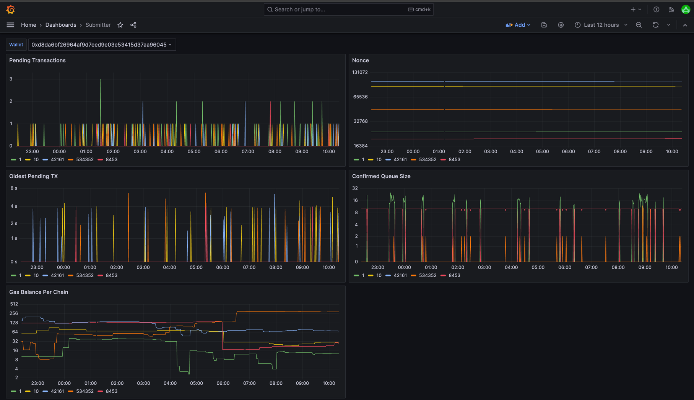

# Submitter

This section is still in progress, please see [here](https://pkg.go.dev/github.com/synapsecns/sanguine/ethergo/submitter#section-readme) for details.

# Ethergo Submitter

## Overview

The Ethergo Submitter module is designed to submit transactions to an EVM-based blockchain. It handles gas bumping and confirmation checking to ensure that transactions are eventually confirmed. This module is essential because the EVM does not specify transaction submission or consensus, and rate limits can affect transaction submission.

## Key Features

- **Transaction Submission**: The main function of the module is the `SubmitTransaction` method, which returns a nonce and ensures that the transaction will eventually be confirmed.
- **Gas Bumping**: Automatically adjusts the gas price to ensure timely transaction confirmation.
- **Confirmation Checking**: Continuously checks the status of submitted transactions to confirm their inclusion in the blockchain.
- **Reaper Functionality**: Flushes old entries in the database that have reached a terminal state.

### Reaper

The submitter also has "reaper" functionality, which flushes old entries in the database that have reached a terminal state (`Replaced`, `ReplacedOrConfirmed`, `Confirmed`). By default, entries are flushed after a week, but this functionality is configurable by the `MaxRecordAge` config value.

### Submitter Config

This section is still in progress, please see [here](https://pkg.go.dev/github.com/synapsecns/sanguine/ethergo@v0.9.0/submitter/config) for details.

### Observability

Submitter exposes metrics for Prometheus. The metrics are:

 - `num_pending_txs`: The number of pending transactions.
 - `current_nonce`: The current nonce.
 - `oldest_pending_tx`: The age of the oldest pending transaction.
 - `confirmed_queue`: The number of confirmed transactions.
 - `gas_balance`: The current gas balance.

The metrics can be used in a dashboard [here](https://raw.githubusercontent.com/synapsecns/sanguine/master/ethergo/dashboard.json). It looks like this:

