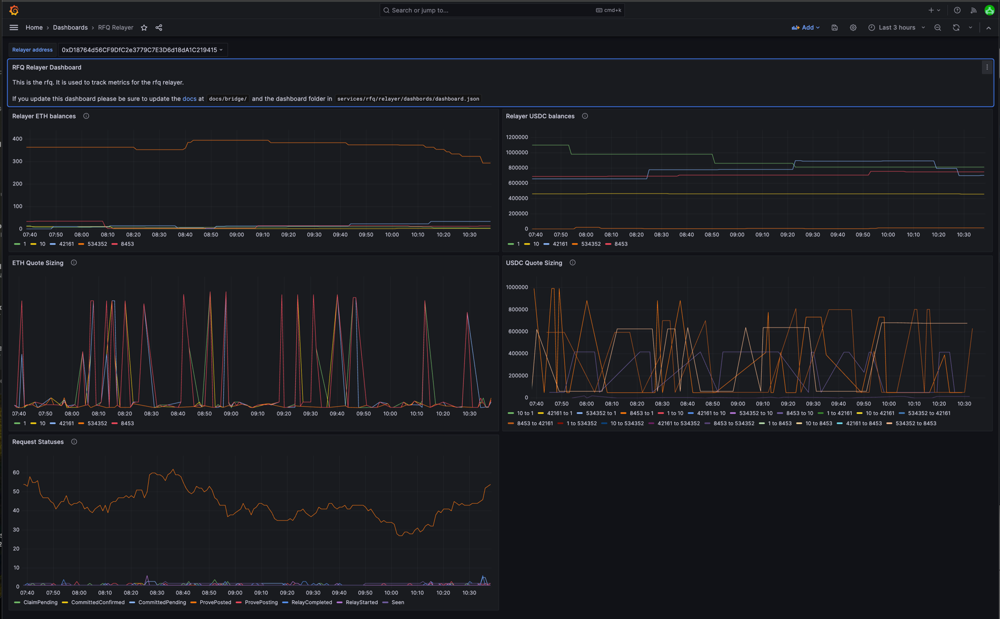

At a high level, the canonical implementation of the relayer has 3 different responsibilities.

- **Quoting** - Keep track of balances on each chain as well as in-flight funds and continuously post-quotes with these balances using the config to adjust quotes to the solvers specifications and posting to the API.
- **Relaying -** Fulfill users [BridgeRequests](https://vercel-rfq-docs.vercel.app/contracts/interfaces/IFastBridge.sol/interface.IFastBridge.html#bridgerequested) by relaying their funds on-chain. Once eligible, claim the users funds on the origin chain.
- **Rebalancing -** In order to handle the complexity of user flows, the Relayer provides an interface that allows funds to be rebalanced. This allows RFQ to be reflexive to cases where flows are mono-directional.

## Architecture

The relayer is a Golang application that polls for events on chain and uses a combo state (db status) and event (on-chain logs) driven architecture to process transactions. The relayer has 3 different event loops going at any given time, specified above and elaborated on below:

### Quoting
The quoting loop is comparitively simple and updates the api on each route it supports. Quotes are posted using the following formula:

 - **Do not quote above available balance**: Available balance is determined by `balance on chain - in-flight funds`. If the token is the gas token, then the minimum gas token amount is subtracted. The relayer will also not post quotes below the `min_quote_amount` specified in the config.
 - **Quote offset**: The quote offset is a percentage of the price of the token. This is used to ensure that the relayer is profitable. The quote offset is added to the price of the token to determine the quote price.
 - **Fee**: The fee is determined by the `fixed_fee_multiplier` in the config. This is multiplied by the `origin_gas_estimate`  and `destination_gas_estimate` to determine the fee. This fee is added to the quote price.

### Rebalancing

The rebalancing loop is more complex and is responsible for ensuring that the relayer has enough liquidity on each chain. Right now only the CCTP rebalancer is supported and works like this:

1. At `rebalance_interval`, check the `maintenance_balance_pct` of each token on each chain and compare it to the current balance. If the balance is below the `maintenance_balance_pct`, continue
2. Calculate the amount to rebalance by taking the difference between the maintenance balance and the current balance and multiplying it by the `initial_balance_pct`.
3. If the amount to rebalance is greater than the `max_rebalance_amount`, set the amount to rebalance to the `max_rebalance_amount`. If the amount to rebalance is less than the `min_rebalance_amount`, do not rebalance.
4. Repeat after `rebalance_interval`

### Relaying

The relaying loop is the most complex and is responsible for relaying funds on-chain. The relayer listens to events on-chain and status updates in the database to take move transactions through the states. The states are as follows:

1. An on-chain transaction emits the event [`BridgeRequested`](https://vercel-rfq-docs.vercel.app/contracts/interfaces/IFastBridge.sol/interface.IFastBridge.html#bridgerequested). We store this event in the db with the status [`Seen`](https://pkg.go.dev/github.com/synapsecns/sanguine/services/rfq/relayer/reldb#Seen).
1. Check if the request is valid, If not, it is marked as [`WillNotProcess`](https://pkg.go.dev/github.com/synapsecns/sanguine/services/rfq/relayer/reldb#WillNotProcess)
1. Check if there's enough inventory, if not mark as [`NotEnoughInventory`](https://pkg.go.dev/github.com/synapsecns/sanguine/services/rfq/relayer/reldb#NotEnoughInventory) and try again later.
1. If these checks pass, it's stored as [`CommittedPending`](https://pkg.go.dev/github.com/synapsecns/sanguine/services/rfq/relayer/reldb#CommittedPending). This will automatically reduce the next quote amount posted to the api since the relayers liquidity has been committed.
1. Check the chain to see if transaction is finalized yet, if not wait until it is.
1. Once the transaction is finalized on chain, update the status to [`CommitedConfirmed`](https://pkg.go.dev/github.com/synapsecns/sanguine/services/rfq/relayer/reldb#CommitedConfirmed). This means the transaction is finalized on chain and we can now relay it to the destination chain.
1. Call [`relay`](https://vercel-rfq-docs.vercel.app/contracts/FastBridge.sol/contract.FastBridge.html#relay) on the contract to relay the transaction and update the status to  [`RelayPending`](https://pkg.go.dev/github.com/synapsecns/sanguine/services/rfq/relayer/reldb#RelayPending)
1. Listen for the relay in the logs. Once we get it we mark the transaction as [`RelayComplete`](https://pkg.go.dev/github.com/synapsecns/sanguine/services/rfq/relayer/reldb#RelayComplete)
1. Call [`Prove()`](https://vercel-rfq-docs.vercel.app/contracts/FastBridge.sol/contract.FastBridge.html#prove) on the contract to prove that we relayed the transaction. Once this is done, we mark the transaction as [`ProvePosting`](https://pkg.go.dev/github.com/synapsecns/sanguine/services/rfq/relayer/reldb#ProvePosting)
1. Wait for the dispute period to expire. Once it does call [`claim`](https://vercel-rfq-docs.vercel.app/contracts/FastBridge.sol/contract.FastBridge.html#claim) mark the transaction as [`ClaimPending`](https://pkg.go.dev/github.com/synapsecns/sanguine/services/rfq/relayer/reldb#ClaimPending)
1. Wait for the dispute period to expire. Once it does mark the transaction as [`ClaimComplete`](https://pkg.go.dev/github.com/synapsecns/sanguine/services/rfq/relayer/reldb#ClaimComplete)

## Running a Relayer

### Building From Source

To build the relayer from source, you will need to have Go installed. You can install Go by following the instructions [here](https://golang.org/doc/install). Once you have Go installed, you can build the relayer by running the following commands:

1. `git clone https://github.com/synapsecns/sanguine --recursive`
2. `cd sanguine/services/rfq/relayer`
3. `go run main.go --config /path/to/config.yaml`

### Running the Docker Image

The relayer can also be run with docker. To do this, you will need to pull the [docker image](https://github.com/synapsecns/sanguine/pkgs/container/sanguine%2Frfq-relayer) and run it with the config file:

```bash
docker run ghcr.io/synapsecns/sanguine/rfq-relayer:latest --config /path/to/config
```

### Withdrawals

The `POST /withdraw` endpoint is exposed to allow for withdrawing from the relayer wallet without having to deal with the private key directly. This can be used for manual rebalancing, if desired. To use this feature, the following config values must be set:

```yaml
enable_api_withdrawals: true
withdrawal_whitelist:
  - <your_address_here>
```

The relayer CLI (at `services/rfq/relayer/main.go`) exposes a withdrawal command for convenience:

```bash
go run main.go withdraw --relayer-url https://localhost:8081 --chain-id 1 --amount 1000000000000000000 --token-address 0xEeeeeEeeeEeEeeEeEeEeeEEEeeeeEeeeeeeeEEeE --to 0x0000000000000000000000000000000000000000
```

Be sure to sub in your respective `to` address!

### Configuration

The relayer is configured with a yaml file. The following is an example configuration:

<details>
  <summary> example config</summary>
  ```yaml
  submitter_config: # please see the more detailed submitter documentation
    chains:
      1:
        supports_eip_1559: true
        gas_estimate: 1000000
  database:
    type: sqlite # can be other mysql or sqlite
    dsn: /tmp/db # should be the dsn of your database. If using sqlite, this can be a path

  signer: # please see more detailed signer config  #can be text, gcp, or aws
    type: GCP
    file: /config/signer.txt

  screener_api_url: 'http://screener-url' # can be left blank
  rfq_url: 'http://rfq-api' # url of the rfq api backend.
  omnirpc_url: 'http://omnirpc' # url of the omnirpc instance
  rebalance_interval: 2m # how often to rebalance
  relayer_api_port: '8081' # api port for the relayer api

  base_chain_config: # this is hte base chain config, other chains override it
    confirmations: 0
    # Claim (72.5k) + Prove (57.5k) gas limits, rounded up
    origin_gas_estimate: 130_000
    # Relay gas limit, rounded up
    dest_gas_estimate: 110_000
    quote_offset_bps: 2
    native_token: ETH
    quote_pct: 90
    min_gas_token: 1000000000000000000
    fixed_fee_multiplier: 1.25

  chains:
    1:
      rfq_address: "0x5523D3c98809DdDB82C686E152F5C58B1B0fB59E" # rfq contract address on eth
      synapse_cctp_address: "0x12715a66773BD9C54534a01aBF01d05F6B4Bd35E" # ccctp contract address on eth
      token_messenger_address: "0xbd3fa81b58ba92a82136038b25adec7066af3155" # token messenger address on eth, note: only one of token_messenger_address or synapse_cctp_address actually needs to be present
      cctp_start_block: 19341000
      confirmations: 2
      tokens:
        USDC:
          address: "0xa0b86991c6218b36c1d19d4a2e9eb0ce3606eb48"
          decimals: 6
          price_usd: 1.0
          min_quote_amount: 10000
          rebalance_method: "circlecctp"
          maintenance_balance_pct: 20
          initial_balance_pct: 50
          max_rebalance_amount: 500000
        ETH:
          address: "0xEeeeeEeeeEeEeeEeEeEeeEEEeeeeEeeeeeeeEEeE"
          decimals: 18
          price_usd: 2600
    10:
      rfq_address: "0x5523D3c98809DdDB82C686E152F5C58B1B0fB59E"
      synapse_cctp_address: "0x12715a66773BD9C54534a01aBF01d05F6B4Bd35E"
      token_messenger_address: "0x2B4069517957735bE00ceE0fadAE88a26365528f"
      cctp_start_block: 116855000
      l1_fee_chain_id: 1
      # Prove + Claim L1 gas estimate
      l1_fee_origin_gas_estimate: 20
      # Relay L1 gas estimate
      l1_fee_dest_gas_estimate: 10
      tokens:
        USDC:
          address: "0x0b2c639c533813f4aa9d7837caf62653d097ff85"
          decimals: 6
          price_usd: 1.0
          min_quote_amount: 10000
          rebalance_method: "circlecctp"
          maintenance_balance_pct: 20
          initial_balance_pct: 50
          max_rebalance_amount: 500000
        ETH:
          address: "0xEeeeeEeeeEeEeeEeEeEeeEEEeeeeEeeeeeeeEEeE"
          decimals: 18
          price_usd: 2600

  quotable_tokens:
    10-0x0b2c639c533813f4aa9d7837caf62653d097ff85:
      - "1-0xa0b86991c6218b36c1d19d4a2e9eb0ce3606eb48"
    1-0xa0b86991c6218b36c1d19d4a2e9eb0ce3606eb48:
      - "10-0x0b2c639c533813f4aa9d7837caf62653d097ff85"
    1-0xEeeeeEeeeEeEeeEeEeEeeEEEeeeeEeeeeeeeEEeE:
      - "10-0xEeeeeEeeeEeEeeEeEeEeeEEEeeeeEeeeeeeeEEeE"
    10-0xEeeeeEeeeEeEeeEeEeEeeEEEeeeeEeeeeeeeEEeE:
      - "1-0xEeeeeEeeeEeEeeEeEeEeeEEEeeeeEeeeeeeeEEeE"

  fee_pricer:
    gas_price_cache_ttl: 60
    token_price_cache_ttl: 60

  cctp_relayer_config:
    cctp_type: "circle"
    circle_api_url: "https://iris-api.circle.com/v1/attestations"
    chains:
      - chain_id: 1
        synapse_cctp_address: "0x12715a66773BD9C54534a01aBF01d05F6B4Bd35E"
        token_messenger_address: "0xbd3fa81b58ba92a82136038b25adec7066af3155"
      - chain_id: 10
        synapse_cctp_address: "0x12715a66773BD9C54534a01aBF01d05F6B4Bd35E"
        token_messenger_address: "0x2B4069517957735bE00ceE0fadAE88a26365528f"
    base_omnirpc_url: "http://omnirpc"
    unbonded_signer:
      type: GCP
      file: /config/signer.txt
    http_backoff_initial_interval_ms: 1000
    http_backoff_max_elapsed_time_ms: 300000
  ```
</details>

<!-- TODO: this should work the same way as the openapi doc gen where its autogenerated from code and  amix-in  -->

 - `submitter_config`  - This is covered [here](../../Services/Submitter#Observability). At a high level this controls gas parameters used for on-chain transactions.
 - `database` - The database settings for the API backend. A database is required to store quotes and other information. Using SQLite with a dsn set to a `/tmp/` directory is recommended for development.
   -  `type` - the database driver to use, can be `mysql` or `sqlite`.
   -  `dsn` - the dsn of your database. If using sqlite, this can be a path, if using mysql please see [here](https://dev.mysql.com/doc/connector-odbc/en/connector-odbc-configuration.html) for more information.
 - `screener_api_url` (optional) -  Please see [here](https://github.com/synapsecns/sanguine/tree/master/contrib/screener-api#screening-api) for an api spec, this is used descision on wether to bridge to given addresses.
 - `rfq_url` - URL of the rfq api, please see the [API](../API#api-urls) page for details and the mainnet/testnet urls.
 - `omnirpc_url` - URL of omnirpc to use, Please see [here](../../Services/Omnirpc) for details on running an omnirpc instance.
 - `rebalance_interval` - How often to rebalance, formatted as (s = seconds, m = minutes, h = hours)
 - `relayer_api_port` - the relayer api is used to control the relayer. <!--TODO: more info here--> This api should be secured/not public.
 - `base_chain_config`: Base chain config is the default config applied for each chain if the other chains do not override it. This is covered in the chains section.
 - `enable_guard`  - Run a guard on the same instance.
 - `submit_single_quotes` - Wether to use the batch endpoint for posting quotes to the api. This can be useful for debugging.
 - `chains` - each chain has a different config that overrides base_chain_config. Here are the parameters for each chain
  - `rfq_address` - the address of the rfq contract on this chain. These addresses are available [here](../Contracts.md).

  - `synapse_cctp_address` (optional) - this is only applicable if **rebalance_method** is set to synapse. This is the address of the CCTP contract available [here](../../CCTP/Contracts).
  - `token_messenger_address` (optional) -  this is only applicable if **rebalance_method** is set to cctp. Tells the relayer to use the token messenger instead of synapse.
      <aside>
      💡 The choice of wether to use synapse cctp or the circle token messenger is up to the user. Synapse will take a fee but unlike the token messenger, will not spend any of the users gas.
      </aside>
  - `confirmations` - how many confirmations to wait before acting on an event. This will vary per-chain.
  - `tokens` - this is a map of token symbol→token info for this chain. For example, token may be USDC, ETH, etc
    - `address` - address of the token on this chain id
    - `decimals` - number of decimals this token uses. Please verify this against the token contract itself.
    - `min_quote_amount` - smallest amount to quote for a given chain. This should be balanced against expected gas spend for a relayer to be profitable. `min_quote_amount` is to be given in decimal units (so 1000.00 is 1000)
    - `rebalance_method` - rebalance method for this particular kind of token. Some tokens may not have a rebalance method. This is either cctp or token messenger.
    - `maintenance_balance_pct` - percent of liquidity that should be maintained on the given chain for this token. If the balance is under this amount a rebalance is triggered.
    - `initial_balance_pct` - percent of liquidity to maintain after a rebalance. The total of these on all-chains should be 100.
    - `min_rebalance_amount` - amount of this token to try to rebalance
    - `max_rebalance_amount` - maximum amount of this token to try to rebalance at once
  - `quotable_tokens`:
- `quotable_tokens`: - list of [chain-id]_[token_address]:  [chain-id]_[token_address]. For example 1-0x00…. could be paired with 10-0x01
    ```yaml
    "1-0x00":
    	- "1-0x01"
    ```
- `cctp_relayer_config`: See the [CCTP page](../../CCTP/Relayer)

### Observability

The RFQ relayer implements open telemetry for both tracing and metrics. Please see the [Observability](../../Observability) page for more info. There is also a custom [grafana dashboard](https://github.com/synapsecns/sanguine/tree/master/services/rfq/relayer/dashboards/dashboard.json) available for the relayer. We'd also highly recommend setting up the [submitter dashboard](../../Services/Submitter) as well.



The metrics exposed by the relayer are:

- `inventory_balance`: The balance of the inventory on the chain for a given `token_name` and `relayer`.
- `quote_amount`: The amount quoted for a given `token_name` and `relayer`.
- `status_count`: The distribution of non-terminal `QuoteRequestStatus` values over time.
