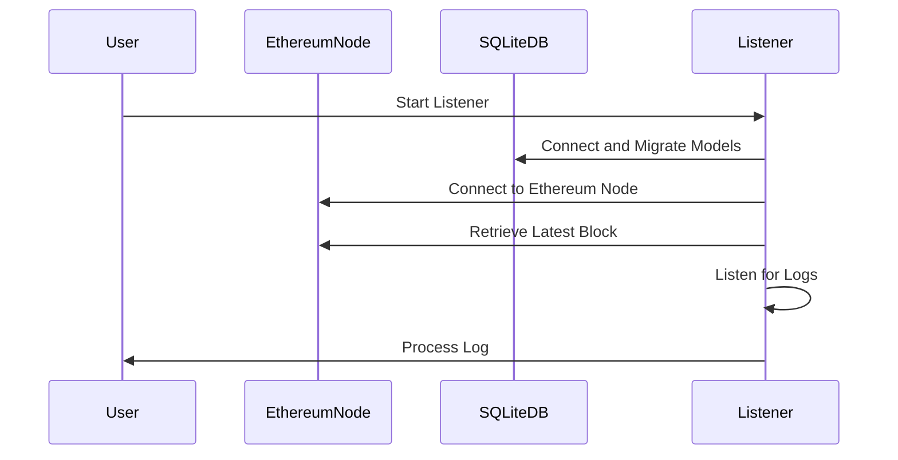

# Listener





# Using Listener DB

There is a simple example [here](../examples/usdclistener).


## Migrating to ListenerDB

This guide outlines the steps to migrate your service to use the new ListenerDB interface. Follow these steps for each service that needs to be updated.

## 1. Remove Deprecated Methods

Delete any deprecated methods that are no longer needed with ListenerDB.

## 2. Update Interface Definitions
Add the `ListenerDB` interface to your `Service` interface:

```go
type Service interface {
    Reader
    Writer
    SubmitterDB() submitterDB.Service
    listenerDB.ChainListenerDB
}
```

## 3. Update GetAllModels Function

Modify the `GetAllModels` function to include ListenerDB models:

```go
func GetAllModels() (allModels []interface{}) {
    allModels = append(txdb.GetAllModels(), &YourModel{})
    allModels = append(allModels, listenerDB.GetAllModels()...)
    return allModels
}
```

## 4. Implement ListenerDB in Store

Update your `Store` struct and `NewStore` function:

```go
type Store struct {
    db             *gorm.DB
    submitterStore submitterDB.Service
    listenerDB.ChainListenerDB
}

func NewStore(db *gorm.DB, metrics metrics.Handler) *Store {
    txDB := txdb.NewTXStore(db, metrics)
    listener := listenerDB.NewChainListenerStore(db, metrics)

    return &Store{
        db:              db,
        submitterStore:  txDB,
        ChainListenerDB: listener,
    }
}
```


## 6. Refactor Usage

Replace all calls to the removed methods with the appropriate methods from the `ChainListenerDB` interface.

## 7. Testing

After making these changes, thoroughly test your service to ensure all functionality works as expected with the new ListenerDB implementation.

By following these steps, you should successfully migrate your service to use the new ListenerDB interface. Remember to replace `YourModel` with the actual model name in your implementation. If you encounter any issues or need further clarification, please refer to the ListenerDB documentation or consult with your team.
