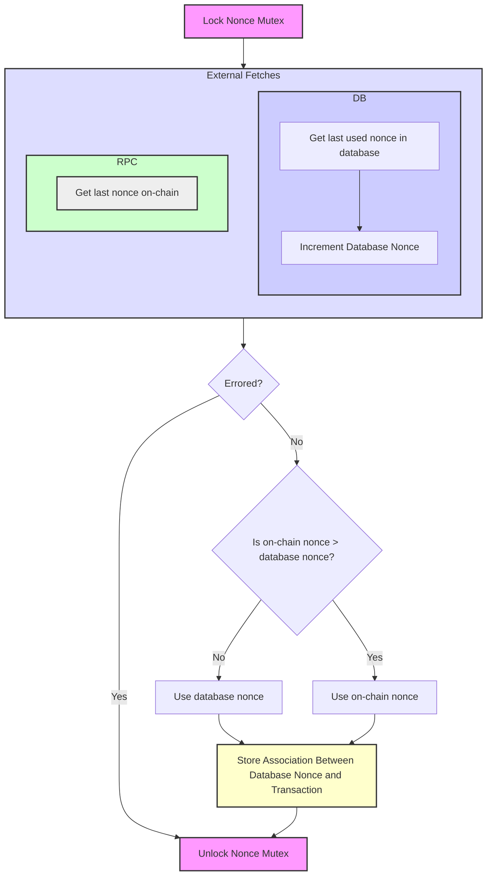

# Submitter

Submitter is a module that submits transactions to an evm based-blockchain and bumps them/checks for completion until they are done. It is designed to abstract away gas bumping, confirmation checking, etc from the caller.

## Understanding `SubmitTransaction`

One of the main goals of submitter is for you to be able to call `SubmitTransaction` once and once you're returned a nonce, be confident that the transaction will eventually get through as long as run keeps running. It's important to understand how this process works and why it exists.

### Nonce Locking

The first thing you'll notice about the  `SubmitTransaction` method is it returns a nonce rather than a transaction hash. This is because once the transaction is submitted, it will be bumped (which requires changing the transaction hash) until the transaction is confirmed. The next nonce is generated in the following manner:

You'll now notice that there are two failure cases for this method: if either the db or the rpc url cannot be reached you'll have to resubmit the tx. But these failures occur atomically, so you can do this in a retry loop w/ a backoff.

<!-- TODO: mermade diagram of confirmation queue and process queue -->
<!-- aditionally, should describe cases in which submit transaction will return an error-->
<!-- To understand why this module is necessary, you first need to understand that the EVM does not specify anything about transaction submission or consensus. It merely refers to a set of instructions for executing byte-code, so different chains are free to change transaction submission and p2p semantics as they wish. This forms the first constraint on transaction submission. The second constraint is formed by rate-limits, if I send my transaction to an rpc node, even if that node has unlimited throughput, there's no gurantee it will send that to all it's peers and not be rate limited by then. We therefore need to be careful about submitting transactions too far ahead of the current nonce.-->
