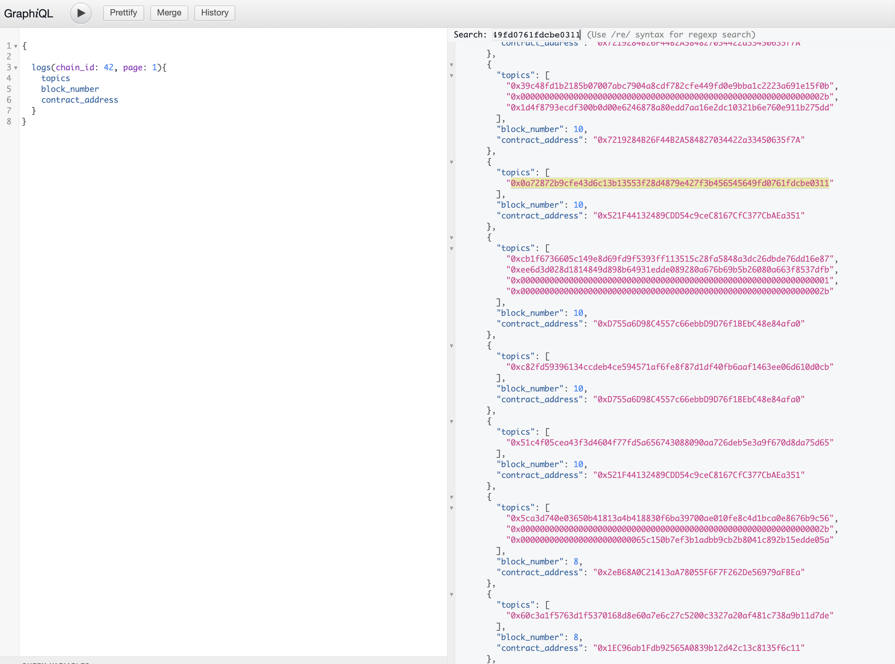

<br/>
<p align="center">
<a href="https://interchain.synapseprotocol.com/" target="_blank">

</a>
</p>
<br/>

[](https://github.com/synapsecns/sanguine/actions/workflows/foundry-tests.yml)
[](https://github.com/synapsecns/sanguine/actions/workflows/solidity.yml)
[](https://interchain-contracts.synapseprotocol.com/)
[](https://www.npmjs.com/package/@synapsecns/contracts-core)

`@synapsecns/contracts-core` contain the Solidity contracts used within the Synapse Interchain Network messaging system.

# Usage

These contracts can be installed with:

`npm i @synapsecns/contracts-core`

Please refer to our [usage guide](https://docs.synapseprotocol.com/synapse-interchain-network-sin/build-on-the-synapse-interchain-network) or [examples](contracts/client/TestClient.sol)

## Directory Structure

<pre>
root
├── <a href="./contracts">contracts</a>: Contains core contracts
│   ├── <a href="./contracts/base">base</a>: Base contracts of the protocol
│   ├── <a href="./contracts/client">client</a>: Client contracts for callers of the messaging system.
│   ├── <a href="./contracts/events">events</a>: Event types
│   ├── <a href="./contracts/hubs">hubs</a>: Hubs
│   ├── <a href="./contracts/inbox">inbox</a>: Inbox contracts
│   ├── <a href="./contracts/interfaces">interfaces</a>: Interfaces
│   ├── <a href="./contracts/libs">libs</a>: Library contracts
│   ├── <a href="./contracts/manager">Manager</a>: Manager contracts
├── <a href="./deployments">deployments</a>: Non-devnet deployments of the contracts
├── <a href="./lib">lib</a>: Git-module based dependencies
├── <a href="./script">script</a>: Scripts for deploying + interacting with contracts
├── <a href="./test">test</a>: Test contracts
</pre>


## Running a devnet

<!-- TODO: this doesn't belong here -->

To run a devnet, you can run `make devnet-up` and `make devnet-deploy` from this directory. This will start a local devnet and deploy the contracts to it. RPC endpoints for debugging etc will be availabe at `http://localhost:9001/rpc/[chain_id]`.

By default, the [`PingPongClient.sol`](contracts/client/PingPongClient.sol) is deployed, so you can interact with it with cast. For instance, to send a ping from chain 42 to chain 44:

```bash
cast send 0x521F44132489CDD54c9ceC8167CfC377CbAEa351 --rpc-url http://localhost:9001/rpc/42 --private-key 0x526db1890baf94e82162f17f25ad769eb7f981272d8d99c527ea1af443c2d0cc "doPing(uint32,address,uint16)" 44 0x521F44132489CDD54c9ceC8167CfC377CbAEa351 1
```

Now, to make sure it work, you can pull up [scribe](../../services/scribe/) by going to http://localhost:9002/graphiql and [querying the logs](http://localhost:9002/graphiql?query=%7B%0A%20%20%0A%20%20logs(chain_id%3A%2044%2C%20page%3A%201)%7B%0A%20%20%20%20topics%0A%20%20%20%20receipt%0A%20%20%20%20block_number%0A%20%20%7D%0A%7D) for chain 44:


```graphql
{

  logs(chain_id: 44, page: 1){
    topics
    block_number
    contract_address
  }
}
```

If everything went well, you will see topic `0x0a72872b9cfe43d6c13b13553f28d4879e427f3b456545649fd0761fdcbe0311` in the logs, which is the topic for the `PingPongClient`'s `Pong` event.


