# Cross Chain Messaging

This section will walk through building the [Synapse Messaging System](glossary.md/#synapse-messaging-system) from the ground up.
The goal in doing so is to establish how trust is established layer by layer throughout the system.

### Step 1: Establishing the Root of Trust

Because the [Synapse Messaging System](glossary.md/#synapse-messaging-system) is designed to be a [permissionless](glossary.md/#permissionless) system, the
[root of trust](glossary.md/#root-of-trust) does NOT come from a [permissioned](glossary.md/#permissioned) central authority,
but rather from a community of [Bonded Agents](glossary.md/#bonded-agent).

The [Synapse Chain](glossary.md/#synapse-chain) is the [Canonical Source of Truth](glossary.md/#canonical-source-of-truth)
that decides who is in the [Bonded Agent Set](glossary.md/#agent-set). Thus, anyone wanting to be a [Bonded Agent](glossary.md/#bonded-agent)
must post a [bond](glossary.md/#bond) on the [Bonding Manager Smart Contract](glossary.md/#bonding-manager-smart-contract) deployed
on the [Synapse Chain](glossary.md/#synapse-chain).

When building up the [Synapse Messaging System](glossary.md/#synapse-messaging-system), the first thing that is required
is to deploy the Smart Contracts that work on the [Synapse Chain](glossary.md/#synapse-chain) to keep track of the
[Bonded Agent Set](glossary.md/#agent-set) (as well as other things to be discussed later).

The Smart Contracts required are listed below, with more detailed descriptions linked on the glossary page for readers
interested in the technical specifics of how the system is coded and deployed.
1. Synapse [Summit Smart Contract](glossary.md/#summit-smart-contract).
2. Synapse [Gas Oracle Smart Contract](glossary.md/#gas-oracle-smart-contract).
3. Synapse [Bonding Manager Smart Contract](glossary.md/#bonding-manager-smart-contract).
4. Synapse [Inbox Smart Contract](glossary.md/#inbox-smart-contract).

This is what our Network looks like after deploying the contracts to the [Synapse Chain](glossary.md/#synapse-chain):
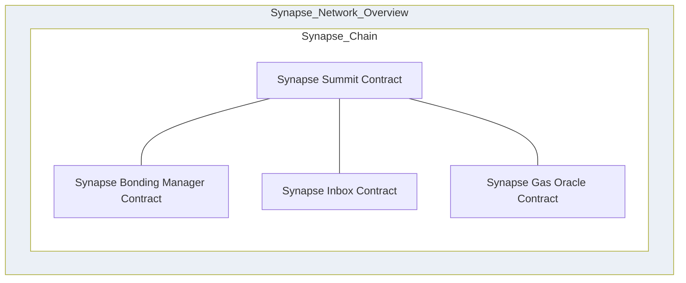

### Step 2: Adding the first Notary
There of course is no point in a [Cross Chain Messaging System](glossary.md/#cross-chain-messaging-system) without at least
two blockchains. Let us walk through how a new blockchain gets bootstrapped onto the [Synapse Messaging System](glossary.md/#synapse-messaging-system).

The very first step is to register the [Notary](glossary.md/#notary) that will be assigned to the new [Remote Chain](glossary.md/#remote-chain).

This is done by having the [Notary](glossary.md/#notary) post a [bond](glossary.md/#bond) on the [Bonding Manager Smart Contract](glossary.md/#bonding-manager-smart-contract)
deployed on the [Synapse Chain](glossary.md/#synapse-chain).
The new [Notary](glossary.md/#notary) is now registered in the [Bonded Agent Set](glossary.md/#agent-set) and thus
the [Bonding Manager Smart Contract](glossary.md/#bonding-manager-smart-contract) will have a new [Agent Root](glossary.md/#agent-root).

This is what our Network looks like after adding the first [Notary](glossary.md/#notary):

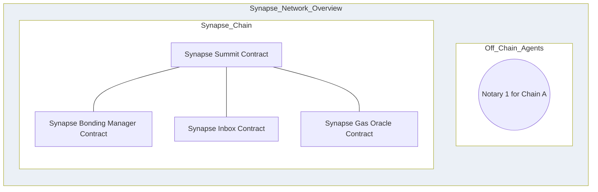

### Step 3: Adding the first Guard
The other kind of [Bonded Agent](glossary.md/#bonded-agent) that plays a crucial role in the [Synapse Messaging System](glossary.md/#synapse-messaging-system)
is the [Guard](glossary.md/#guard). Just as we did with our first [Notary](glossary.md/#notary), we will need our first
[Guard](glossary.md/#guard) to post a [bond](glossary.md/#bond) (not nearly as large as the [Notary's](glossary.md/#notary)) on the [Bonding Manager Smart Contract](glossary.md/#bonding-manager-smart-contract).
The new [Guard](glossary.md/#guard) is now registered in the [Bonded Agent Set](glossary.md/#agent-set) and thus
the [Bonding Manager Smart Contract](glossary.md/#bonding-manager-smart-contract) will have a new [Agent Root](glossary.md/#agent-root).

This is what our Network looks like after adding the first [Guard](glossary.md/#guard):

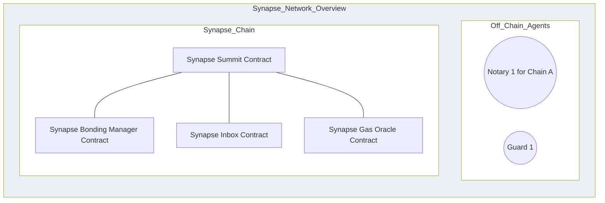

### Step 4: Setting up the first Remote Chain
We already registered a [Notary](glossary.md/#notary) for the first [remote chain](glossary.md/#remote-chain), so now it's
time to deploy the necessary Smart Contracts.
These are the contracts that need to be deployed:

1. Synapse [Origin Smart Contract](glossary.md/#origin-smart-contract).
2. Synapse [Destination Smart Contract](glossary.md/#destination-smart-contract).
3. Synapse [Gas Oracle Smart Contract](glossary.md/#gas-oracle-smart-contract).
4. Synapse [Light Manager Smart Contract](glossary.md/#light-manager-smart-contract).
5. Synapse [Light Inbox Smart Contract](glossary.md/#light-inbox-smart-contract).

Note that the [Destination Smart Contract](glossary.md/#destination-smart-contract) will be initialized with the latest
[Agent Root](glossary.md/#agent-root) taken from the [Bonding Manager Smart Contract](glossary.md/#bonding-manager-smart-contract)
on the [Synapse Chain](glossary.md/#synapse-chain). This is how the [Root of Trust](glossary.md/#root-of-trust) is bootstrapped
on the [remote chain](glossary.md/#remote-chain).

Just like any time a [remote chain](glossary.md/#remote-chain) receives an updated [Agent Root](glossary.md/#agent-root), all of the
[Bonded Agents](glossary.md/#bonded-agent) will need to submit a proof of inclusion against that [Agent Root](glossary.md/#agent-root)
so they can be added to the [Agent Set](glossary.md/#agent-set) on the [remote chain](glossary.md/#remote-chain).

This is what our Network looks like after setting up the first [remote chain](glossary.md/#remote-chain):

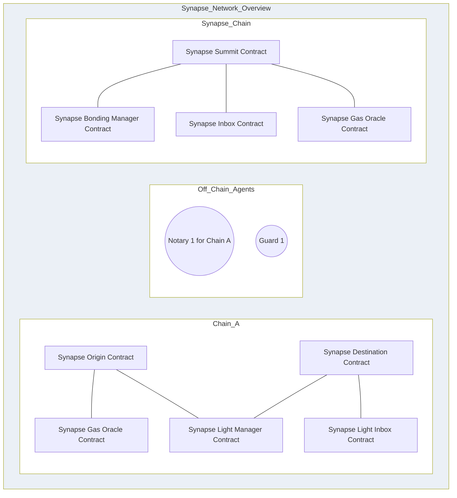

### Step 5: Setting up the second Remote Chain
Our first chain currently does not have another chain to send messages to, so let's add our second chain by repeating the
same steps including adding a [Notary](glossary.md/#notary).

Note that after adding the other [Notary](glossary.md/#notary), the [Bonding Manager Smart Contract](glossary.md/#bonding-manager-smart-contract) will have a new [Agent Root](glossary.md/#agent-root).

This is what our Network looks like after setting up the second [remote chain](glossary.md/#remote-chain):

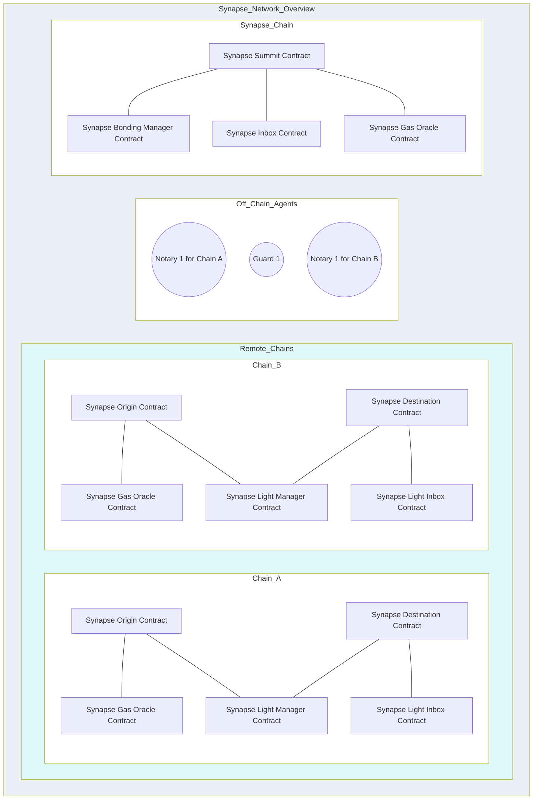

### Step 6: Onboarding clients of the Messaging System
As of right now, we have set up the [Synapse Chain](glossary.md/#synapse-chain) and two [Remote Chains](glossary.md/#remote-chain)
by deploying the necessary Synapse Smart Contracts. We are now ready to start adding [clients](glossary.md/#client-smart-contract-application-developer)
of the [Synapse Messaging System](glossary.md/#synapse-messaging-system).

This section is for [Client Smart Contract Application Developers](glossary.md/#client-smart-contract-application-developer) who need to send messages [Cross Chain](glossary.md/#cross-chain).

The first step is to identify which chains need to communicate with each other. In this case, we have our two chains already
set up.

The next step is for each chain, deploy a [Client Sending Smart Contract](glossary.md/#client-sending-smart-contract) and
a [Client Receiving Smart Contract](glossary.md/#client-receiving-smart-contract). These are the application-specific smart contracts
developed by the [Client Smart Contract Application Developers](glossary.md/#client-smart-contract-application-developer).

Note that it is perfectly normal to combine the [Client Sending Smart Contract](glossary.md/#client-sending-smart-contract) and
a [Client Receiving Smart Contract](glossary.md/#client-receiving-smart-contract) into a single smart contract.

In fact the Synapse team has a couple example test clients that do just this.

Please see the examples here for reference:
1.  [TestClient.sol](https://github.com/synapsecns/sanguine/blob/master/packages/contracts-core/contracts/client/TestClient.sol)
2.  [PingPong.sol](https://github.com/synapsecns/sanguine/blob/master/packages/contracts-core/contracts/client/PingPongClient.sol)

After deploying the first [Cross Chain](glossary.md/#cross-chain) client, this is what our network looks like:

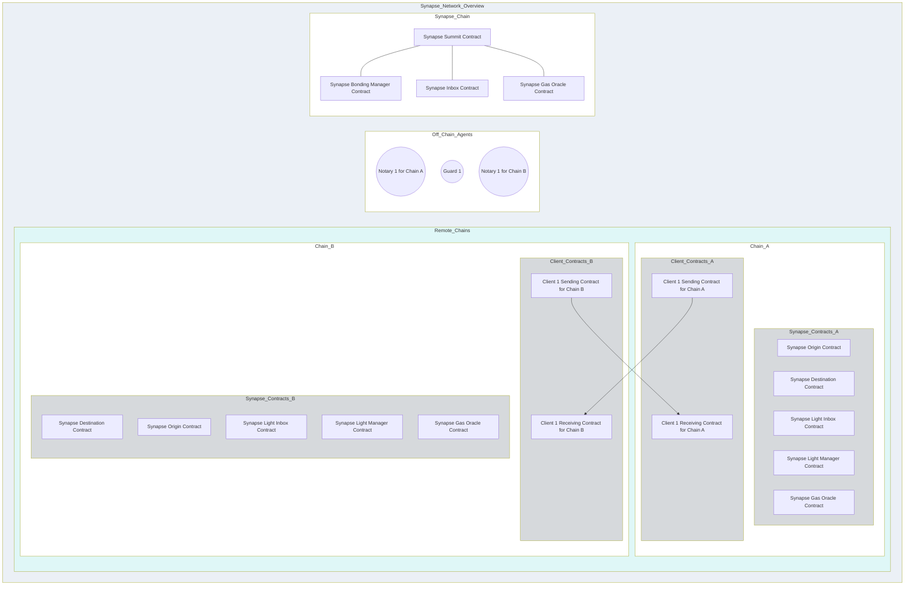

### Step 7: Adding the first Executor
The [Synapse Messaging System](glossary.md/#synapse-messaging-system) also needs at least one [Executor](glossary.md/#executor)
to run as an [Unbonded Agent](glossary.md/#unbonded-agent) in order to execute messages that are eligible based on the
work done by the [Bonded Agents](glossary.md/#bonded-agent).

Because the [Executor](glossary.md/#executor) is not required to post a [bond](glossary.md/#bond), it does not need to register
with the [Bonding Manager Smart Contract](glossary.md/#bonding-manager-smart-contract). This means that anyone is permitted
to serve as an [Executor](glossary.md/#executor) and earn [tips](glossary.md/#tips). The [Synapse Messaging System](glossary.md/#synapse-messaging-system)
was designed to encourage many [Executors](glossary.md/#executor) because they play an important role in [Liveness](glossary.md/#liveness).

This is what our Network looks like after adding the first [Executor](glossary.md/#executor):

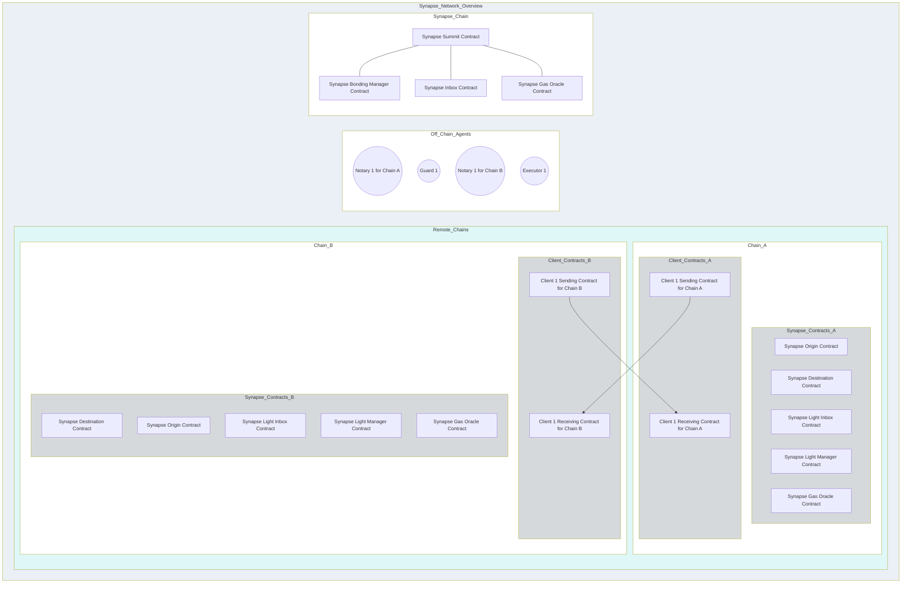

## Ready to Send Messages and add other Bonded Agents Permissionlessly
At this point, we have bootstrapped the [Synapse Messaging System](glossary.md/#synapse-messaging-system) and are ready for
the client to send messages between the two chains in the network.

In addition, because each chain has a [Notary](glossary.md/#notary) and [Guard](glossary.md/#guard) which was added
through a [permissioned](glossary.md/#permissioned) mechanism during initialization, we are now in a position to add
new [Bonded Agents](glossary.md/#bonded-agent) through a [permissionless](glossary.md/#permissionless) mechanism.

### Sending Messages
We will now illustrate sending a message from the [Client Sending Smart Contract](glossary.md/#client-sending-smart-contract)
on Chain A to the [Client Receiving Smart Contract](glossary.md/#client-receiving-smart-contract) on Chain B.

We will see how the [Synapse Messaging System](glossary.md/#synapse-messaging-system) supports both
[Liveness](glossary.md/#liveness) and [Integrity](glossary.md/#integrity).

1.  On Chain A, [Client Sending Smart Contract](glossary.md/#client-sending-smart-contract) calls the "send message" method on the [Origin Smart Contract](glossary.md/#origin-smart-contract).
The result of this is that the message is added in the Origin's [Message Merkle Tree](glossary.md/#message-merkle-tree) and Chain A will have
a new [state](glossary.md/#state) with a new [Message Merkle Root](glossary.md/#message-merkle-root).
For this example, we will say that Chain A sends 4 messages to Chain B so we can illustrate what it's [Message Merkle Tree](glossary.md/#message-merkle-tree) looks like.
This is what the message Merkle tree looks like, with the simplification of having a height of only 3 rather than 32:

2.  On [Synapse Chain](glossary.md/#synapse-chain), the [Guard](glossary.md/#guard) will submit a [State Snapshot](glossary.md/#state-snapshot) that includes
the new [state](glossary.md/#state) of Chain A. For this example, we will also claim that Chain B also has a [state](glossary.md/#state) included in the snapshot.
This is what the [State Snapshot](glossary.md/#state-snapshot) would look like with the states from both chains:

3.  On [Synapse Chain](glossary.md/#synapse-chain), either of the [Notaries](glossary.md/#notary) will submit a [State Snapshot](glossary.md/#state-snapshot) that includes
the new [state](glossary.md/#state) of Chain A. This results in the [Synapse Chain](glossary.md/#synapse-chain) registering a
new [Attestation](glossary.md/#attestation) that includes the [Snap Root](glossary.md/#snap-root) as well as the current [Agent Root](glossary.md/#agent-root).

4.  On Chain B, the [Notary](glossary.md/#notary) for Chain B proposes the [Attestation](glossary.md/#attestation).
5.  The system must wait for the [Optimistic Period](glossary.md/#optimistic-period) before executing the message. This is when
the [Guard](glossary.md/#guard) has an opportunity to report [fraud](glossary.md/#fraud) if either the [Attestation](glossary.md/#attestation)
was not registered on the [Synapse Chain](glossary.md/#synapse-chain) or if one of the [states](glossary.md/#state) included in the [State Snapshot](glossary.md/#state-snapshot)
was not a valid state on the Origin chain.
6.  On Chain B after the [Optimistic Period](glossary.md/#optimistic-period) has passed without any [fraud reports](glossary.md/#fraud-report), the
[Executor](glossary.md/#executor) will execute the message. This is done by a [Merkle Proof](glossary.md/#merkle-proof) for the [state](glossary.md/#state) against the [Snap Root](glossary.md/#snap-root)
in the [Attestation](glossary.md/#attestation), and then with another [Merkle Proof](glossary.md/#merkle-proof) for the [message](glossary.md/#message) against the [Message Merkle Root](glossary.md/#message-merkle-root)
in the [state](glossary.md/#state).

Below is a sequence diagram illustrating the steps involved in sending a message from Remote Chain A to Remote Chain B:

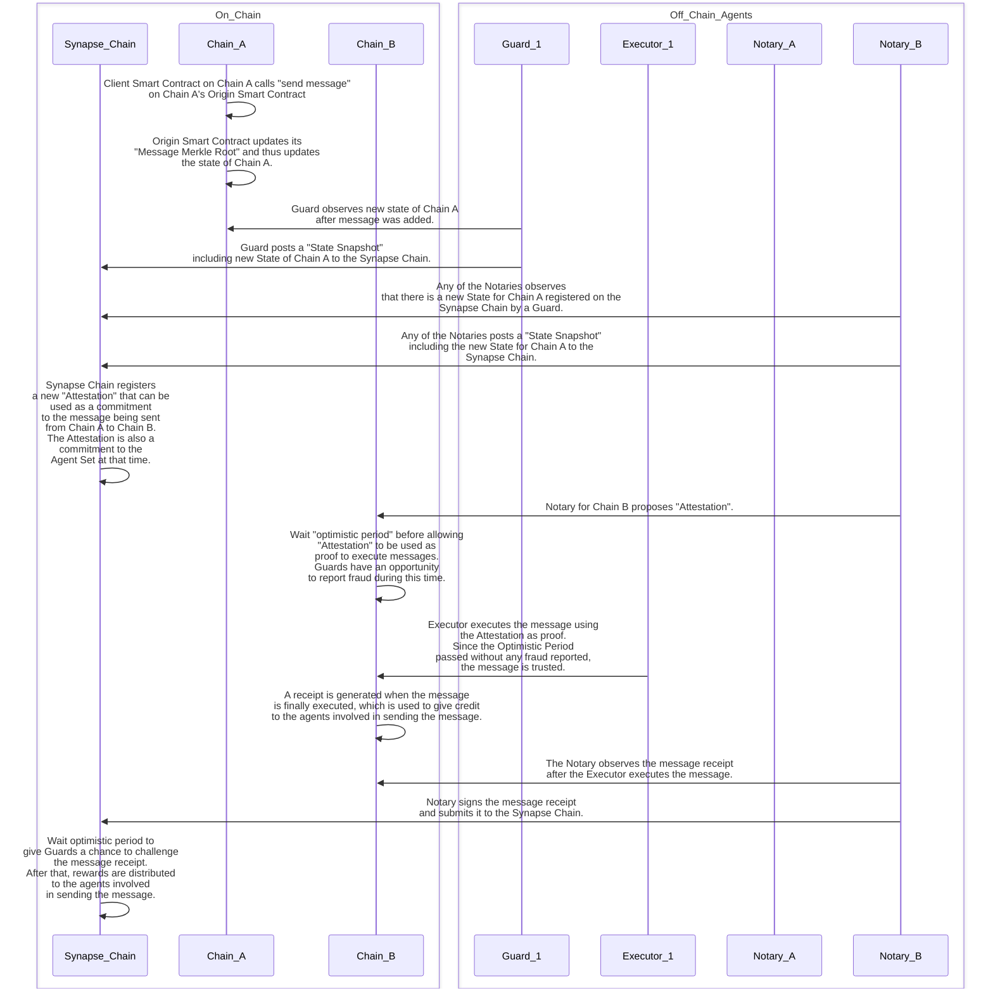

### Adding other Bonded Agents
The requirement to become a [Bonded Agent](glossary.md/#bonded-agent) is to post a [bond](glossary.md/#bond) on the [Bonding Manager Smart Contract](glossary.md/#bonding-manager-smart-contract) on the [Synapse Chain](glossary.md/#synapse-chain).
Upon adding the new [Bonded Agent](glossary.md/#bonded-agent) to the [Agent Set](glossary.md/#agent-set), the [Bonding Manager Smart Contract](glossary.md/#bonding-manager-smart-contract) on the [Synapse Chain](glossary.md/#synapse-chain) will
calculate a new [Agent Root](glossary.md/#agent-root).

Below is an illustration of how the [Agent Root](glossary.md/#agent-root) is calculated from the [Agent Set](glossary.md/#agent-set).

The tricky part is how to communicate this [Agent Root](glossary.md/#agent-root) to the [remote chains](glossary.md/#remote-chain).

Whenever a [Notary](glossary.md/#notary) submits a [State Snapshot](glossary.md/#state-snapshot) to the [Synapse Chain](glossary.md/#synapse-chain),
the Synapse Smart Contract that handles that transaction will register an [Attestation](glossary.md/#attestation)
that includes the [Snap Root](glossary.md/#snap-root) as well as the current [Agent Root](glossary.md/#agent-root).

Then, one of the [Notaries](glossary.md/#notary) for each [remote chain](glossary.md/#remote-chain) will take that
[Attestation](glossary.md/#attestation) and propose it to its [remote chain](glossary.md/#remote-chain).

Just as there is an [Optimistic Period](glossary.md/#optimistic-period) for each [message](glossary.md/#message), the [Agent Root](glossary.md/#agent-root)
also has an [Optimistic Period](glossary.md/#optimistic-period) defined by the system, during which any [Guard](glossary.md/#guard)
could call out [fraud](glossary.md/#fraud) if it believes the [Agent Root](glossary.md/#agent-root) is wrong.

If no guard submits a [fraud report](glossary.md/#fraud-report), the new [Agent Root](glossary.md/#agent-root) will become active
on the [remote chain](glossary.md/#remote-chain).

Whenever there is a change in the [Agent Root](glossary.md/#agent-root) on a [remote chain](glossary.md/#remote-chain),
each [Bonded Agent](glossary.md/#bonded-agent) must re-register themselves by providing a proof of inclusion.

Below is a sequence diagram illustrating the steps involved in adding another bonded agent (a new Guard):

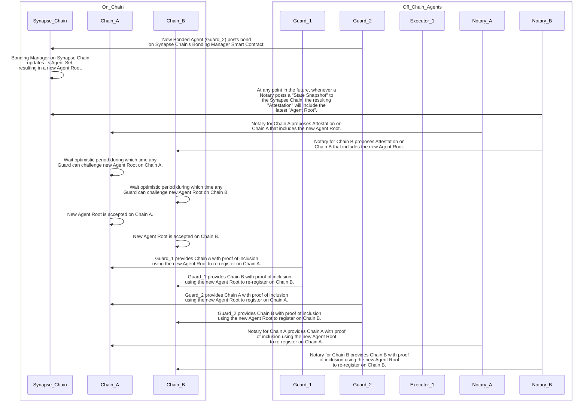

## Trust But Verify: Detecting and Reporting Fraud from Bonded Agents

Any time a [Bonded Agent](glossary.md/#bonded-agent) makes a claim to one blockchain about something that happened
on another blockchain, it must provide a [digital signature](glossary.md/#digital-signatures) which binds that
specific [Bonded Agent](glossary.md/#bonded-agent) to that specific claim. The [digital signature](glossary.md/#digital-signatures)
is thus how the [Bonded Agents](glossary.md/#bonded-agent) receive credit for truthful claims and blame for fraudulent claims.
If the claim ends
up being [fraud](glossary.md/#fraud), the [Bonded Agent](glossary.md/#bonded-agent) will be [slashed](glossary.md/#slash)
and removed from the [Agent Set](glossary.md/#agent-set).
The purpose of this section is to walk through the flow of each of the possible forms of [fraud](glossary.md/#fraud)
and how the [Synapse Messaging System](glossary.md/#synapse-messaging-system) protects itself from attackers.

### Fraudulent Attestation
When a [Guard](glossary.md/#guard) detects a [Fraudulent Attestation](glossary.md/#fraudulent-attestation), this means that a malicious
[Notary](glossary.md/#notary) has posted an [Attestation](glossary.md/#attestation) to its [remote chain](glossary.md/#remote-chain) that was never registered
on the [Synapse Chain](glossary.md/#synapse-chain).

Below are the steps of what happens starting from the intitial [fraud](glossary.md/#fraud) to the  [fraud resolution](glossary.md/#fraud-resolution).
1. A malicious [Notary](glossary.md/#notary) posts an [Attestation](glossary.md/#attestation) to its [remote chain](glossary.md/#remote-chain)
that was never registered on the [Synapse Chain](glossary.md/#synapse-chain).
2. A [Guard](glossary.md/#guard) observes the [Attestation](glossary.md/#attestation) on the [remote chain](glossary.md/#remote-chain).
3. The [Guard](glossary.md/#guard) checks on the [Synapse Chain](glossary.md/#synapse-chain) whether or not the [Attestation](glossary.md/#attestation) is valid.
4. Upon learning from the [Synapse Chain](glossary.md/#synapse-chain) that it is a [fraudulent attestation](glossary.md/#fraudulent-attestation),
the [Guard](glossary.md/#guard) submits a transaction to the [Synapse Chain](glossary.md/#synapse-chain) that provides proof
of the [fraudulent attestation](glossary.md/#fraudulent-attestation) and this results in
[slashing](glossary.md/#slash) the [Accused Notary](glossary.md/#accused-notary) and removing it from the [Agent Set](glossary.md/#agent-set).
5. While the [remote chain](glossary.md/#remote-chain) waits to learn about the new [Agent Root](glossary.md/#agent-root),
it is at risk of having messages executed using the [fraudulent attestation](glossary.md/#fraudulent-attestation). The [Guard](glossary.md/#guard)
protects the [remote chain](glossary.md/#remote-chain) by submitting an [Attestation Fraud Report](glossary.md/#attestation-fraud-report) to
the [remote chain](glossary.md/#remote-chain) so it knows to immediately stop trusting that [Accused Notary](glossary.md/#accused-notary).

It is very important that the [Guard](glossary.md/#guard) lets the [remote chain](glossary.md/#remote-chain)
know that it should pause all trust of the suspected [Notary](glossary.md/#notary). For this, the [Guard](glossary.md/#guard) submits an
"Attestation Fraud Report" to the [remote chain](glossary.md/#remote-chain). The result of this is that the [remote chain](glossary.md/#remote-chain)
places both the accused [Notary](glossary.md/#notary) and the accusing [Guard](glossary.md/#guard) in the [Disputed Agent Set](glossary.md/#disputed-agent-set) until
the [Fraud Resolution](glossary.md/#fraud-resolution) happens on the [Synapse Chain](glossary.md/#synapse-chain).
Prior to submitting the
"Attestation Fraud Report" on the [remote chain](glossary.md/#remote-chain), the [Accusing Guard](glossary.md/#accusing-guard) will have checked
the [Synapse Chain](glossary.md/#synapse-chain) to confirm the [Fraudulent Attestation](glossary.md/#fraudulent-attestation), and it will have
submitted a proof of the [Fraudulent Attestation](glossary.md/#fraudulent-attestation) to the [Synapse Chain](glossary.md/#synapse-chain).
This immediately results in the
[Accused Notary](glossary.md/#accused-notary) getting [slashed](glossary.md/#slash) and removed from the [Agent Set](glossary.md/#agent-set) on the [Synapse Chain](glossary.md/#synapse-chain).
However, it will take time for this information to propagate to the [remote chain](glossary.md/#remote-chain), which is now
at risk of having [messages](glossary.md/#message) executed using the [Fraudulent Attestation](glossary.md/#fraudulent-attestation).
Thus, the [Guard](glossary.md/#guard) will submit the "Attestation Fraud Report" on the [remote chain](glossary.md/#remote-chain) as a way
to immediately protect that chain from the malicious [Notary](glossary.md/#notary).

Below is a sequence diagram illustrating the steps involved in detecting a Fraudulent Attestation:

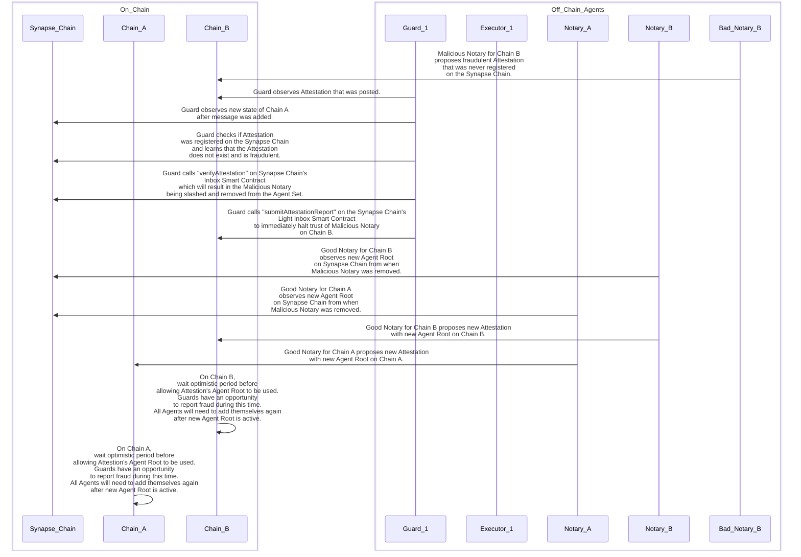

### Fraudulent Snapshot by a Guard
 If a malicious [Guard](glossary.md/#guard) posts a [State Snapshot](glossary.md/#state-snapshot) that has at least one fraudulent
[State](glossary.md/#state) to the [Synapse Chain](glossary.md/#synapse-chain), a non-malicious [Guard](glossary.md/#guard)
can submit a [Fraud Report](glossary.md/#fraud-report) to the [Origin Chain](glossary.md/#origin-chain), which is the
chain that is uniquely able to determine whether the [State](glossary.md/#state) is valid or not.
Upon determining that the [State Snapshot](glossary.md/#state-snapshot) did in fact contain [fraud](glossary.md/#fraud),
this needs to be communicated to the rest of the chains in the network, and importantly the malicious [Guard](glossary.md/#guard)
will need to be [slashed](glossary.md/#slash) on the [Synapse Chain](glossary.md/#synapse-chain).
This is accomplished through a special kind of [message](glossary.md/#message) called a [System Message](glossary.md/#system-message), which
is sent by the Origin when it determines the malicious [Guard](glossary.md/#guard) should be [slashed](glossary.md/#slash).
The [System Message](glossary.md/#system-message) requires an
 [Optimisic Period](glossary.md/#optimistic-period) just like any other message before it can be accepted. The result of
executing this particular [System Message](glossary.md/#system-message) will be to [slash](glossary.md/#slash) the malicious
 [Guard](glossary.md/#guard) and remove it from the [Agent Set](glossary.md/#agent-set).
The other chains will learn about the removal of the [Guard](glossary.md/#guard) because there will be a new
 [Agent Root](glossary.md/#agent-root).
Because the [System Message](glossary.md/#system-message) and the new [Agent Root](glossary.md/#agent-root) both take time to
propagate through the network, there is a mechanism for any honest [Guard](glossary.md/#guard) to submit a fraud
report to the other chains that will cause the other chain to halt trusting anything from the malicious [Guard](glossary.md/#guard)
until the [Fraud Resolution](glossary.md/#fraud-resolution) has transpired.
The hope is that the [fraud](glossary.md/#fraud) committed by the [Guard](glossary.md/#guard) will be detected and
blocked before the fraudulent [State](glossary.md/#state) can be used by a malicious [Notary](glossary.md/#notary)
to submit a fraudulent [State Snapshot](glossary.md/#state-snapshot) using that bad state.
The next section talks about what happens if the malicious [Notary](glossary.md/#notary) is able to commit such
[fraud](glossary.md/#fraud) using the bad [State](glossary.md/#state).

Below is a diagram illustrating the steps involved in detecting a Fraudulent Snapshot by a Guard:

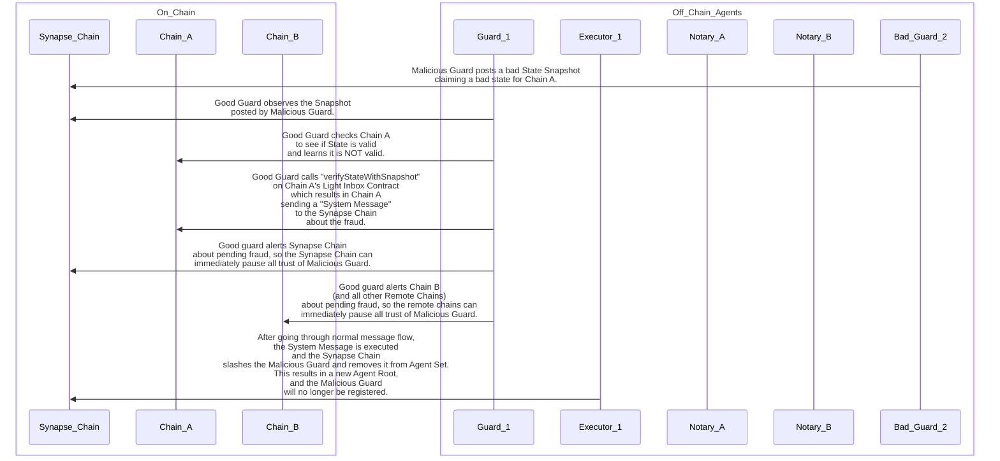

### Fraudulent Snapshot by a Notary
It is important to keep in mind that the only way for a [Notary](glossary.md/#notary) to submit a [State Snapshot](glossary.md/#state-snapshot)
containing a bad [State](glossary.md/#state) is if a malicious [Guard](glossary.md/#guard) first registered the bad [State](glossary.md/#state).
When the [Notary](glossary.md/#notary) submits a [State Snapshot](glossary.md/#state-snapshot), the byproduct is an [Attestation](glossary.md/#attestation)
that is registered on the [Synapse Chain](glossary.md/#synapse-chain) which can be used to submit to any of the [remote chains](glossary.md/#remote-chain).
It is very important to catch and block fraudulent [Attestations](glossary.md/#attestation).
All of the steps involved in catching and reporting the [Fraudulent Snapshot by a Guard](#fraudulent-snapshot-by-a-guard) applies to
the Fraudulent Snapshot by a Notary.
Note that any [Notary](glossary.md/#notary) who signed and submitted an [Attestation](glossary.md/#attestation) that came from a
fraudulent [State Snapshot](glossary.md/#state-snapshot) will also be guilty of committing a [Fraudulent Attestation](glossary.md/#fraudulent-attestation).
This is why it is very important that all [Notaries](glossary.md/#notary) independently verify the [States](glossary.md/#state) being
attested to when signing and submitting an [Attestation](glossary.md/#attestation) to the [remote chains](glossary.md/#remote-chain).

Below is a sequence diagram illustrating the steps involved in detecting a Fraudulent Snapshot by a Notary:

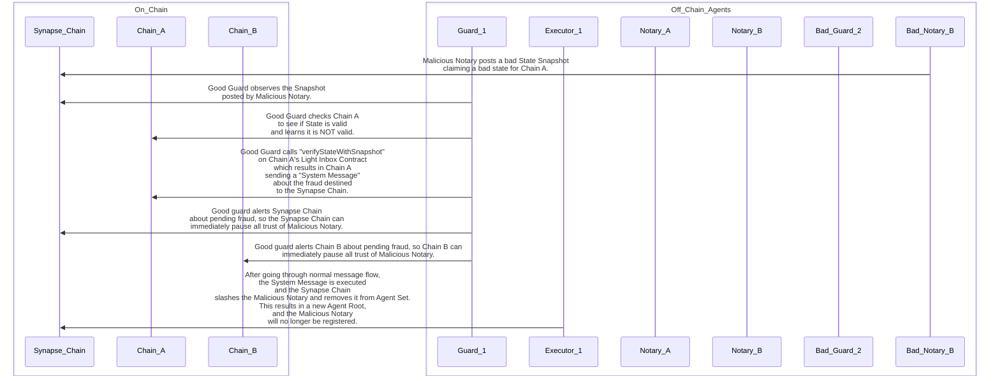

### Fraudulent Attestation Fraud Report
The section that talks about [Fraudulent Attestations](glossary.md/#fraudulent-attestation) mentions the need for alerting the
[remote chain](glossary.md/#remote-chain) about the pending [fraud](glossary.md/#fraud). While the
[fraud resolution](glossary.md/#fraud-resolution) works its way through the system, the [remote chain](glossary.md/#remote-chain)
can momentarily halt using anything from the accused agent.
While this is critical to ensuring the [Integrity](glossary.md/#integrity) of the system, it opens the door for a denial of service attack
by a malicious [Guard](glossary.md/#guard) to submit a dishonest fraud report. This is the reason why [Guards](glossary.md/#guard)
are required to post a bond. If it turns out that they sign off on a dishonest fraud report, they will be [slashed](glossary.md/#slash).
Thus, other [Guards](glossary.md/#guard) will be on the look out whenever a [fraud report](glossary.md/#fraud-report) is
submitted, and they will check if it is a valid report or not.
In the case of an [Attestation Fraud Report](glossary.md/#attestation-fraud-report), this will have been submitted on
a [remote chain](glossary.md/#remote-chain). Another [Guard](glossary.md/#guard) will take that to the
[Synapse Chain](glossary.md/#synapse-chain) who can determine whether or not the [Fraud Report](glossary.md/#fraud-report)
is valid or not. If it is NOT valid, then the malicious [Guard](glossary.md/#guard) will be [slashed](glossary.md/#slash)
and removed from the [Agent Set](glossary.md/#agent-set). This will result in a new [Agent Root](glossary.md/#agent-root)
which is how the [remote chain](glossary.md/#remote-chain) will learn about the result of the [fraud resolution](glossary.md/#fraud-resolution).

Below is a sequence diagram illustrating the steps involved in detecting a Fraudulent Attestation Fraud Report by a Guard:

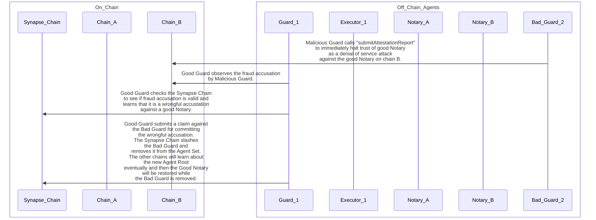

### Fraudulent Shapshot Fraud Report
Another denial of service attack that a malicious [Guard](glossary.md/#guard) could attempt is to claim that another [Guard](glossary.md/#guard)
or [Notary](glossary.md/#notary) submitted a bad [State Snapshot](glossary.md/#state-snapshot) in order to get that chain
to temporarily halt trusting anything from the (wrongfully) [Accused Agent](glossary.md/#accused-agent).
Just as with the case of a fraudulent [Attesstation Fraud Report](glossary.md/#attestation-fraud-report), other [Guards](glossary.md/#guard)
must monitor and validate whenever there is a [Snapshot Fraud Report](glossary.md/#snapshot-fraud-report).
In this case, the dishonest [Snapshot Fraud Report](glossary.md/#snapshot-fraud-report) will be presented to the [Origin Chain](glossary.md/#origin-chain)
which is the only chain that can decide whether the [fraud report](glossary.md/#fraud-report) is valid or not.
If the [Origin Chain](glossary.md/#origin-chain) determines that it was a dishonest fraud report, it will send
a [System Message](glossary.md/#system-message) to the [Synapse Chain](glossary.md/#synapse-chain) which will then [slash](glossary.md/#slash)
the malicious [Guard](glossary.md/#guard) and restore the status of the wrongfully [Accused Agent](glossary.md/#accused-agent).

Below is a sequence diagram illustrating the steps involved in detecting a Fraudulent Snapshot Fraud Report by a Guard:

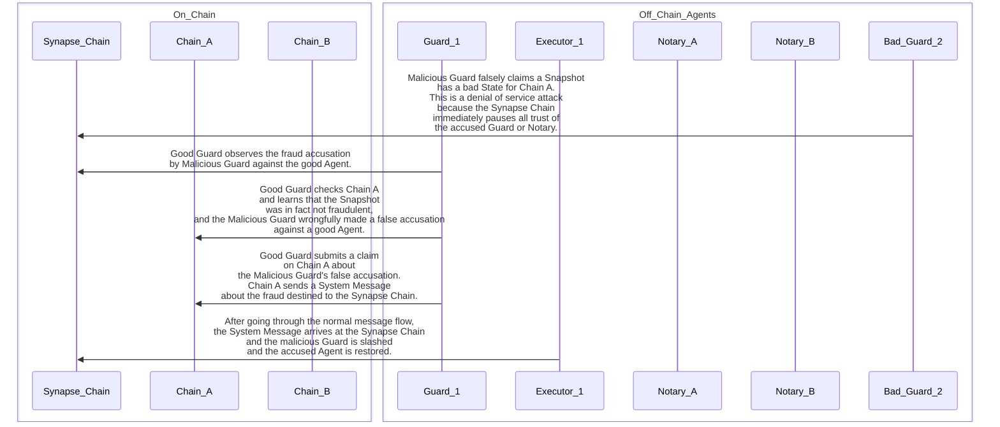

### Fraudulent Receipt
In order to distribute [tips](glossary.md/#tips) for taking part in successfully executing a message, the [Destination Chain](glossary.md/#destination-chain)
will generate a message [receipt](glossary.md/#receipt) that will be signed by the [Notary](glossary.md/#notary) and submitted to the
[Synapse chain](glossary.md/#synapse-chain). This is another opportunity for the [Notary](glossary.md/#notary) to commit fraud by
signing a bad [receipt](glossary.md/#receipt). For this, [Guards](glossary.md/#guard) will montior the submitted receipts and double check that
they are valid on the [Destination Chain](glossary.md/#destination-chain). If a fraudulent [receipt](glossary.md/#receipt) is detected,
the [Guards](glossary.md/#guard) will submit the [Fraud Report](glossary.md/#fraud-report) to the [Destination Chain](glossary.md/#destination-chain),
which is the chain uniquely able to determine fraud or not in this case. If it is fraudulent, the [Destination Chain](glossary.md/#destination-chain)
will send a [System Message](glossary.md/#system-message) to the [Synapse chain](glossary.md/#synapse-chain). The result of that
will be to [slash](glossary.md/#slash) the [Notary](glossary.md/#notary) and remove it from the [Agent Set](glossary.md/#agent-set).
The other chains will learn about it when they receive the new [Agent Root](glossary.md/#agent-root).

Below is a sequence diagram illustrating the steps involved in detecting a Fraudulent Receipt by a Notary:

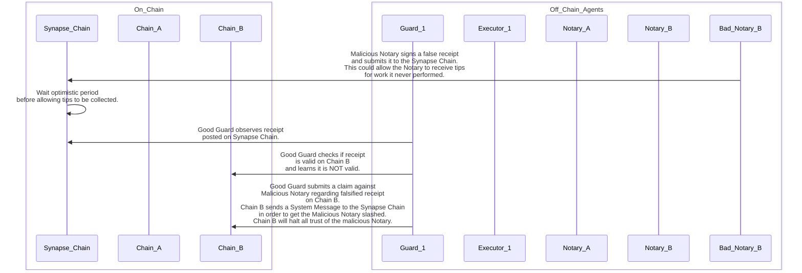
