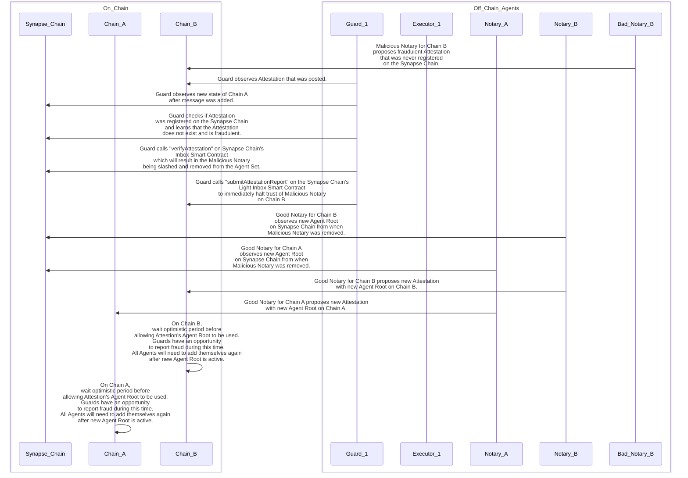
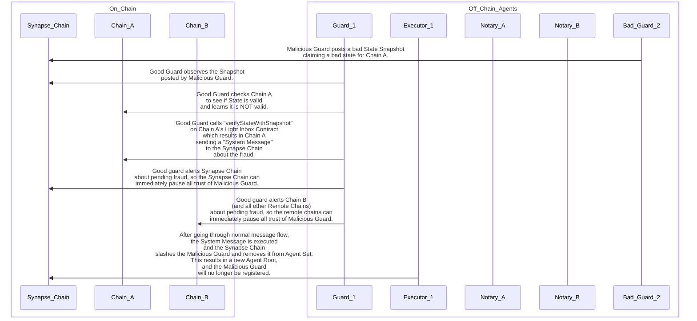
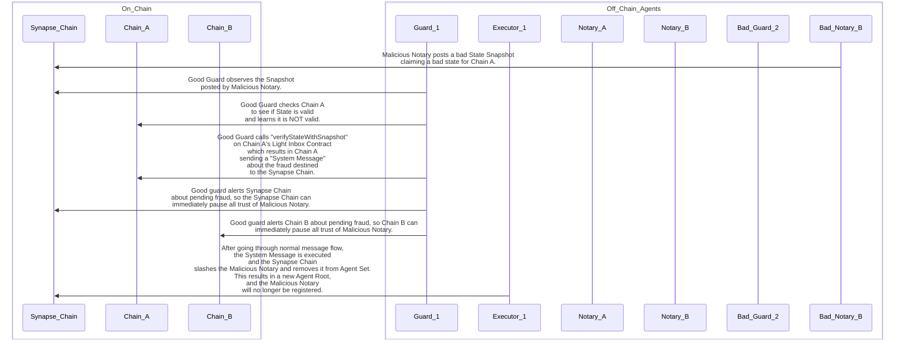
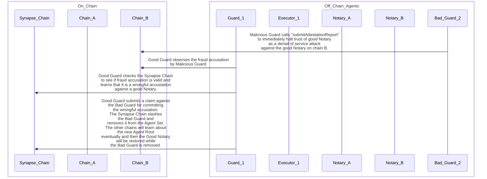
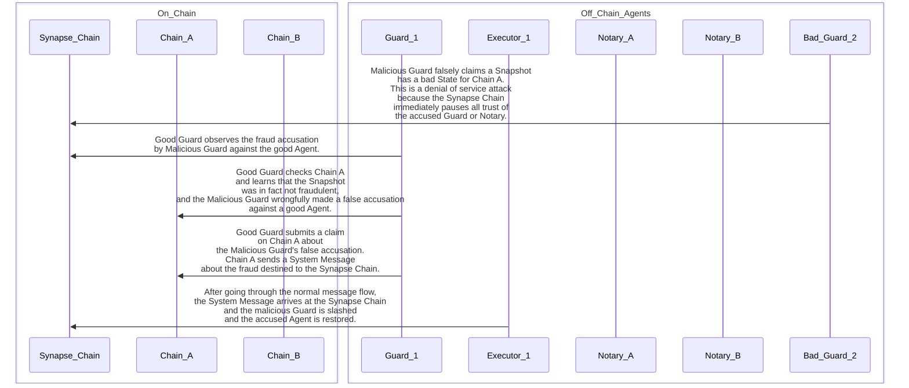
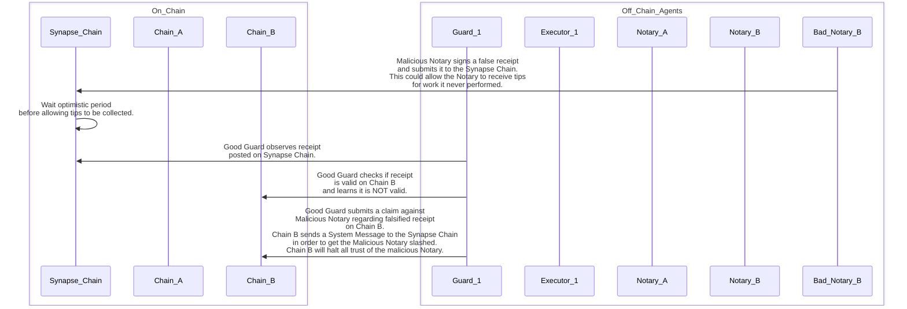

# Fraud Prevention

## Trust but Verify: Detecting and Reporting Fraud from Bonded Agents

Any time a [Bonded Agent](glossary.md/#bonded-agent) makes a claim to one blockchain about something that happened
on another blockchain, it must provide a [digital signature](glossary.md/#digital-signatures) which binds that
specific [Bonded Agent](glossary.md/#bonded-agent) to that specific claim. The [digital signature](glossary.md/#digital-signatures)
is thus how the [Bonded Agents](glossary.md/#bonded-agent) receive credit for truthful claims and blame for fraudulent claims.
If the claim ends
up being [fraud](glossary.md/#fraud), the [Bonded Agent](glossary.md/#bonded-agent) will be [slashed](glossary.md/#slash)
and removed from the [Agent Set](glossary.md/#agent-set).
The purpose of this section is to walk through the flow of each of the possible forms of [fraud](glossary.md/#fraud)
and how the [Synapse Messaging System](glossary.md/#synapse-messaging-system) protects itself from attackers.

## Fraudulent Attestation

When a [Guard](glossary.md/#guard) detects a [Fraudulent Attestation](glossary.md/#fraudulent-attestation), this means that a malicious
[Notary](glossary.md/#notary) has posted an [Attestation](glossary.md/#attestation) to its [remote chain](glossary.md/#remote-chain) that was never registered
on the [Synapse Chain](glossary.md/#synapse-chain).

Below are the steps of what happens starting from the intitial [fraud](glossary.md/#fraud) to the [fraud resolution](glossary.md/#fraud-resolution).

1. A malicious [Notary](glossary.md/#notary) posts an [Attestation](glossary.md/#attestation) to its [remote chain](glossary.md/#remote-chain)
   that was never registered on the [Synapse Chain](glossary.md/#synapse-chain).
2. A [Guard](glossary.md/#guard) observes the [Attestation](glossary.md/#attestation) on the [remote chain](glossary.md/#remote-chain).
3. The [Guard](glossary.md/#guard) checks on the [Synapse Chain](glossary.md/#synapse-chain) whether or not the [Attestation](glossary.md/#attestation) is valid.
4. Upon learning from the [Synapse Chain](glossary.md/#synapse-chain) that it is a [fraudulent attestation](glossary.md/#fraudulent-attestation),
   the [Guard](glossary.md/#guard) submits a transaction to the [Synapse Chain](glossary.md/#synapse-chain) that provides proof
   of the [fraudulent attestation](glossary.md/#fraudulent-attestation) and this results in
   [slashing](glossary.md/#slash) the [Accused Notary](glossary.md/#accused-notary) and removing it from the [Agent Set](glossary.md/#agent-set).
5. While the [remote chain](glossary.md/#remote-chain) waits to learn about the new [Agent Root](glossary.md/#agent-root),
   it is at risk of having messages executed using the [fraudulent attestation](glossary.md/#fraudulent-attestation). The [Guard](glossary.md/#guard)
   protects the [remote chain](glossary.md/#remote-chain) by submitting an [Attestation Fraud Report](glossary.md/#attestation-fraud-report) to
   the [remote chain](glossary.md/#remote-chain) so it knows to immediately stop trusting that [Accused Notary](glossary.md/#accused-notary).

It is very important that the [Guard](glossary.md/#guard) lets the [remote chain](glossary.md/#remote-chain)
know that it should pause all trust of the suspected [Notary](glossary.md/#notary). For this, the [Guard](glossary.md/#guard) submits an
"Attestation Fraud Report" to the [remote chain](glossary.md/#remote-chain). The result of this is that the [remote chain](glossary.md/#remote-chain)
places both the accused [Notary](glossary.md/#notary) and the accusing [Guard](glossary.md/#guard) in the [Disputed Agent Set](glossary.md/#disputed-agent-set) until
the [Fraud Resolution](glossary.md/#fraud-resolution) happens on the [Synapse Chain](glossary.md/#synapse-chain).
Prior to submitting the
"Attestation Fraud Report" on the [remote chain](glossary.md/#remote-chain), the [Accusing Guard](glossary.md/#accusing-guard) will have checked
the [Synapse Chain](glossary.md/#synapse-chain) to confirm the [Fraudulent Attestation](glossary.md/#fraudulent-attestation), and it will have
submitted a proof of the [Fraudulent Attestation](glossary.md/#fraudulent-attestation) to the [Synapse Chain](glossary.md/#synapse-chain).
This immediately results in the
[Accused Notary](glossary.md/#accused-notary) getting [slashed](glossary.md/#slash) and removed from the [Agent Set](glossary.md/#agent-set) on the [Synapse Chain](glossary.md/#synapse-chain).
However, it will take time for this information to propagate to the [remote chain](glossary.md/#remote-chain), which is now
at risk of having [messages](glossary.md/#message) executed using the [Fraudulent Attestation](glossary.md/#fraudulent-attestation).
Thus, the [Guard](glossary.md/#guard) will submit the "Attestation Fraud Report" on the [remote chain](glossary.md/#remote-chain) as a way
to immediately protect that chain from the malicious [Notary](glossary.md/#notary).

Below is a sequence diagram illustrating the steps involved in detecting a Fraudulent Attestation:

## Fraudulent Snapshot by a Guard

If a malicious [Guard](glossary.md/#guard) posts a [State Snapshot](glossary.md/#state-snapshot) that has at least one fraudulent
[State](glossary.md/#state) to the [Synapse Chain](glossary.md/#synapse-chain), a non-malicious [Guard](glossary.md/#guard)
can submit a [Fraud Report](glossary.md/#fraud-report) to the [Origin Chain](glossary.md/#origin-chain), which is the
chain that is uniquely able to determine whether the [State](glossary.md/#state) is valid or not.
Upon determining that the [State Snapshot](glossary.md/#state-snapshot) did in fact contain [fraud](glossary.md/#fraud),
this needs to be communicated to the rest of the chains in the network, and importantly the malicious [Guard](glossary.md/#guard)
will need to be [slashed](glossary.md/#slash) on the [Synapse Chain](glossary.md/#synapse-chain).
This is accomplished through a special kind of [message](glossary.md/#message) called a [System Message](glossary.md/#system-message), which
is sent by the Origin when it determines the malicious [Guard](glossary.md/#guard) should be [slashed](glossary.md/#slash).
The [System Message](glossary.md/#system-message) requires an
[Optimisic Period](glossary.md/#optimistic-period) just like any other message before it can be accepted. The result of
executing this particular [System Message](glossary.md/#system-message) will be to [slash](glossary.md/#slash) the malicious
[Guard](glossary.md/#guard) and remove it from the [Agent Set](glossary.md/#agent-set).
The other chains will learn about the removal of the [Guard](glossary.md/#guard) because there will be a new
[Agent Root](glossary.md/#agent-root).
Because the [System Message](glossary.md/#system-message) and the new [Agent Root](glossary.md/#agent-root) both take time to
propagate through the network, there is a mechanism for any honest [Guard](glossary.md/#guard) to submit a fraud
report to the other chains that will cause the other chain to halt trusting anything from the malicious [Guard](glossary.md/#guard)
until the [Fraud Resolution](glossary.md/#fraud-resolution) has transpired.
The hope is that the [fraud](glossary.md/#fraud) committed by the [Guard](glossary.md/#guard) will be detected and
blocked before the fraudulent [State](glossary.md/#state) can be used by a malicious [Notary](glossary.md/#notary)
to submit a fraudulent [State Snapshot](glossary.md/#state-snapshot) using that bad state.
The next section talks about what happens if the malicious [Notary](glossary.md/#notary) is able to commit such
[fraud](glossary.md/#fraud) using the bad [State](glossary.md/#state).

Below is a diagram illustrating the steps involved in detecting a Fraudulent Snapshot by a Guard:

## Fraudulent Snapshot by a Notary

It is important to keep in mind that the only way for a [Notary](glossary.md/#notary) to submit a [State Snapshot](glossary.md/#state-snapshot)
containing a bad [State](glossary.md/#state) is if a malicious [Guard](glossary.md/#guard) first registered the bad [State](glossary.md/#state).
When the [Notary](glossary.md/#notary) submits a [State Snapshot](glossary.md/#state-snapshot), the byproduct is an [Attestation](glossary.md/#attestation)
that is registered on the [Synapse Chain](glossary.md/#synapse-chain) which can be used to submit to any of the [remote chains](glossary.md/#remote-chain).
It is very important to catch and block fraudulent [Attestations](glossary.md/#attestation).
All of the steps involved in catching and reporting the [Fraudulent Snapshot by a Guard](#fraudulent-snapshot-by-a-guard) applies to
the Fraudulent Snapshot by a Notary.
Note that any [Notary](glossary.md/#notary) who signed and submitted an [Attestation](glossary.md/#attestation) that came from a
fraudulent [State Snapshot](glossary.md/#state-snapshot) will also be guilty of committing a [Fraudulent Attestation](glossary.md/#fraudulent-attestation).
This is why it is very important that all [Notaries](glossary.md/#notary) independently verify the [States](glossary.md/#state) being
attested to when signing and submitting an [Attestation](glossary.md/#attestation) to the [remote chains](glossary.md/#remote-chain).

Below is a sequence diagram illustrating the steps involved in detecting a Fraudulent Snapshot by a Notary:

## Fraudulent Attestation Fraud Report

The section that talks about [Fraudulent Attestations](glossary.md/#fraudulent-attestation) mentions the need for alerting the
[remote chain](glossary.md/#remote-chain) about the pending [fraud](glossary.md/#fraud). While the
[fraud resolution](glossary.md/#fraud-resolution) works its way through the system, the [remote chain](glossary.md/#remote-chain)
can momentarily halt using anything from the accused agent.
While this is critical to ensuring the [Integrity](glossary.md/#integrity) of the system, it opens the door for a denial of service attack
by a malicious [Guard](glossary.md/#guard) to submit a dishonest fraud report. This is the reason why [Guards](glossary.md/#guard)
are required to post a bond. If it turns out that they sign off on a dishonest fraud report, they will be [slashed](glossary.md/#slash).
Thus, other [Guards](glossary.md/#guard) will be on the look out whenever a [fraud report](glossary.md/#fraud-report) is
submitted, and they will check if it is a valid report or not.
In the case of an [Attestation Fraud Report](glossary.md/#attestation-fraud-report), this will have been submitted on
a [remote chain](glossary.md/#remote-chain). Another [Guard](glossary.md/#guard) will take that to the
[Synapse Chain](glossary.md/#synapse-chain) who can determine whether or not the [Fraud Report](glossary.md/#fraud-report)
is valid or not. If it is NOT valid, then the malicious [Guard](glossary.md/#guard) will be [slashed](glossary.md/#slash)
and removed from the [Agent Set](glossary.md/#agent-set). This will result in a new [Agent Root](glossary.md/#agent-root)
which is how the [remote chain](glossary.md/#remote-chain) will learn about the result of the [fraud resolution](glossary.md/#fraud-resolution).

Below is a sequence diagram illustrating the steps involved in detecting a Fraudulent Attestation Fraud Report by a Guard:

## Fraudulent Shapshot Fraud Report

Another denial of service attack that a malicious [Guard](glossary.md/#guard) could attempt is to claim that another [Guard](glossary.md/#guard)
or [Notary](glossary.md/#notary) submitted a bad [State Snapshot](glossary.md/#state-snapshot) in order to get that chain
to temporarily halt trusting anything from the (wrongfully) [Accused Agent](glossary.md/#accused-agent).
Just as with the case of a fraudulent [Attesstation Fraud Report](glossary.md/#attestation-fraud-report), other [Guards](glossary.md/#guard)
must monitor and validate whenever there is a [Snapshot Fraud Report](glossary.md/#snapshot-fraud-report).
In this case, the dishonest [Snapshot Fraud Report](glossary.md/#snapshot-fraud-report) will be presented to the [Origin Chain](glossary.md/#origin-chain)
which is the only chain that can decide whether the [fraud report](glossary.md/#fraud-report) is valid or not.
If the [Origin Chain](glossary.md/#origin-chain) determines that it was a dishonest fraud report, it will send
a [System Message](glossary.md/#system-message) to the [Synapse Chain](glossary.md/#synapse-chain) which will then [slash](glossary.md/#slash)
the malicious [Guard](glossary.md/#guard) and restore the status of the wrongfully [Accused Agent](glossary.md/#accused-agent).

Below is a sequence diagram illustrating the steps involved in detecting a Fraudulent Snapshot Fraud Report by a Guard:

## Fraudulent Receipt

In order to distribute [tips](glossary.md/#tips) for taking part in successfully executing a message, the [Destination Chain](glossary.md/#destination-chain)
will generate a message [receipt](glossary.md/#receipt) that will be signed by the [Notary](glossary.md/#notary) and submitted to the
[Synapse chain](glossary.md/#synapse-chain). This is another opportunity for the [Notary](glossary.md/#notary) to commit fraud by
signing a bad [receipt](glossary.md/#receipt). For this, [Guards](glossary.md/#guard) will montior the submitted receipts and double check that
they are valid on the [Destination Chain](glossary.md/#destination-chain). If a fraudulent [receipt](glossary.md/#receipt) is detected,
the [Guards](glossary.md/#guard) will submit the [Fraud Report](glossary.md/#fraud-report) to the [Destination Chain](glossary.md/#destination-chain),
which is the chain uniquely able to determine fraud or not in this case. If it is fraudulent, the [Destination Chain](glossary.md/#destination-chain)
will send a [System Message](glossary.md/#system-message) to the [Synapse chain](glossary.md/#synapse-chain). The result of that
will be to [slash](glossary.md/#slash) the [Notary](glossary.md/#notary) and remove it from the [Agent Set](glossary.md/#agent-set).
The other chains will learn about it when they receive the new [Agent Root](glossary.md/#agent-root).

Below is a sequence diagram illustrating the steps involved in detecting a Fraudulent Receipt by a Notary:

