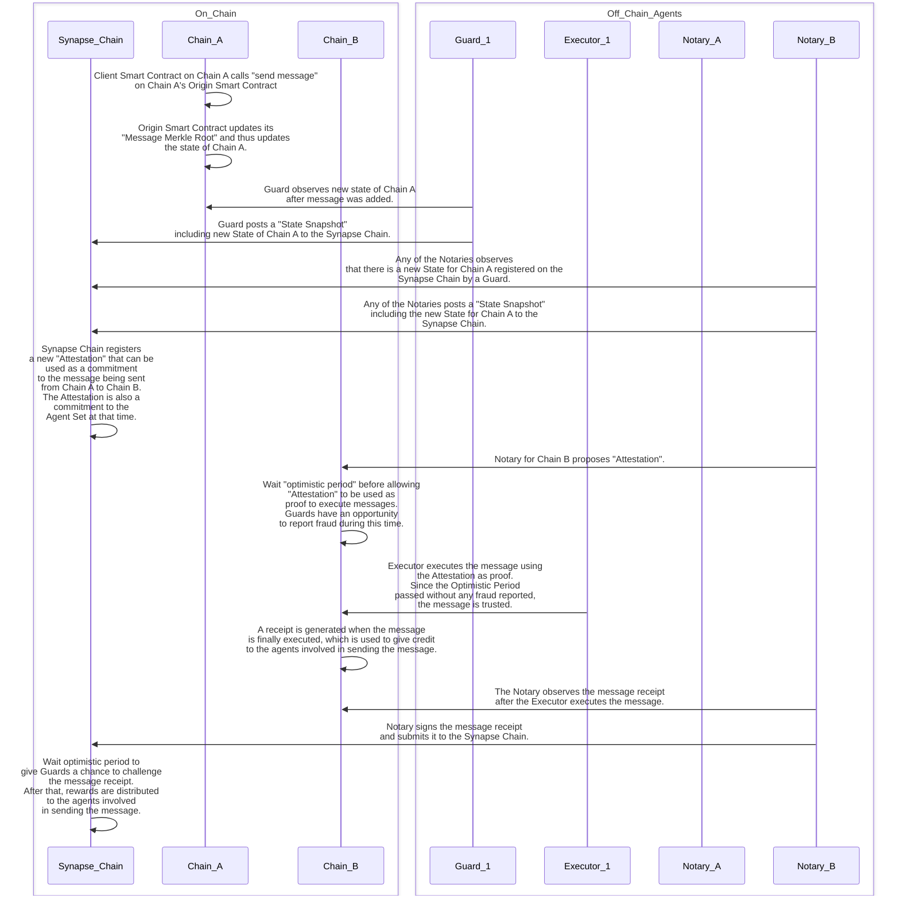
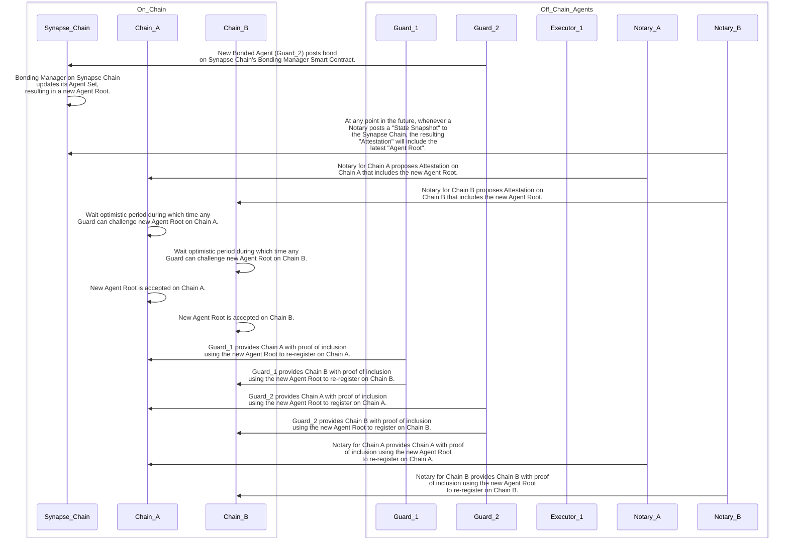

# Messaging

<!-- ## Sending a Message

1. To initiate a message, a client contract calls the `send message` method on the Synapse origin contract.
   This has the following effects:
   - The message is added to the origin's Message Merkle Tree
   - A state is added to the local chain with a new Message Merkle Root
2. On Synapse Chain, a guard submits a state snapshot that includes the new state of the origin chian.
3. On Synapse Chain, a notary submits a state snapshot that icnludes the new state of the origin chain.
4. Synapse Chain registers a new attestation that includes the snap and agent roots.
5. A notary on the destination chain proposes the attestation.
6. The security window begins.
7. The executor executres the message via a Merkle proofs for the state against the snap root in the attestation, and for the message against the message Merkle root in the state. -->

## Sending Messages

We will now illustrate sending a message from the [Client Sending Smart Contract](glossary.md/#client-sending-smart-contract)
on Chain A to the [Client Receiving Smart Contract](glossary.md/#client-receiving-smart-contract) on Chain B.

We will see how the [Synapse Messaging System](glossary.md/#synapse-messaging-system) supports both
[Liveness](glossary.md/#liveness) and [Integrity](glossary.md/#integrity).

1.  On Chain A, [Client Sending Smart Contract](glossary.md/#client-sending-smart-contract) calls the "send message" method on the [Origin Smart Contract](glossary.md/#origin-smart-contract).
    The result of this is that the message is added in the Origin's [Message Merkle Tree](glossary.md/#message-merkle-tree) and Chain A will have
    a new [state](glossary.md/#state) with a new [Message Merkle Root](glossary.md/#message-merkle-root).
    For this example, we will say that Chain A sends 4 messages to Chain B so we can illustrate what it's [Message Merkle Tree](glossary.md/#message-merkle-tree) looks like.
    This is what the message Merkle tree looks like, with the simplification of having a height of only 3 rather than 32:
    
2.  On [Synapse Chain](glossary.md/#synapse-chain), the [Guard](glossary.md/#guard) will submit a [State Snapshot](glossary.md/#state-snapshot) that includes
    the new [state](glossary.md/#state) of Chain A. For this example, we will also claim that Chain B also has a [state](glossary.md/#state) included in the snapshot.
    This is what the [State Snapshot](glossary.md/#state-snapshot) would look like with the states from both chains:
    
3.  On [Synapse Chain](glossary.md/#synapse-chain), either of the [Notaries](glossary.md/#notary) will submit a [State Snapshot](glossary.md/#state-snapshot) that includes
    the new [state](glossary.md/#state) of Chain A. This results in the [Synapse Chain](glossary.md/#synapse-chain) registering a
    new [Attestation](glossary.md/#attestation) that includes the [Snap Root](glossary.md/#snap-root) as well as the current [Agent Root](glossary.md/#agent-root).
    
4.  On Chain B, the [Notary](glossary.md/#notary) for Chain B proposes the [Attestation](glossary.md/#attestation).
5.  The system must wait for the [Optimistic Period](glossary.md/#optimistic-period) before executing the message. This is when
    the [Guard](glossary.md/#guard) has an opportunity to report [fraud](glossary.md/#fraud) if either the [Attestation](glossary.md/#attestation)
    was not registered on the [Synapse Chain](glossary.md/#synapse-chain) or if one of the [states](glossary.md/#state) included in the [State Snapshot](glossary.md/#state-snapshot)
    was not a valid state on the Origin chain.
6.  On Chain B after the [Optimistic Period](glossary.md/#optimistic-period) has passed without any [fraud reports](glossary.md/#fraud-report), the
    [Executor](glossary.md/#executor) will execute the message. This is done by a [Merkle Proof](glossary.md/#merkle-proof) for the [state](glossary.md/#state) against the [Snap Root](glossary.md/#snap-root)
    in the [Attestation](glossary.md/#attestation), and then with another [Merkle Proof](glossary.md/#merkle-proof) for the [message](glossary.md/#message) against the [Message Merkle Root](glossary.md/#message-merkle-root)
    in the [state](glossary.md/#state).

Below is a sequence diagram illustrating the steps involved in sending a message from Remote Chain A to Remote Chain B:

## Adding other Bonded Agents

The requirement to become a [Bonded Agent](glossary.md/#bonded-agent) is to post a [bond](glossary.md/#bond) on the [Bonding Manager Smart Contract](glossary.md/#bonding-manager-smart-contract) on the [Synapse Chain](glossary.md/#synapse-chain).
Upon adding the new [Bonded Agent](glossary.md/#bonded-agent) to the [Agent Set](glossary.md/#agent-set), the [Bonding Manager Smart Contract](glossary.md/#bonding-manager-smart-contract) on the [Synapse Chain](glossary.md/#synapse-chain) will
calculate a new [Agent Root](glossary.md/#agent-root).

Below is an illustration of how the [Agent Root](glossary.md/#agent-root) is calculated from the [Agent Set](glossary.md/#agent-set).

The tricky part is how to communicate this [Agent Root](glossary.md/#agent-root) to the [remote chains](glossary.md/#remote-chain).

Whenever a [Notary](glossary.md/#notary) submits a [State Snapshot](glossary.md/#state-snapshot) to the [Synapse Chain](glossary.md/#synapse-chain),
the Synapse Smart Contract that handles that transaction will register an [Attestation](glossary.md/#attestation)
that includes the [Snap Root](glossary.md/#snap-root) as well as the current [Agent Root](glossary.md/#agent-root).

Then, one of the [Notaries](glossary.md/#notary) for each [remote chain](glossary.md/#remote-chain) will take that
[Attestation](glossary.md/#attestation) and propose it to its [remote chain](glossary.md/#remote-chain).

Just as there is an [Optimistic Period](glossary.md/#optimistic-period) for each [message](glossary.md/#message), the [Agent Root](glossary.md/#agent-root)
also has an [Optimistic Period](glossary.md/#optimistic-period) defined by the system, during which any [Guard](glossary.md/#guard)
could call out [fraud](glossary.md/#fraud) if it believes the [Agent Root](glossary.md/#agent-root) is wrong.

If no guard submits a [fraud report](glossary.md/#fraud-report), the new [Agent Root](glossary.md/#agent-root) will become active
on the [remote chain](glossary.md/#remote-chain).

Whenever there is a change in the [Agent Root](glossary.md/#agent-root) on a [remote chain](glossary.md/#remote-chain),
each [Bonded Agent](glossary.md/#bonded-agent) must re-register themselves by providing a proof of inclusion.

Below is a sequence diagram illustrating the steps involved in adding another bonded agent (a new Guard):

