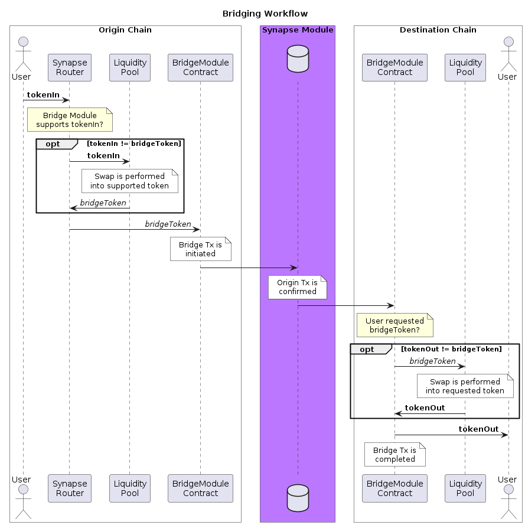
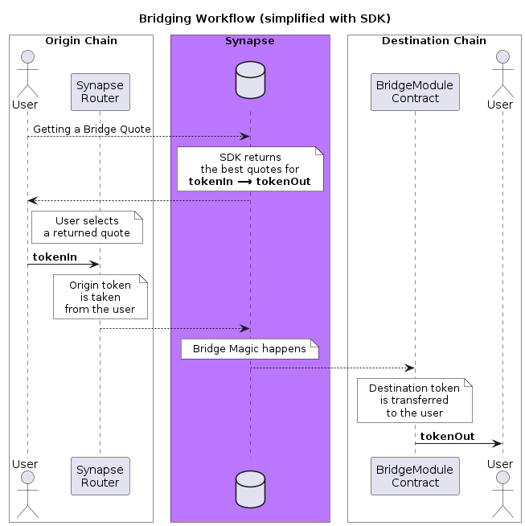

# Synapse Router SDK

[](https://www.npmjs.com/package/@synapsecns/sdk-router)

This package contains the Synapse Protocol Cross-Chain Swap and Bridging SDK

[See the Docs](https://synapse-3.gitbook.io/synapse-protocol/developers/bridge-sdk)

## Environment Variables

The SDK Router supports the following environment variables:

| Variable    | Description         | Default Value              |
| ----------- | ------------------- | -------------------------- |
| RFQ_API_URL | URL for the RFQ API | https://rfq-api.omnirpc.io |

# Synapse SDK

The Synapse SDK allows you to interact with [Synapse Protocol](https://synapseprotocol.com/) router contracts deployed on 19 chains. It handles:

- Bridging operations (cross-chain swaps):
  - Getting bridge quotes
  - Initiating bridge transactions
  - Tracking the status of bridge transactions
- On-chain swap operations:
  - Getting swap quotes
  - Initiating swap transactions
- Utilities for getting miscellaneous data related to protocol, fees, and chains

## SDK Installation

```bash
npm install @synapsecns/sdk-router
```

## SDK Initialization

To use the SDK, first instantiate it with chain IDs and Ethereum providers:

```ts
import { SynapseSDK } from '@synapsecns/sdk-router'
import { JsonRpcProvider } from '@ethersproject/providers'

// Create providers for Ethereum, Arbitrum and Optimism
// Any Ethers.js provider can be used
const arbitrumProvider = new JsonRpcProvider('<arbitrum-provider-url>')
const ethereumProvider = new JsonRpcProvider('<ethereum-provider-url>')
const optimismProvider = new JsonRpcProvider('<optimism-provider-url>')
// Create lists of chain IDs and their matching providers
const chainIds = [1, 10, 42161]
const providers = [ethereumProvider, optimismProvider, arbitrumProvider]
const synapseSDK = new SynapseSDK(chainIds, providers)
```

## Bridging

### Router Deployments

The Routers for each module are deployed to consistent addresses across all chains, with a few exceptions noted below.

| Bridge Module | Chain   | Address                                      |
| ------------- | ------- | -------------------------------------------- |
| SynapseBridge | All[^1] | `0x7E7A0e201FD38d3ADAA9523Da6C109a07118C96a` |
| SynapseBridge | Blast   | `0x0000000000365b1d5B142732CF4d33BcddED21Fc` |
| SynapseCCTP   | All     | `0xd5a597d6e7ddf373a92C8f477DAAA673b0902F48` |
| SynapseRFQ    | All     | `0x00cD000000003f7F682BE4813200893d4e690000` |

[^1]: Except Blast

### Deprecated Router Deployments

The following deployments are no longer in use and should be avoided. Please refer to the latest deployments in the table above.

| Bridge Module | Chain | Address                                          |
| ------------- | ----- | ------------------------------------------------ |
| SynapseBridge | Blast | ~~`0x7E7A0e201FD38d3ADAA9523Da6C109a07118C96a`~~ |
| SynapseRFQ    | All   | ~~`0x0000000000489d89D2B233D3375C045dfD05745F`~~ |

### Full bridging workflow



### Simplified bridging workflow

Following concepts are abstracted away from the SDK consumer:

- Optional swaps on origin and destination chains.
- Bridge modules and their supported tokens.

The SDK consumer simply operates by getting quotes for sending `tokenIn` on the origin chain and receiving `tokenOut` on the destination chain. The SDK then finds the bridge modules that can fulfill this bridging intent.



### Getting a bridge quote

Below is the example of how to get the list of quotes for sending 1000 USDC from Ethereum and receiving USDT on Arbitrum:

```ts
const bridgeQuotes: BridgeQuote[] = await synapseSDK.allBridgeQuotes(
  // 1
  originChainId,
  // 42161
  destChainId,
  // Address of the token to start from on origin chain: 0xA0b86991c6218b36c1d19D4a2e9Eb0cE3606eB48
  tokenIn,
  // Address of the token to end with on destination chain: 0xFd086bC7CD5C481DCC9C85ebE478A1C0b69FCbb9
  tokenOut,
  // Amount of tokens to bridge, in origin token decimals: 1_000_000_000
  amountIn,
  {
    // Deadline for the transaction to be initiated on the origin chain, in seconds (optional)
    deadline: 1234567890,
    // List of bridge modules to exclude from the result, optional.
    // Empty list means that all modules are included.
    excludedModules: ['SynapseBridge', 'SynapseCCTP', 'SynapseRFQ'],
    // Address of the user on the origin chain, optional.
    // MANDATORY if a smart contract is going to initiate the bridge operation on behalf of the user.
    originUserAddress: '0x1234567890abcdef1234567890abcdef12345678',
  }
)
```

- **Important:** It is crucial to provide the `originUserAddress` when a smart contract will initiate the bridge operation on behalf of the user. This requirement applies to smart wallets (e.g., Safe) and third-party integrations (such as bridge aggregator smart contracts).
- For native gas tokens (e.g., ETH on Ethereum/Arbitrum, AVAX on Avalanche, etc.), use the specialized address `0xEeeeeEeeeEeEeeEeEeEeeEEEeeeeEeeeeeeeEEeE` instead of the token address for either input or output tokens.
- The returned list is sorted by the `maxAmountOut` field in descending order, with the first quote offering the highest amount of tokens on the destination chain.
- All quotes in the list are provided without any slippage settings applied. To add slippage to the quotes, use the `applyBridgeSlippage` function.
- All quotes in the list include the provided origin deadline. If no deadline is specified, the default module's deadline is used. To modify the deadline for the quotes, use the `applyBridgeDeadline` function.
- All quotes in the list include the default destination deadline.

> **Note:** The `bridgeQuote` method serves as a wrapper for the `allBridgeQuotes` method.
> While `bridgeQuote` returns only the first (best) quote from the list, `allBridgeQuotes` provides the complete list of quotes.

### `BridgeQuote` object

`BridgeQuote` objects are returned by the `bridgeQuote` and `allBridgeQuotes` methods. They contain the following fields:

```ts
export type BridgeQuote = {
  // Address of the Router contract that user will be interacting with
  routerAddress: string
  // Expected final amount of tokens to be received on the destination chain by the user,
  // if the bridge transaction is completed right after the quote is generated
  maxAmountOut: BigNumber
  // Query object for the origin chain
  originQuery: Query
  // Query object for the destination chain
  destQuery: Query
  // Estimated median time for the bridge transaction to be completed
  estimatedTime: number
  // Name of the "bridge module" that will be used to bridge the tokens.
  // Supported values are "SynapseBridge", "SynapseCCTP" and "SynapseRFQ"
  moduleName: string
  // Amount of native gas tokens that user will receive on the destination chain
  // on top of the token amount
  gasDropAmount: BigNumber
  // Origin chain id
  originChainId: number
  // Destination chain id
  destChainId: number
}
```

> **Note:** `Query` objects contain information about the optional swaps to be performed on behalf of the user on origin and destination chains. The exact composition of the `Query` object, as well as the concept of the optional swaps, is abstracted away from the SDK consumer.
> A collection of methods to modify the `Query` object is provided in the `SynapseSDK` class, allowing the consumer to be unaware of the underlying object structure.

### Applying slippage (Recommended)

Some of the returned quotes may contain information about the optional swaps on origin and destination chains. As the liquidity composition may change over time, it is recommended to apply slippage to the quotes to account for the possible price changes. If no slippage is applied, the user transaction might be reverted due to insufficient funds. The default value for the slippage is 10 basis points (0.1%).

```ts
const { originQuery, destQuery } = await synapseSDK.applyBridgeSlippage(
  // fields from the BridgeQuote object returned by the allBridgeQuotes method
  bridgeQuote.moduleName,
  bridgeQuote.originQuery,
  bridgeQuote.destQuery,
  // Numerator of the slippage percentage, optional (defaults to 10)
  slipNumerator,
  // Denominator of the slippage percentage, optional (defaults to 10000)
  slipDenominator
)
```

> **Note**: this method will not modify the original `Query` objects, but will return new ones. This allows to change the applied slippage without having to re-fetch the quotes.

### Modifying deadline (Optional)

Bridge quotes returned by the `allBridgeQuotes` method come with the deadlines set in `Query` objects. It is possible to further modify the deadlines before initiating the bridge transaction.

```ts
const { originQuery, destQuery } = synapseSDK.applyBridgeDeadline(
  // fields from the BridgeQuote object returned by the allBridgeQuotes method
  bridgeQuote.moduleName,
  bridgeQuote.originQuery,
  bridgeQuote.destQuery,
  // New deadline for the origin chain (optional, default depends on the bridge module)
  originDeadline,
  // New deadline for the destination chain (optional, default depends on the bridge module)
  destDeadline
)
```

We recommend to not modify the destination deadline, as the behavior of the bridge module with expired destination deadline varies depending on the module.

> **Note**: this method will not modify the original `Query` objects, but will return new ones. This allows to change the deadlines without having to re-fetch the quotes.

### Performing a bridge transaction

At this stage, we assume that following steps have been performed:

- Bridge quotes have been fetched using the `allBridgeQuotes` or `bridgeQuote` methods.
- Slippage has been applied to the quotes using the `applyBridgeSlippage` method.
- User has approved `routerAddress` to spend `amountIn` of `tokenIn` on the origin chain.

Use the `bridge` method to form the payload for the bridge transaction:

```ts
// Populate the transaction data using the SDK
const { data, to, value } = await synapseSDK.bridge(
  // User address on the destination chain that will receive the tokens
  addressTo,
  bridgeQuote.routerAddress,
  // Parameters used to obtain the BridgeQuote object
  originChainId,
  destinationChainId,
  tokenIn,
  amountIn,
  // Query objects with applied slippage
  originQuery,
  destQuery
)
```

`data` and `to` fields should be then used to initiate the bridge transaction on the origin chain, with `value` being the amount of native gas tokens to be sent along with the transaction.

```ts
// Initiate the populated transaction, e.g. using ethers.js Signer
const tx = await signer.sendTransaction({
  to,
  data,
  value,
})
```

> **Note**: the `bridge` method will not initiate the transaction, but will only return the payload for the transaction. The transaction should be initiated by the user using their preferred method (e.g. MetaMask, WalletConnect, etc.).

### Tracking the status of the bridge transaction

In order to track the status of the bridge transaction, the consumer first needs to fetch its unique "Synapse Tx ID" using the `getSynapseTxId` method:

```ts
const synapseTxId = await synapseSDK.getSynapseTxId(
  // Chain ID of the ORIGIN chain
  originChainId,
  bridgeQuote.moduleName,
  // Transaction hash of the bridge transaction on the origin chain
  txHash
)
```

> `synapseTxId` value stays the same for a given bridge transaction, so there is no need to re-fetch it every time the status is checked.

The status of the bridge transaction can then be checked using the `getBridgeTxStatus` method:

```ts
const status: boolean = await synapseSDK.getBridgeTxStatus(
  // Chain ID of the DESTINATION chain
  destChainId,
  bridgeQuote.moduleName,
  synapseTxId
)
```
