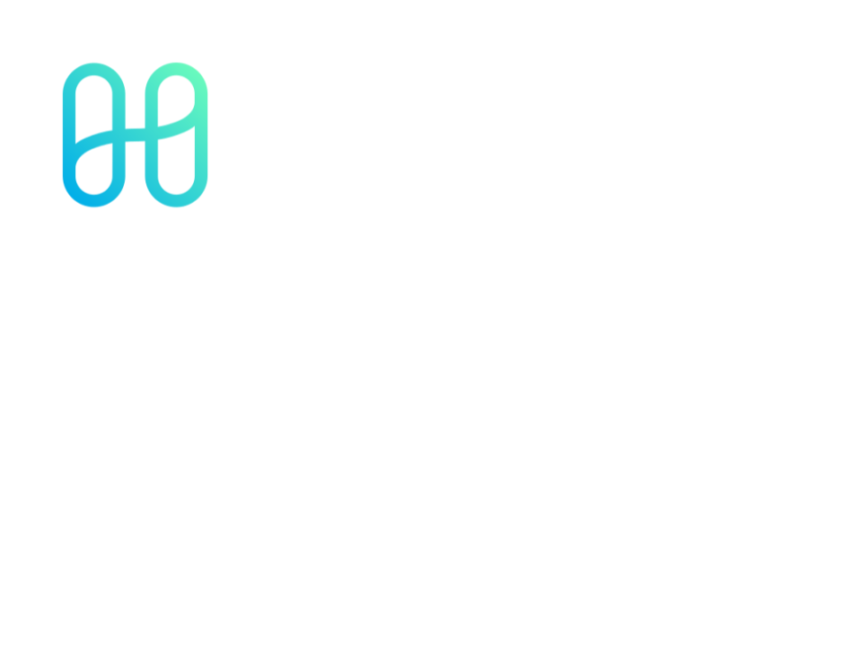
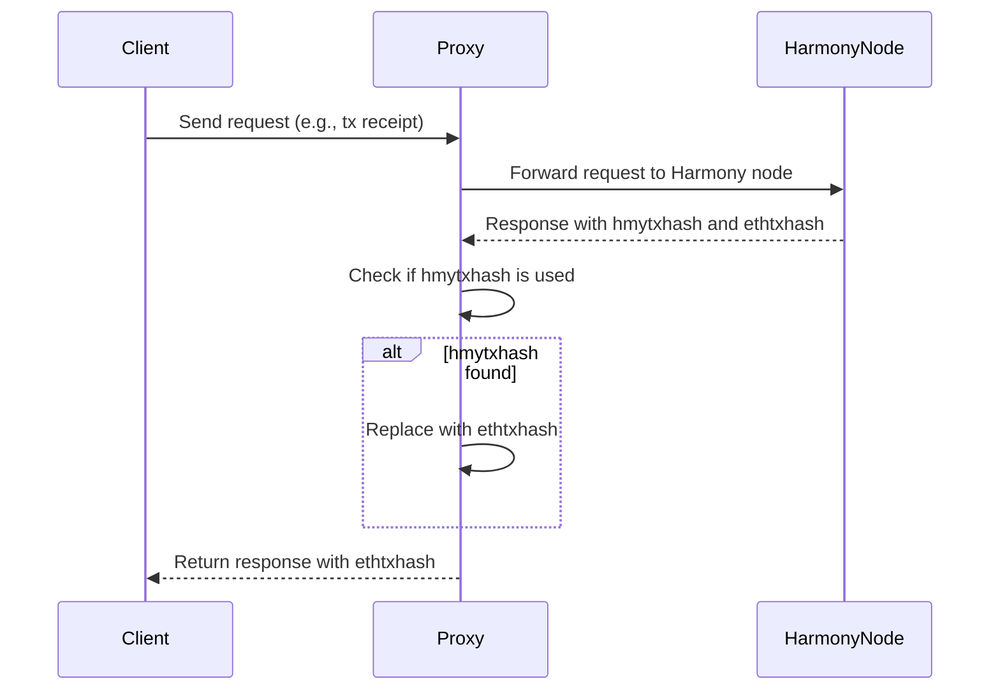

# Harmony Proxy

The `harmonyproxy` package provides a solution to inconsistencies in transaction hashes returned by the Harmony blockchain. The primary role of this service is to ensure that only one type of transaction hash, specifically the Ethereum-compatible transaction hash (`ethtxhash`), is being used. Harmony sometimes provides its own transaction hash format, which can lead to discrepancies when interacting with Ethereum-compatible systems.

## Purpose

In the Harmony blockchain, two types of transaction hashes can be returned:
- **Harmony-specific transaction hash** (`hmytxhash`)
- **Ethereum-compatible transaction hash** (`ethtxhash`)

This discrepancy can cause issues when interoperating with Ethereum tools and services that expect the `ethtxhash`. The purpose of this service is to intercept Harmony blockchain requests, verify the type of transaction hash returned, and ensure that only the `ethtxhash` is passed back to the requesting client.

## How It Works

When a request is made to the Harmony blockchain through this proxy:
1. The proxy intercepts the request and forwards it to the Harmony node.
2. It retrieves the response from the node, which may contain either a `hmytxhash` or an `ethtxhash`.
3. The proxy compares the transaction hashes. If the Harmony-specific `hmytxhash` is found, it checks for the correct `ethtxhash` and ensures this hash is returned to the client.
4. If a mismatch is found between the two types of transaction hashes, the proxy reports an error or corrects the response.

### Example Flow

1. **Incoming Request**: A client requests transaction receipt data.
2. **Proxy Intercepts**: The proxy forwards the request to the Harmony node.
3. **Harmony Response**: The node returns a response with a `hmytxhash` and an `ethtxhash`.
4. **Verification**: The proxy checks the transaction hashes. If the Harmony-specific `hmytxhash` is present, the proxy ensures that the `ethtxhash` is used in the response.
5. **Final Response**: The proxy forwards the verified response containing the `ethtxhash` back to the client.

## Visualization

The following mermaid diagram outlines the process of how the Harmony Proxy manages transaction hashes:

## Conclusion

The `harmonyproxy` service ensures consistency and compatibility between the Harmony blockchain and Ethereum-based systems by enforcing the use of the `ethtxhash`. This prevents potential errors or conflicts caused by the use of Harmony-specific transaction hashes (`hmytxhash`) in Ethereum contexts.
